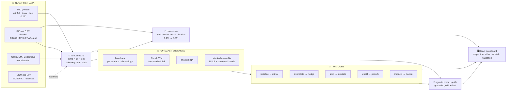
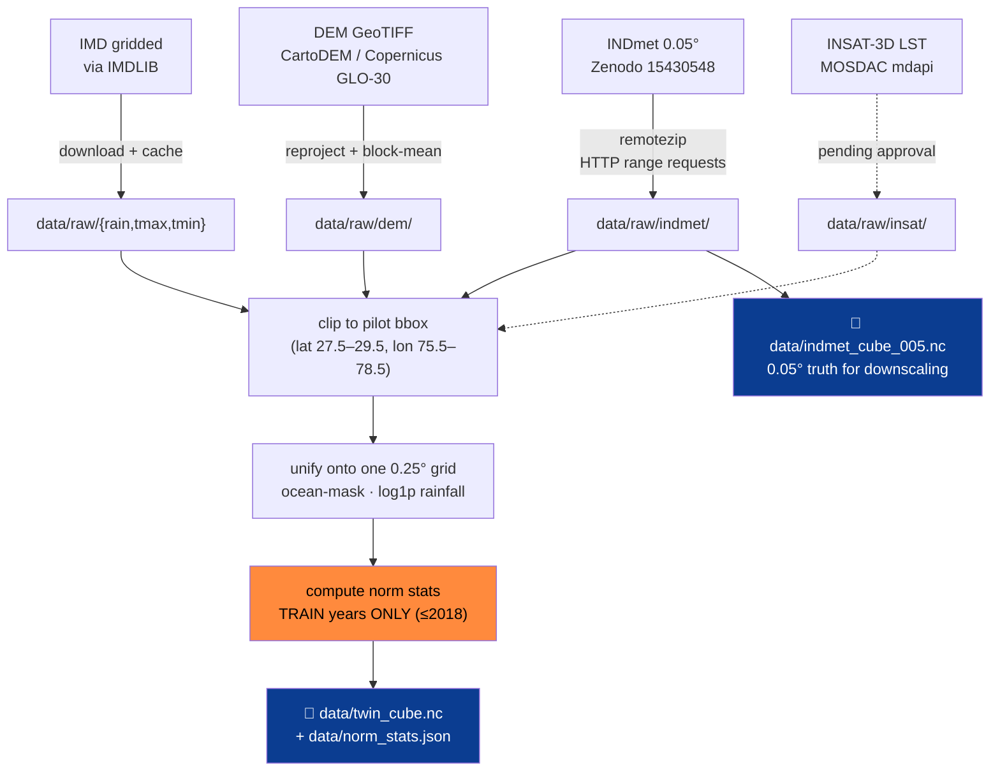
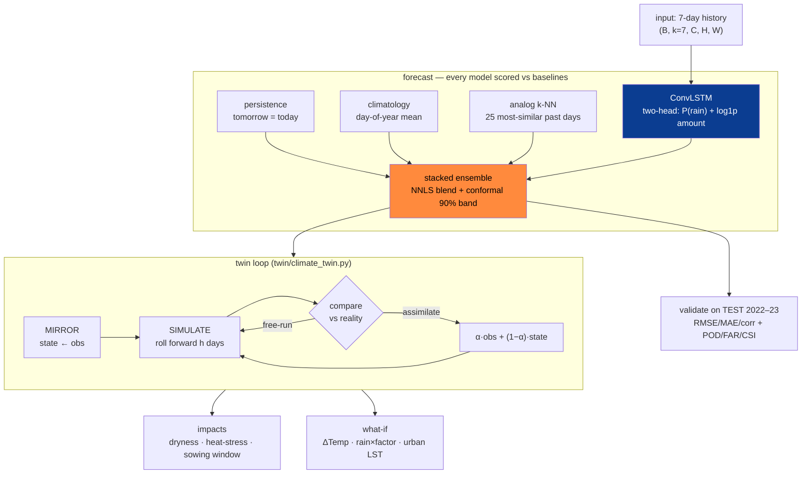

# ClimaTwin India 🌦️

**An AI-powered digital twin of India's climate — built on India's own data (IMD + ISRO/INSAT).**

Not a forecast model — a **digital twin**: it mirrors a live gridded climate state,
**assimilates** observations, **simulates** forward with a trained neural model,
**downscales** to ~5 km, runs **"what-if"** scenarios with decision-ready impacts, and can be
**operated in plain English** by a grounded, offline-first AI agent.
Pilot region **Delhi-NCR** · variables **rainfall + Tmax/Tmin** · 1–14 day horizon.
ISRO problem-statement PoC, scaled honestly to hackathon compute — same three-stage shape as
**NVIDIA Earth-2 / EU Destination Earth**.

---

## 1 · What it does (the working, in one picture)



The three Earth-2 stages — **assimilate → forecast → downscale** — are all present, wrapped in a
real twin loop and an honest validation harness, then driven by an AI layer and a dashboard.

---

## 2 · Why it's different

- **A real twin, not a CNN + chart.** The full loop lives in `twin/climate_twin.py`:
  `initialize` (mirror) · `assimilate` (α-nudging) · `step` (forward sim) · `whatif` (perturb) ·
  `impacts` (decide) · `run_twin` (mirror-vs-reality drift over the horizon).
- **No single model wins — so we stack honestly.** Persistence, climatology, **analog k-NN**, and a
  **two-head ConvLSTM** each win different cells; a **non-negative (NNLS) stacked ensemble** blends
  them per-variable/per-horizon and wraps **split-conformal 90% prediction intervals** with
  **verified out-of-sample coverage**.
- **Generative downscaling, scored the right way.** A **CorrDiff-style residual diffusion** model
  super-resolves 0.25° → **0.05° (~5 km)** against real **INDmet** truth, judged on **FSS / CRPS /
  power-spectrum** (not just pixel RMSE — the SOTA way).
- **Operable in plain English.** An **offline-first agentic brain** (planner → executor → critic →
  explainer → grounding guard) actually *calls the twin's own tools* and answers with every number
  cited `[tool:field]`; a separate **always-on guide** explains each screen for non-experts.
- **Indigenous data, end-to-end.** Real **IMD** gridded + **INDmet** (IMD-anchored) + real
  **elevation** + **INSAT-3D/MOSDAC** path — Atmanirbhar, no foreign backbone.
- **Scalable by construction.** The pilot region is one line in `config.py`; changing it rebuilds
  the whole cube → model → dashboard with no code edits.

---

## 3 · How we find & build the data



**Principle:** every fitted statistic (normalization, climatology, conformal half-widths) is
computed on **train years only**, then applied to val/test. Splits are **temporal**
(train ≤2018 · val 2019–21 · test 2022–23) — never random. The demo runs **fully offline** from the
cached cube. See [`docs/datasets.md`](docs/datasets.md) for exact sources, licenses, and commands.

---

## 4 · The algorithm (forecast + twin loop)



- **Rainfall is zero-inflated**, so ConvLSTM uses a **two-head** loss — a rain/no-rain classifier
  plus a `log1p` amount regressor — instead of plain MSE.
- **Temperature** uses MSE/L1.
- **Multi-horizon** (`models/train_multihorizon.py`) can train the ConvLSTM *through* an
  autoregressive rollout to reduce 3–7 day drift (future LST from train-year climatology — no leakage).
- The **ensemble** is the default served model; it wins **7 of 9** variable×horizon cells.

---

## 5 · Results (real IMD, temporal test split 2022–23, baseline-relative)

RMSE — **best in bold**. The ensemble is leakage-safe (fit on val 2019–20, conformal-calibrated on
the disjoint val 2021, scored on untouched test 2022–23):

| Lead | rainfall (mm) | tmax (°C) | tmin (°C) |
|---|---|---|---|
| **1-day** | **ensemble 7.35** · analog 7.38 · convlstm 7.40 · clim 8.08 · persist 9.41 | **ensemble 1.51** · convlstm 1.55 · persist 1.59 | **ensemble 1.05** · analog 1.16 · convlstm 1.19 |
| **3-day** | **ensemble 7.96** · analog 8.04 · convlstm 7.98 | **ensemble 2.36** · analog 2.43 | **ensemble 1.64** · analog 1.75 |
| **7-day** | ensemble 8.04 · **convlstm 8.03** · clim 8.11 | **ensemble 2.72** · analog 2.82 · clim 2.89 | **ensemble 1.82** · clim 1.93 |

**Rain detection (categorical, 1-day @ 2.5 mm):** ensemble **POD 0.64 · CSI 0.37 · FAR 0.53** vs
persistence's 0.45 / 0.29 / 0.55 — the two-head design materially lifts detection.

**Conformal coverage (90% target, on untouched test):** rainfall 0.90 · tmax 0.87–0.93 · tmin
0.89–0.94 — intervals are honest, not decorative.

**Diffusion downscaler (rainfall, 0.25° → 0.05° INDmet truth):** FSS@2.5 mm **0.82 vs bilinear
0.68**; high-wavenumber spectral power vs truth **0.36 vs 0.16** (≈2.3× more recovered texture).
RMSE 4.42 vs bilinear 5.34 — diffusion wins here too, but spatial/spectral skill is the point. *(Tmax/Tmin
diffusion: code ready, train on Colab — `notebooks/ClimaTwin_Diffusion_Temp_Colab.ipynb`.)*

---

## 6 · Quickstart

```bash
make install      # Python 3.13 venv + deps (torch + geo stack)
make data         # build twin_cube.nc  (IMD if available, else offline synthetic)
make train        # train the ConvLSTM forecaster   → models/checkpoints/convlstm.pt
python -m models.ensemble --fit   # fit NNLS blend + conformal bands → ensemble_weights.json
make validate     # honest leaderboard vs baselines → validation_metrics.json
make serve        # FastAPI on http://127.0.0.1:8000  (interactive docs at /docs)

cd frontend && npm install && npm run dev    # dashboard on http://localhost:5173
```

> **The golden rule:** any time you retrain the ConvLSTM, re-run `models.ensemble --fit` **and**
> `make validate` — the ensemble weights and the leaderboard depend on it.

**Heavy/GPU jobs run on free Colab:**
- Temperature hi-res diffusion → `notebooks/ClimaTwin_Diffusion_Temp_Colab.ipynb`
- Custom local LLM (QLoRA on Qwen2.5-3B) → `notebooks/ClimaTwin_Finetune_Colab.ipynb`

---

## 7 · API

| Endpoint | Purpose |
|---|---|
| `GET /meta` | grid, dates, models, provenance, thresholds, availability flags |
| `GET /state?date=` | observed twin state + impacts |
| `GET /forecast?model=&horizon=&uncertainty=` | roll-forward fields (+ uncertainty / conformal bands) |
| `GET /analog?date=&horizon=` | analog-ensemble forecast + the matched past IMD days |
| `POST /whatif` | perturb ΔTemp / rainfall× / urban polygon → diff map + impacts |
| `GET /twin/run` + `WS /ws/twin` | reality-vs-twin drift + sync %, streamed as live ticks |
| `GET /highres?date=&var=` | real INDmet 0.05° (~5 km) observed field |
| `GET /downscale?var=` · `GET /downscale/diffusion?var=` | SR-CNN and diffusion super-resolution + skill |
| `GET /validate` | baseline-relative metrics (RMSE/MAE/corr, POD/FAR/CSI) + conformal calibration |
| `GET /brain?q=` · `GET /brain/anomaly` | agentic answer (plan → tools → cited answer) + autonomous anomaly scan |
| `GET /guide?view=&q=` | plain-language explainer for the current screen |

Full schema in [`docs/architecture.md`](docs/architecture.md) §API and at `/docs` when serving.

---

## 8 · Dashboard (React + Vite + Leaflet)

Six views — **Overview** (mission hero + capabilities), **Twin** (mirror→assimilate→simulate with
live sync %), **Explore** (Leaflet grid + time slider + per-cell sparklines), **What-If** (scenario
presets + drawable urban polygon + diff map), **Validation** (honest leaderboard + error map),
**Downscale** (drag-to-reveal SR-CNN + diffusion ensemble). Plus a global **Command Console** (ask
in English → routed to the brain), **Cmd+K** palette, compare mode, PNG export, uncertainty/hi-res
toggles, rain particles, and heat-stress pulses. Dark mission-control theme with a light mode.

---

## 9 · Future aspects (roadmap)

```mermaid
flowchart LR
    subgraph DONE["✅ Done (P0 + P1)"]
        d1["twin loop + assimilation"]
        d2["two-head ConvLSTM"]
        d3["analog + stacked ensemble<br/>+ conformal bands"]
        d4["real elevation (DEM)"]
        d5["CorrDiff diffusion (rainfall)"]
        d6["agentic brain + guide"]
        d7["React dashboard + real-time WS"]
    end
    subgraph NEXT["⏳ In flight"]
        n1["temperature hi-res diffusion<br/>(Colab)"]
        n2["multi-horizon rollout training"]
        n3["fine-tuned local LLM quality"]
    end
    subgraph FUTURE["🔭 Beyond the PoC"]
        f1["real INSAT-3D LST fusion<br/>(MOSDAC approval)"]
        f2["FNO / transformer head"]
        f3["soil-moisture / drought (NICES)"]
        f4["all-India scale-out<br/>(config-driven)"]
        f5["data assimilation upgrade<br/>(EnKF-lite)"]
    end
    DONE --> NEXT --> FUTURE
```



See [`docs/implementation.md`](docs/implementation.md) for the phased roadmap and
[`docs/research.md`](docs/research.md) for the SOTA references behind each choice.

---

## 10 · Documentation map

| Need | File |
|---|---|
| Operating guide for AI coding agents | [`CLAUDE.md`](CLAUDE.md) |
| Architecture, twin-core, API, diagrams | [`docs/architecture.md`](docs/architecture.md) |
| Data sources, acquisition, preprocessing | [`docs/datasets.md`](docs/datasets.md) |
| SOTA, references, why each decision | [`docs/research.md`](docs/research.md) |
| Requirements, features, demo script | [`docs/prd.md`](docs/prd.md) |
| Roadmap, phases, rubric mapping | [`docs/implementation.md`](docs/implementation.md) |
| Slide-by-slide deck content | [`docs/pptcontent.md`](docs/pptcontent.md) |
| Docs index + rubric → artifact map | [`docs/README.md`](docs/README.md) |

---

## 11 · Honesty notes

Skill is always reported **vs persistence/climatology baselines**; splits are **temporal** (no
leakage); every fitted stat is **train-years-only**; the demo runs **offline** from a cached cube.
The **INSAT LST** layer is currently a clearly-tagged `synthetic_demo` placeholder while the real
MOSDAC ingestion path awaits data approval — the footer labels it *"INSAT fusion: roadmap"*.
**Elevation is real** (CartoDEM/Copernicus GLO-30, labeled as such). Diffusion downscaling is scored
on spatial/spectral skill, with RMSE shown alongside even when it isn't the headline.

---

*Build the loop. Use India's data. Validate honestly. Keep the demo offline and rehearsed. — ClimaTwin India*
