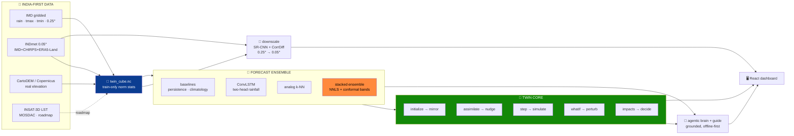

<!-- ░░░ ANIMATED BANNER ░░░ -->
<p align="center">
  
</p>

<p align="center">
  <a href="https://git.io/typing-svg">
    
  </a>
</p>

<!-- ░░░ BADGES ░░░ -->
<p align="center">
  
  
  
</p>

<p align="center">
  
  
  
  
  
  
  
</p>

---

> **Not a forecast model — a digital twin.** It mirrors a live gridded climate state, **assimilates**
> observations, **simulates** forward with a trained neural ensemble, **downscales** to ~5 km, runs
> **"what-if"** scenarios with decision-ready impacts, and can be **driven in plain English** by a
> grounded, offline-first AI agent.
>
> 📍 Pilot **Delhi-NCR** · 🌧️ rainfall + 🌡️ Tmax/Tmin · ⏱️ 1–14 day horizon · 🛰️ IMD + INSAT/MOSDAC

---

## 🛰️ Built for the Bharatiya Antariksh Hackathon 2026

The **third edition** of the Bharatiya Antariksh Hackathon — a national innovation initiative by the
**Indian Space Research Organisation (ISRO)**, powered by **Hack2skill**. 
**ClimaTwin India** is Team CodeCatalysts' 
---

## 👥 Team CodeCatalysts

| 🧑‍🚀 Member | 🎖️ Role | ✉️ Email |
|---|---|---|
| **Ayush Sharma** | 👑 Team Leader | iayushsharma.2008@gmail.com |
| **Gaurika Kindra** | Member | kindragaurika21@gmail.com |
| **Vardaan Dua** | Member | vardaandua333@gmail.com |
| **Paavni Jain** | Member | jainpaavni06@gmail.com |

---

## 🌍 What it does, in one picture



All three Earth-2 stages — **assimilate → forecast → downscale** — are present, wrapped in a real twin
loop, an honest validation harness, an AI layer, and a dashboard.

---

## ✨ Why it's different

| | |
|---|---|
| 🔁 **A real twin, not a CNN + chart** | The full loop lives in `twin/climate_twin.py`: mirror · α-nudge assimilate · forward sim · what-if perturb · decision impacts · drift-vs-reality. |
| 🧠 **No single model wins — so we stack honestly** | Persistence, climatology, **analog k-NN** and a **two-head ConvLSTM** each win different cells; an **NNLS stacked ensemble** blends them per variable/horizon with **split-conformal 90% bands** and verified coverage. |
| 🔬 **Generative downscaling, scored right** | A **CorrDiff-style residual diffusion** model super-resolves 0.25° → **5 km** vs real **INDmet** truth, judged on **FSS / CRPS / power-spectrum** — not just pixel RMSE. |
| 🤖 **Operable in plain English** | An **offline-first agentic brain** (plan → execute → critic → explain → grounding guard) *calls the twin's own tools* and cites every number `[tool:field]`. |
| 🇮🇳 **Indigenous data, end-to-end** | Real **IMD** + **INDmet** + real **elevation** + **INSAT-3D/MOSDAC** path. Atmanirbhar, no foreign backbone. |
| 📈 **Scalable by construction** | The pilot region is **one line in `config.py`** — change it and the whole cube → model → dashboard rebuilds with no code edits. |

---

## 📊 Results — real IMD, temporal test split 2022–23 (baseline-relative)

RMSE, **best in bold**. Ensemble is leakage-safe: fit on val 2019–20, conformal-calibrated on val 2021,
scored on untouched test 2022–23.

| Lead | 🌧️ rainfall (mm) | 🌡️ tmax (°C) | 🌡️ tmin (°C) |
|---|---|---|---|
| **1-day** | **ensemble 7.35** · analog 7.38 · convlstm 7.40 | **ensemble 1.51** · convlstm 1.55 | **ensemble 1.05** · analog 1.16 |
| **3-day** | **ensemble 7.96** · analog 8.04 | **ensemble 2.36** · analog 2.43 | **ensemble 1.64** · analog 1.75 |
| **7-day** | **convlstm 8.03** · ensemble 8.04 | **ensemble 2.72** · analog 2.82 | **ensemble 1.82** · clim 1.93 |

- 🎯 **Rain detection (1-day @ 2.5 mm):** ensemble **POD 0.64 · CSI 0.37 · FAR 0.53** vs persistence 0.45 / 0.29 / 0.55.
- 📏 **Conformal coverage (90% target):** rainfall 0.90 · tmax 0.87–0.93 · tmin 0.89–0.94 — honest, not decorative.
- 🔬 **Diffusion downscaler (rainfall):** FSS@2.5 mm **0.82 vs bilinear 0.68**; ≈2.3× more recovered texture; RMSE 4.42 vs 5.34.
- 🤝 **Temperature diffusion — honest negative result:** on smooth temp fields bilinear is already near-optimal (~0.12 °C); diffusion over-textures, so we keep it labeled, not headlined.

---

## ⚡ Quickstart

```bash
make install      # Python 3.13 venv + deps (torch + geo stack)
make data         # build twin_cube.nc (IMD if available, else offline synthetic)
make train        # train the ConvLSTM forecaster  → models/checkpoints/convlstm.pt
python -m models.ensemble --fit   # fit NNLS blend + conformal bands
make validate     # honest leaderboard vs baselines
make serve        # FastAPI → http://127.0.0.1:8000  (docs at /docs)

cd frontend && npm install && npm run dev   # dashboard → http://localhost:5173
```

> 🥇 **Golden rule:** retrain the ConvLSTM → re-run `models.ensemble --fit` **and** `make validate`.
> The ensemble weights and the leaderboard depend on it.

🖥️ **Dashboard:** six views — **Overview · Twin · Explore · What-If · Validation · Downscale** — plus a
global **Command Console** (ask in English), **Cmd+K** palette, compare mode, PNG export, live WebSocket
sync, rain particles, and heat-stress pulses. Dark mission-control theme + light mode.

---

## 🔌 API at a glance

| Endpoint | Purpose |
|---|---|
| `GET /state?date=` | observed twin state + impacts |
| `GET /forecast?model=&horizon=&uncertainty=` | roll-forward fields + conformal bands |
| `GET /analog?date=&horizon=` | analog ensemble + matched past IMD days |
| `POST /whatif` | ΔTemp / rainfall× / urban polygon → diff map + impacts |
| `GET /twin/run` + `WS /ws/twin` | reality-vs-twin drift + sync %, streamed live |
| `GET /downscale?var=` · `/downscale/diffusion?var=` | SR-CNN & diffusion super-resolution + skill |
| `GET /validate` | baseline-relative metrics + conformal calibration |
| `GET /brain?q=` · `/brain/anomaly` | agentic cited answer + autonomous anomaly scan |
| `GET /guide?view=&q=` | plain-language explainer for the current screen |

Full schema in [`docs/architecture.md`](docs/architecture.md) and at `/docs` when serving.

---

## 🗺️ Roadmap


---

## 📚 Documentation

| Need | File |
|---|---|
| Architecture, twin-core, API | [`docs/architecture.md`](docs/architecture.md) |
| Data sources & preprocessing | [`docs/datasets.md`](docs/datasets.md) |
| SOTA & why each decision | [`docs/research.md`](docs/research.md) |
| Requirements, features, demo | [`docs/prd.md`](docs/prd.md) |
| Roadmap, phases, rubric | [`docs/implementation.md`](docs/implementation.md) |
| Slide-by-slide deck | [`docs/pptcontent.md`](docs/pptcontent.md) |

---

## 🤝 Honesty notes

Skill is always reported **vs persistence/climatology baselines**; splits are **temporal** (no leakage);
every fitted stat is **train-years-only**; the demo runs **offline** from a cached cube. The **INSAT LST**
layer is a clearly-tagged `synthetic_demo` placeholder while the real MOSDAC path awaits data approval.
**Elevation is real** (CartoDEM/Copernicus GLO-30). Diffusion downscaling is scored on spatial/spectral
skill, with RMSE shown alongside.

---

<p align="center">
  <em>Build the loop. Use India's data. Validate honestly. Keep the demo offline and rehearsed.</em>
</p>
<p align="center">
  <strong>— Team CodeCatalysts · ClimaTwin India 🇮🇳🛰️</strong>
</p>

<p align="center">
  
</p>
