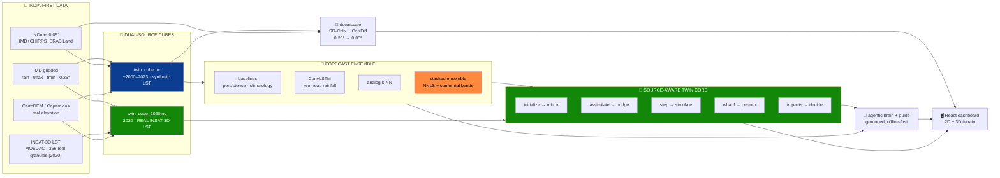

<!-- ░░░ ANIMATED BANNER ░░░ -->
<p align="center">
  
</p>

<p align="center">
  <a href="https://git.io/typing-svg">
    
  </a>
</p>

<!-- ░░░ BADGES ░░░ -->
<p align="center">
  
  
  
</p>

<p align="center">
  
  
  
  
  
  
  
  
</p>

---

> **Not a forecast model — a digital twin.** It mirrors a live gridded climate state, **assimilates**
> observations, **simulates** forward with a trained neural ensemble, **downscales** to ~5 km, runs
> **"what-if"** scenarios with decision-ready impacts, and can be **driven in plain English** by a
> grounded, offline-first AI agent.
>
> 📍 Pilot **Delhi-NCR** · 🌧️ rainfall + 🌡️ Tmax/Tmin · ⏱️ 1–14 day horizon · 🛰️ **dual-source: IMD (synthetic LST) + real INSAT-3D/MOSDAC LST (2020)**

---

## 🛰️ Built for the Bharatiya Antariksh Hackathon 2026

The **third edition** of the Bharatiya Antariksh Hackathon — a national innovation initiative by the
**Indian Space Research Organisation (ISRO)**, powered by **Hack2skill** — challenging student
innovators across India to build for the nation's future in space.
**ClimaTwin India** is Team CodeCatalysts' answer: an India-first climate digital twin, scaled honestly
to hackathon compute.

---

## 👥 Team CodeCatalysts

| 🧑‍🚀 Member | 🎖️ Role | ✉️ Email |
|---|---|---|
| **Ayush Sharma** | 👑 Team Leader | iayushsharma.2008@gmail.com |
| **Gaurika Kindra** | Member | kindragaurika21@gmail.com |
| **Vardaan Dua** | Member | vardaandua333@gmail.com |
| **Paavni Jain** | Member | jainpaavni06@gmail.com |

---

## 🌍 What it does, in one picture



All three Earth-2 stages — **assimilate → forecast → downscale** — are present, wrapped in a real twin
loop, an honest validation harness, an AI layer, and a dashboard. The **same forecaster-agnostic twin
class** drives two interchangeable data regimes: the validated **synthetic** full record, and a
read-only **INSAT-3D** regime carrying **real ISRO satellite Land Surface Temperature** for 2020.

---

## ✨ Why it's different

| | |
|---|---|
| 🔁 **A real twin, not a CNN + chart** | The full loop lives in `twin/climate_twin.py`: mirror · α-nudge assimilate · forward sim · what-if perturb · decision impacts · drift-vs-reality. |
| 🛰️ **Dual data-source, one twin** | A source switcher flips between the **synthetic** full-record regime and a real **INSAT-3D/MOSDAC** regime (2020). One source-aware twin + grounded AI operate either regime with no code change. |
| 🌐 **Real 3D terrain + real satellite LST** | The INSAT-3D regime renders on a **3D CartoDEM relief** (three.js, ×1.6 exaggeration) with **real INSAT-3D Land Surface Temperature** draped on it, plus a procedural atmosphere and a MOSDAC offline basemap in 2D. |
| 🧠 **No single model wins — so we stack honestly** | Persistence, climatology, **analog k-NN** and a **two-head ConvLSTM** each win different cells; an **NNLS stacked ensemble** blends them per variable/horizon with **split-conformal 90% bands** and verified coverage. |
| 🔬 **Generative downscaling, scored right** | A **CorrDiff-style residual diffusion** model super-resolves 0.25° → **5 km** vs real **INDmet** truth, judged on **FSS / CRPS / power-spectrum** — not just pixel RMSE. |
| 🤖 **Operable in plain English** | An **offline-first agentic brain** (plan → execute → critic → explain → grounding guard) *calls the twin's own tools* and cites every number `[tool:field]`. |
| 🇮🇳 **Indigenous data, end-to-end** | Real **IMD** + **INDmet** + real **elevation** + real **INSAT-3D/MOSDAC** LST. Atmanirbhar, no foreign backbone. |
| 📈 **Scalable by construction** | The pilot region is **one line in `config.py`** — change it and the whole cube → model → dashboard rebuilds with no code edits. |

---

## 🛰️ Dual-source regime — synthetic vs real INSAT-3D (2020)

ClimaTwin now ships **two data regimes**, selectable live from the dashboard's source switcher and via the
`source=` API param:

| | `synthetic` (default) | `insat_real` |
|---|---|---|
| **Record** | full ~2000–2023 | **2020 only** |
| **LST channel** | synthetic-demo (not surfaced as a layer) | **real INSAT-3D LST** (observation layer) |
| **Real granules** | — | **366** `3DIMG_*_L2B_LST_V01R00.h5` (one per 2020 day, ~0600 UTC overpass) |
| **LST coverage** | — | **0.6414** (cloud-gapped, gap-filled) |
| **Forecasters** | persistence · climatology · analog · ConvLSTM · **ensemble** | persistence · climatology · ConvLSTM *(if `convlstm_2020.pt` present, else read-only/PENDING)* |
| **Status** | validated default | read-only satellite-data showcase |

Real LST is pulled through a **native MOSDAC client** (`data/mosdac_client.py`, ISRO's `mdapi` HTTP
contract, lockout-safe auth) and a **one-overpass-per-day** downloader, decoded from HDF5
(`_FillValue` mask → scale/offset → Kelvin→°C → regrid onto the 0.25° grid), and fused into the focused
`data/twin_cube_2020.nc`. LST is **never a forecast variable** — it is a read-only observed layer.

> 🔭 **Honest scope:** the real-LST integration is **single-year (2020) and read-only**, and the full
> multi-year `twin_cube.nc` still serves a clearly-tagged `synthetic_demo` LST channel (the committed
> ConvLSTM was trained on it). Fusing real LST into the full multi-year cube is flagged out-of-distribution
> roadmap. No "real-time INSAT", no multi-year real LST claims.

---

## 📸 Gallery

The live mission-control dashboard (all images live in [`assets/pictures/`](assets/pictures/)).

| Overview | Twin · drift & re-sync | Explore · map + timeline |
|:--:|:--:|:--:|
| [](assets/pictures/01-overview-mission-control.png) | [](assets/pictures/02-twin-free-run-drift.png) | [](assets/pictures/03-explore-map-tmax.png) |
| **What-If · scenario diff** | **Validation · honest leaderboard** | **Downscale · rainfall SR** |
| [](assets/pictures/04-whatif-scenario-diff.png) | [](assets/pictures/05-validation-skill-leaderboard.png) | [](assets/pictures/06-downscale-rainfall-srcnn.png) |
| **Downscale · temp (honest −ve)** | **Command Console · grounded brain** | **Compare models** |
| [](assets/pictures/07-downscale-tmin-diffusion.png) | [](assets/pictures/08-command-console-brain.png) | [](assets/pictures/11-compare-models-modal.png) |

### 🛰️ NEW — real INSAT-3D regime, 3D terrain & MOSDAC basemap

| Source switcher | 3D terrain · Tmax drape | 3D · real INSAT-3D LST |
|:--:|:--:|:--:|
| [](assets/pictures/12-source-switcher-insat.png) | [](assets/pictures/13-explore-3d-terrain-insat.png) | [](assets/pictures/14-explore-3d-insat-lst.png) |
| **2D · MOSDAC offline basemap** | **What-If on INSAT-3D regime** | |
| [](assets/pictures/15-explore-2d-mosdac-lst.png) | [](assets/pictures/16-whatif-insat-mosdac.png) | |

- **12 · Source switcher** — toggle synthetic (IMD · synthetic LST, 2000–2023) vs INSAT-3D (IMD · real fused LST, 2020).
- **13 · 3D terrain** — real CartoDEM relief (×1.6) with Tmax draped; orbit/zoom controls.
- **14 · Real INSAT-3D LST** — observed Land Surface Temperature (18.9–50.8 °C, plasma) draped on the DEM — the satellite-data headline.
- **15 · MOSDAC basemap** — offline ADM1 boundaries + graticule + coverage locator under the Delhi-NCR grid.
- **16 · What-If on INSAT-3D** — scenario ΔTmax diff over the MOSDAC basemap with presets, sliders, impact bar.

<details>
<summary>More — guide assistant</summary>

| In context | Panel close-up |
|:--:|:--:|
| [](assets/pictures/09-downscale-guide-assistant.png) | [](assets/pictures/10-guide-assistant-panel.png) |

</details>

---

## 📊 Results — real IMD, temporal test split 2022–23 (baseline-relative)

RMSE, **best in bold**. Ensemble is leakage-safe: fit on val 2019–20, conformal-calibrated on val 2021,
scored on untouched test 2022–23.

| Lead | 🌧️ rainfall (mm) | 🌡️ tmax (°C) | 🌡️ tmin (°C) |
|---|---|---|---|
| **1-day** | **ensemble 7.35** · analog 7.38 · convlstm 7.40 | **ensemble 1.51** · convlstm 1.55 | **ensemble 1.05** · analog 1.16 |
| **3-day** | **ensemble 7.96** · analog 8.04 | **ensemble 2.36** · analog 2.43 | **ensemble 1.64** · analog 1.75 |
| **7-day** | **convlstm 8.03** · ensemble 8.04 | **ensemble 2.72** · analog 2.82 | **ensemble 1.82** · clim 1.93 |

- 🎯 **Rain detection (1-day @ 2.5 mm):** ensemble **POD 0.64 · CSI 0.37 · FAR 0.53** vs persistence 0.45 / 0.29 / 0.55.
- 📏 **Conformal coverage (90% target):** rainfall 0.90 · tmax 0.87–0.93 · tmin 0.89–0.94 — honest, not decorative.
- 🔬 **Diffusion downscaler (rainfall):** FSS@2.5 mm **0.82 vs bilinear 0.68**; ≈2.3× more recovered texture; RMSE 4.42 vs 5.34.
- 🤝 **Temperature diffusion — honest negative result:** on smooth temp fields bilinear is already near-optimal (~0.12 °C); diffusion over-textures, so we keep it labeled, not headlined.

> 🛰️ **2020 INSAT-3D regime (1-day lead, 61-day Nov–Dec test):** validated separately with `lst_coverage 0.6414`.
> Because the single-year month split leaves **no overlapping day-of-year** between train and test, the
> **climatology column is a degenerate artifact** (predicting ≈0 is near-right for a dry Delhi winter) — *not skill*.
> The **meaningful comparison for this regime is ConvLSTM vs persistence**. The twin's dryness/SPI path is fixed
> by fitting rain climatology over the **multi-year** 2000–2018 train window so every day-of-year has support.

---
> **Prerequisites**
>
> Before running the project locally, ensure you have the following installed:
>
> - Python 3.13+
> - Node.js and npm
> - Git

## ⚡ Quickstart

```bash
make install      # Python 3.13 venv + deps (torch + geo stack)
make data         # build twin_cube.nc (IMD if available, else offline synthetic)
make train        # train the ConvLSTM forecaster  → models/checkpoints/convlstm.pt
python -m models.ensemble --fit   # fit NNLS blend + conformal bands
make validate     # honest leaderboard vs baselines
make serve        # FastAPI → http://127.0.0.1:8000  (docs at /docs)

cd frontend && npm install && npm run dev   # dashboard → http://localhost:5173
```

> 🥇 **Golden rule:** retrain the ConvLSTM → re-run `models.ensemble --fit` **and** `make validate`.
> The ensemble weights and the leaderboard depend on it.

🖥️ **Dashboard:** six views — **Overview · Twin · Explore · What-If · Validation · Downscale** — plus a
global **Command Console** (ask in English), **Cmd+K** palette, **data-source switcher**, **2D/3D toggle**,
compare mode, PNG export, live WebSocket sync, rain particles, and heat-stress pulses. Dark mission-control
theme + light mode.

---

## 🔌 API at a glance

Most data endpoints accept a `source=` param (`synthetic` | `insat_real`, default `synthetic`); unknown
values silently fall back to synthetic.

| Endpoint | Purpose |
|---|---|
| `GET /meta` | data sources + grid + models + default model |
| `GET /state?date=&source=` | observed twin state + impacts (regime-aware) |
| `GET /forecast?model=&horizon=&uncertainty=&source=` | roll-forward fields + conformal bands (uncertainty: synthetic only) |
| `GET /analog?date=&horizon=` | analog ensemble + matched past IMD days (synthetic only) |
| `POST /whatif?source=` | ΔTemp / rainfall× / urban polygon → diff map + impacts |
| `GET /twin/run` + `WS /ws/twin` | reality-vs-twin drift + sync %, streamed live |
| `GET /downscale?var=` · `/downscale/diffusion?var=` | SR-CNN & diffusion super-resolution + skill *(source validates date only; data always synthetic INDmet truth)* |
| `GET /terrain` | DEM terrain payload (powers the 3D relief) |
| `GET /validate?source=` | baseline-relative metrics + conformal calibration |
| `GET /brain?q=&source=` · `/brain/anomaly?source=` | agentic cited answer + autonomous anomaly scan |
| `GET /guide?view=&q=&source=` | plain-language explainer for the current screen |

Full schema in [`docs/architecture.md`](docs/architecture.md) and at `/docs` when serving.

---

## 🗺️ Roadmap


---

## 📚 Documentation

| Need | File |
|---|---|
| Architecture, twin-core, API | [`docs/architecture.md`](docs/architecture.md) |
| Data sources & preprocessing | [`docs/datasets.md`](docs/datasets.md) |
| SOTA & why each decision | [`docs/research.md`](docs/research.md) |
| Requirements, features, demo | [`docs/prd.md`](docs/prd.md) |
| Roadmap, phases, rubric | [`docs/implementation.md`](docs/implementation.md) |
| Slide-by-slide deck | [`docs/pptcontent.md`](docs/pptcontent.md) |

---

## 🤝 Honesty notes

Skill is always reported **vs persistence/climatology baselines**; splits are **temporal** (no leakage);
every fitted stat is **train-years-only**; the demo runs **offline** from cached cubes.

**Real INSAT-3D LST is genuinely integrated** — 366 real MOSDAC granules decoded and fused into a focused
2020 cube (`lst_coverage 0.6414`) — but stay honest about scope: it is a **single-year (2020), read-only**
regime (the 2020 forecaster is **PENDING** until `convlstm_2020.pt` arrives), LST is an **observation layer,
never a forecast variable**, and the **full multi-year `twin_cube.nc` still serves a clearly-tagged
`synthetic_demo` LST channel**. No real-time INSAT, no multi-year real LST.

The **2020 climatology RMSE numbers are degenerate artifacts** (no shared day-of-year between train and
test), not skill — the meaningful comparison there is ConvLSTM vs persistence. **Elevation is real**
(CartoDEM/Copernicus GLO-30). Diffusion downscaling is scored on spatial/spectral skill, with RMSE shown
alongside, and temperature diffusion is kept as an **honest negative result**.

---

<p align="center">
  <em>Build the loop. Use India's data. Validate honestly. Keep the demo offline and rehearsed.</em>
</p>
<p align="center">
  <strong>— Team CodeCatalysts · ClimaTwin India 🇮🇳🛰️</strong>
</p>

<p align="center">
  
</p>
