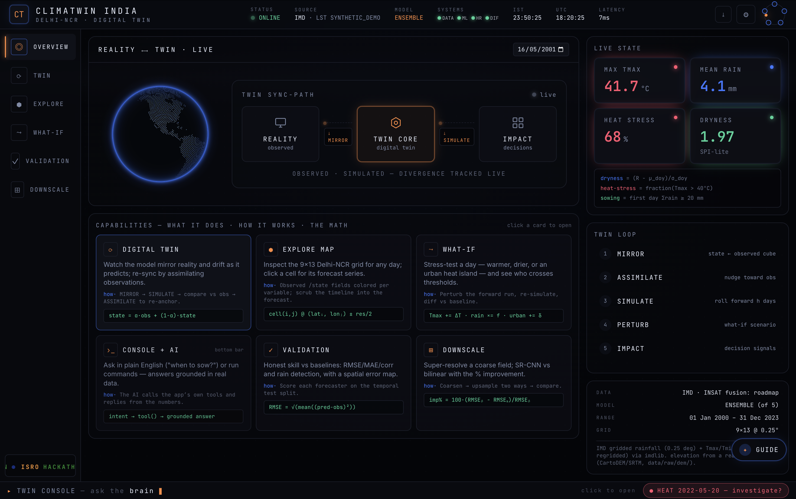
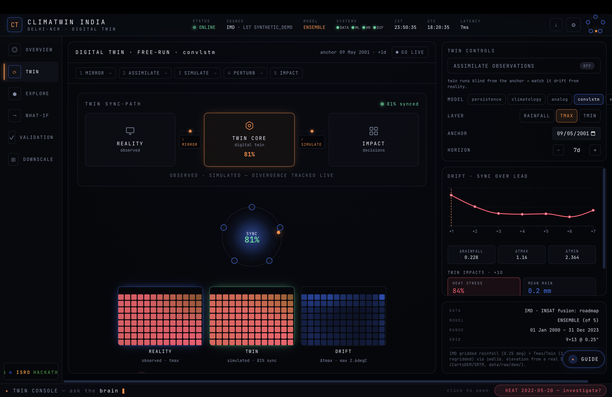
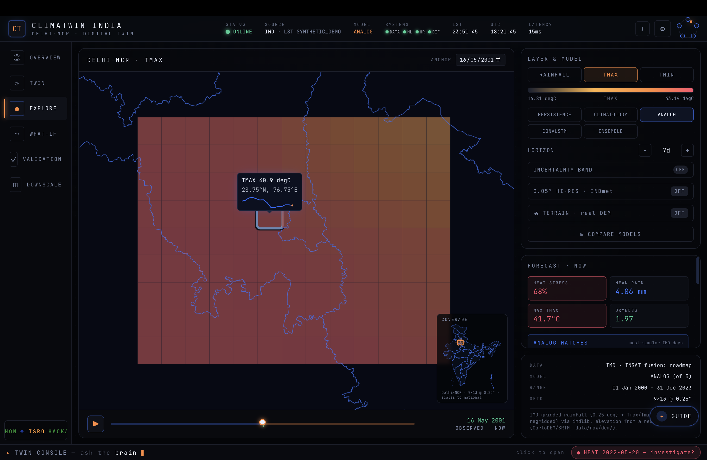
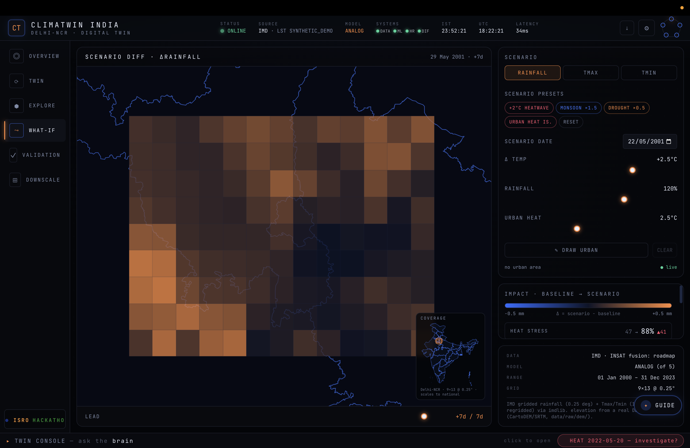
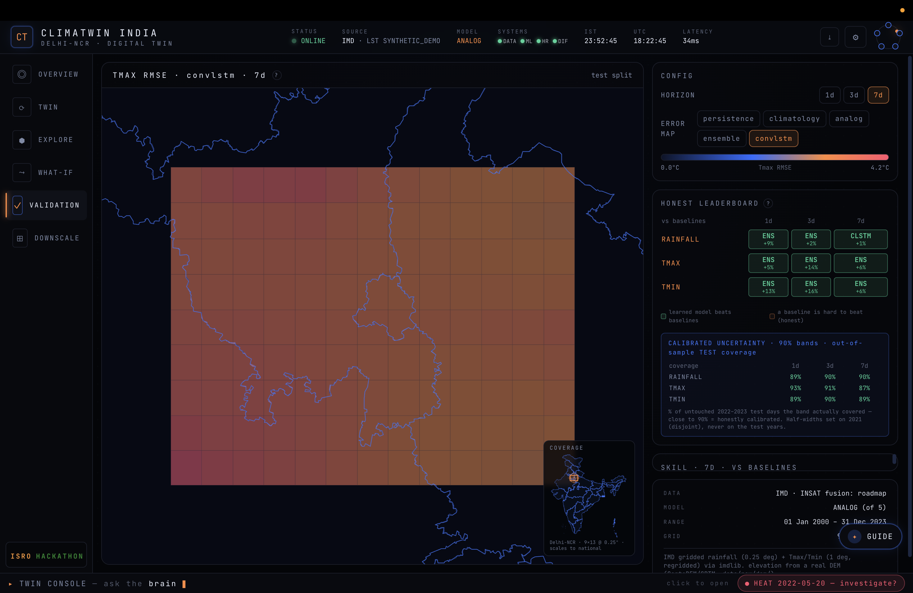
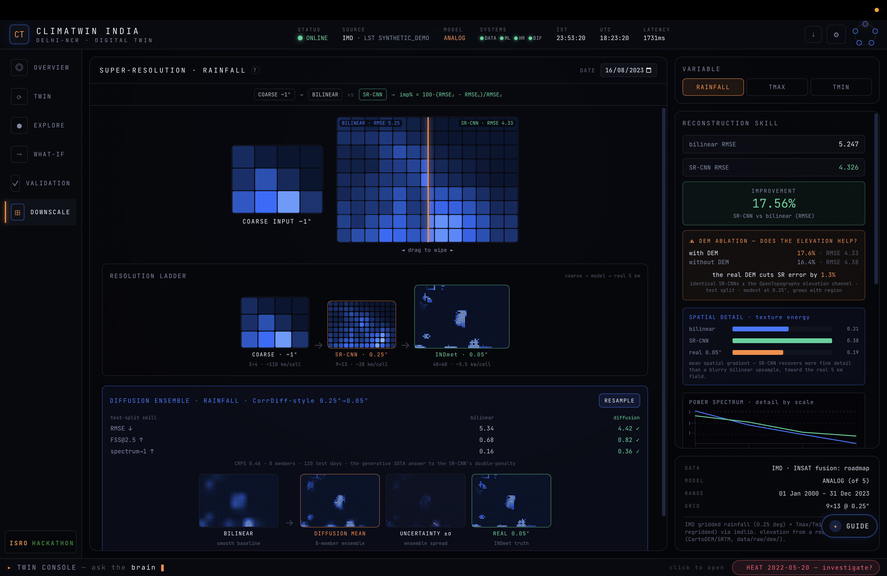
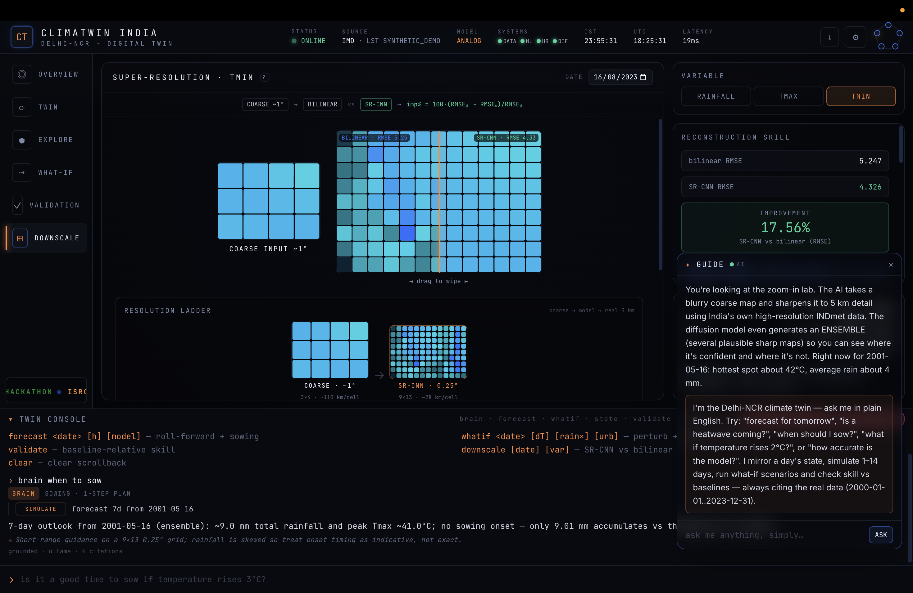
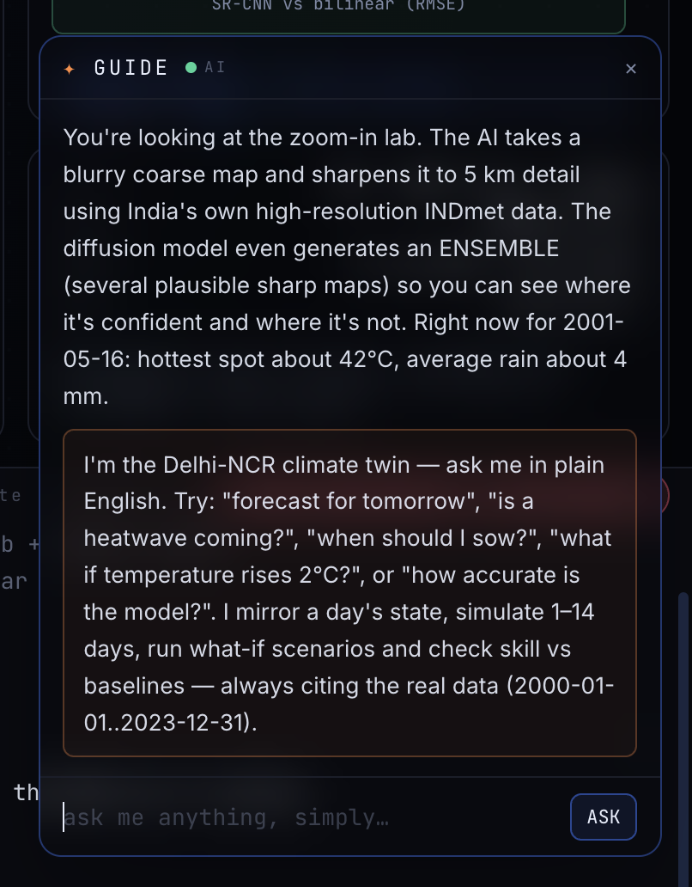
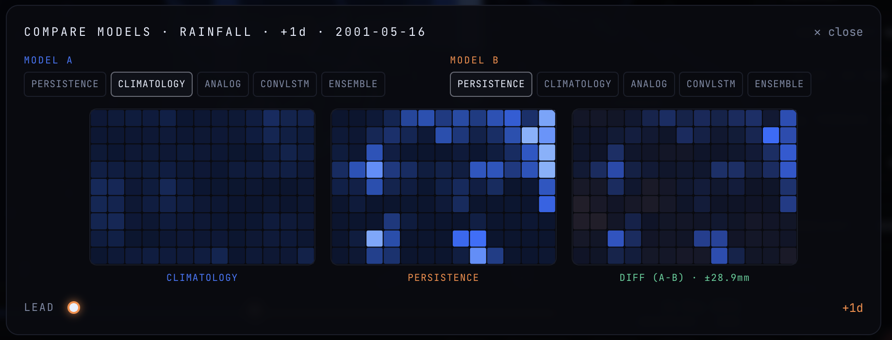

<!-- ░░░ GALLERY BANNER ░░░ -->

  

  
  
  

> Screenshot gallery of the **ClimaTwin India** dashboard (Delhi-NCR digital twin). All shots are from the
> live React + FastAPI app running offline from the cached cube. Files are numbered in tour order — use
> them in slides, the PRD, or the root README. Referenced from `../../README.md`,
> `../../frontend/README.md`, and `../../backend/README.md`.

---

## 1 · Overview — Mission Control

The home screen: spinning globe, the **TWIN SYNC-PATH** (REALITY → TWIN CORE → IMPACT), live state tiles
(Max Tmax, Mean Rain, Heat Stress, Dryness), the 5-stage twin loop, and the capability cards with the math.

---

## 2 · Twin — free-run drift & re-sync

The genuine twin loop: the digital twin runs **free** from the anchor and drifts from reality. The sync
gauge (81%), the **DRIFT · SYNC OVER LEAD** curve, and the side-by-side **REALITY ⟷ TWIN ⟷ DRIFT**
heatmaps show divergence; flipping **ASSIMILATE** re-anchors it.

---

## 3 · Explore — map + timeline

The 9×13 Delhi-NCR grid over a dark India map, colored by variable (Tmax here). Click a cell for its
forecast series, scrub the past→now→forecast timeline, switch model (analog), and toggle hi-res / terrain.

---

## 4 · What-If — scenario diff

Counterfactual simulator: presets (+2 °C heatwave, monsoon ×1.5, drought ×0.5, urban heat island) and
ΔTemp / rainfall / urban-heat sliders produce a **diverging diff map** (scenario − baseline) plus impact
deltas (heat stress 47 → 88 %).

---

## 5 · Validation — honest leaderboard

The honesty scoreboard: a per-cell **Tmax RMSE error map** on the untouched 2022–23 test split, the
baseline-relative leaderboard (ENS / CLSTM win %), and **calibrated 90 % uncertainty** out-of-sample
coverage (close to 90 % = honestly calibrated).

---

## 6 · Downscale — rainfall super-resolution

Drag-to-wipe **bilinear vs SR-CNN** (17.56 % RMSE improvement), the resolution ladder (coarse → SR-CNN
0.25° → INDmet 0.05°), the **CorrDiff diffusion ensemble** (mean / uncertainty / truth), the DEM-ablation,
and the power-spectrum / texture-energy panels. Rainfall is the headline diffusion win (FSS 0.82 vs 0.68).

---

## 7 · Downscale — temperature (honest negative result)

The same pipeline on Tmin: on smooth temperature fields bilinear is already near-optimal, so the diffusion
**over-textures** and does *not* beat bilinear. Kept and labeled for honest comparison, not as a win.

---

## 8 · Command Console — the grounded brain

Ask in plain English ("when to sow"). The agentic brain plans a 1-step SIMULATE, runs the real tool, and
answers grounded in the numbers — *"no sowing onset — only 9.01 mm accumulates vs the 20.0 mm threshold"*
— with `grounded · ollama · 4 citations`.

---

## 9 · Guide assistant (in context)

The always-on plain-language guide open over the Downscale view — explaining the screen for non-experts
and grounded in the same tools.

---

## 10 · Guide assistant — panel

Close-up of the guide panel: a jargon-free screen explainer plus an "ask me anything, simply…" box.

---

## 11 · Compare models — side by side

The compare modal: pick **Model A vs Model B** (climatology vs persistence here) for a variable and lead
day, and see both fields plus the **diff (A − B)** map.

---

<em>Six views, one twin, zero fabricated numbers — Team CodeCatalysts 🛰️</em>

