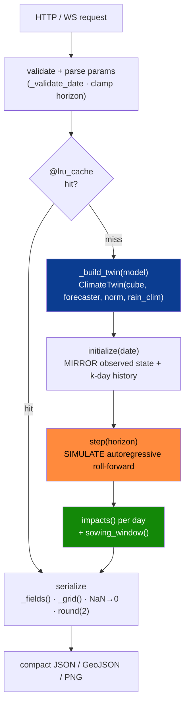
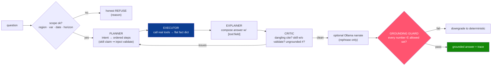
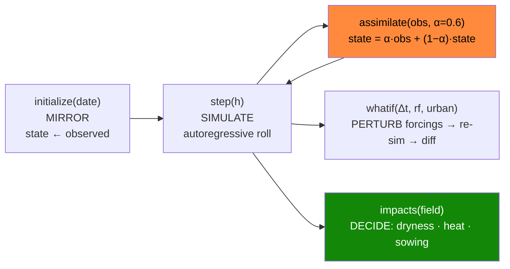

<!-- ░░░ BACKEND BANNER ░░░ -->
<p align="center">
  
</p>

<p align="center">
  
  
  
  
  
</p>

> The backend is the **twin engine**: it loads one cached climate cube, wraps it in the five-stage twin
> loop, serves every forecast/what-if/validation through a cached FastAPI surface, streams a live twin
> run over WebSocket, and answers plain-English questions through a **grounded agentic brain that
> cannot fabricate a number**. Everything runs **offline** from `twin_cube.nc` + saved checkpoints.

---

## 📁 Files

| File | Role | LOC |
|---|---|---|
| `app.py` | FastAPI service — 18 endpoints + `WS /ws/twin`, caching, warm-start | ~1030 |
| `brain.py` | Agentic brain — planner → executor → critic → explainer → grounding guard | ~710 |
| `guide.py` | Always-on plain-language screen explainer (per-view help + glossary) | ~195 |
| `ai_engine.py` | Simple intent answerer for `GET /ai` | ~255 |
| `smoke_test.py` | End-to-end import + endpoint smoke test | ~90 |

Imports from the wider repo: `twin/climate_twin.py` (the loop), `models/*` (forecasters), `config.py`.

---

## 🧭 Request → twin → response (lifecycle)



**Boot (`lifespan`, app.py:64–152):** load `twin_cube.nc` once → register forecasters in priority order
`ensemble > convlstm > climatology > analog > persistence` → pick `default_model` as the first present →
**warm-cache** the featured date's state + 7-day forecast so the dashboard never lags → optionally load
`indmet_cube_005.nc` (0.05° hi-res) → optionally enable Ollama (`climatwin-ft`) unless `OLLAMA_DISABLE=1`.

**State singleton (app.py:41–54)** holds `cube`, `norm`, `rain_clim`, `forecasters`, `dates`, `lats/lons`,
per-var `ranges` (2–98th pct), `data_source`, `default_model`, optional `indmet`, and `featured` date.

**Serialization helpers (app.py:167–184):** `_grid()` NaN→0 + round to `ROUND=2`; `_fields()` one grid per
`cfg.VARS` channel; `_validate_date()` bounds-checks `YYYY-MM-DD` against the cube date range.

---

## 🔌 Endpoint reference

> Default forecast model = `ensemble`, falling back `convlstm > climatology`. CORS is open (`*`) for the
> Vite dev server. Interactive docs at **`/docs`** when serving.

| Method · Path | Stage | Key params | Returns | Cache |
|---|---|---|---|---|
| `GET /health` | — | — | `{status, data_source, dates, region}` | — |
| `GET /meta` | — | — | grid, bbox, vars, units, colorbar ranges, split, models, thresholds, availability flags | — |
| `GET /state` | MIRROR | `date?` | observed `fields` + `impacts` | 512 |
| `GET /forecast` | SIMULATE | `date? horizon(1–14) model? uncertainty? samples(5–60)` | `days[]` + `sowing_window` (+ `std`/`analogs`/conformal bands) | 512 |
| `GET /analog` | SIMULATE | `date horizon` | analog k-NN forecast + matched past IMD dates | 256 |
| `POST /whatif` | PERTURB | body `WhatIfRequest` | per-day `baseline/scenario/diff` + impacts + sowing | — |
| `GET /highres` | MIRROR | `date? var` | real INDmet **0.05°** observed field | 256 |
| `GET /terrain` | MIRROR | — | real Copernicus GLO-30 elevation grid | 1 |
| `GET /twin/run` | ASSIMILATE | `date? horizon assimilate model?` | reality-vs-twin `days[]` + `divergence` + `sync_pct` | 128 |
| `WS /ws/twin` | live | `date? horizon assimilate model? interval_ms(120–3000)` | `init` → `tick`×N → `done` frames | — |
| `GET /validate` | SKILL | — | `horizons[h][model][var]` RMSE/MAE/corr (+ categorical) + conformal calibration | — |
| `GET /downscale` | SIMULATE | `date? var` | coarse · bilinear · SR-CNN + RMSE + DEM ablation | — |
| `GET /downscale/diffusion` | SIMULATE | `date samples(2–24) var` | bilinear · ensemble mean/std · truth · CRPS/FSS metrics | 64 |
| `GET /ai` | — | `q` | simple intent answer | — |
| `GET /brain` | agentic | `q date?` | full trace: `plan · facts · answer · citations · caveat` | — |
| `GET /brain/anomaly` | agentic | — | autonomous heat/dryness anomaly vs train thresholds | — |
| `GET /guide` | — | `view variable model? date? q?` | plain-language screen explainer | — |
| `GET /` | — | — | service info + endpoint index | — |

**Uncertainty variants of `/forecast`:** MC-dropout (`std` per day, `uncertainty_method:"MC-dropout"`),
analog ensemble spread (`analogs[]`, `k`), and stacked-ensemble **split-conformal 90% bands**
(`uncertainty_method:"split-conformal-90"`).

**`WS /ws/twin` protocol:** `{"type":"init", …grid/dates/model…}` → repeated
`{"type":"tick","lead_day","date","stage":"SIMULATE"|"ASSIMILATE", …entry…}` paced by `interval_ms` →
`{"type":"done","steps":N}`. Disconnects handled gracefully; errors sent as `{"type":"error","message"}`.

**Sync metric:** `sync_pct = max(0, 1 − tmax_divergence / 6) × 100` (6 °C drift ⇒ 0 % sync).

---

## 🧠 The agentic brain (`brain.py`)

The brain **operates the twin's own tools** and answers in plain English with **every number cited
`[tool:field]`**. It has **no hard LLM dependency** — an optional Ollama model may only *rephrase*
grounded text, and a final guard rejects any number not traceable to a tool result.



**Grounding contract (brain.py:88–146).** `_collect_numbers()` harvests every numeric leaf from the fact
tree; `_allowed_numbers()` = those numbers ∪ config thresholds ∪ grid dims ∪ date bounds; `_numbers_in()`
extracts numbers a reader sees (skipping `[tool:field]` tokens and ISO dates); `_is_grounded()` asserts
**every** visible number is in the allowed set. `_num_forms()` matches a value across renderings
(`str`, `:g`, round-1, round-2, int) so a slight rephrase still validates.

**Scope guards (brain.py:64–83, 200–224).** Regex refusals for other regions (Maharashtra, Mumbai…) and
other variables (humidity, wind, AQI, PM2.5…); `_scope_violation()` also enforces date range, year range,
and `horizon ≤ max_horizon`. Out-of-scope ⇒ honest refusal, never a guess.

**Tools the brain calls (flat, citable facts):**

| Tool | Returns |
|---|---|
| `state(date)` | `max_tmax · mean_rain · heat_pct · dryness` |
| `forecast(date,h)` | `total_rain · peak_tmax · sowing_ok · onset_lead_day · accumulated_rain_mm · threshold_mm` |
| `whatif(date,Δt,rf)` | `base_tmax/scen_tmax · base_heat/scen_heat · base_sowing/scen_sowing` |
| `validate()` | `best:{var:model} · pod · csi` (auto-injected before any accuracy claim) |
| `twin(date,h)` | `free_sync_start/end · assim_sync_end · drift_end` |

**Intents:** `help · state · forecast · sowing · whatif · validate · twin` plus brain-only `investigate`
("why / unusual / anomaly") and `compound` (a decision question *and* a scenario perturbation).
`_perturbation()` parses Δtemp + rain-factor from natural language (e.g. "half the rain" → 0.5,
"2 °C warmer" → +2, clamped to ±10).

**Anomaly scan (brain.py:546–615).** Train-years-only thresholds (98th-pct grid-peak Tmax for heat;
5th-pct 30-day rainfall accumulation for dryness), scanned over the **unseen test split** — no leakage.
Heat takes priority over dryness; returns a `suggested_question` to investigate.

---

## 💬 `guide.py` & `ai_engine.py`

- **`guide.py`** — per-view templates (`overview/explore/twin/whatif/validation/downscale`) + a jargon
  **glossary** (digital twin, assimilate, ensemble, conformal, downscale, diffusion…). Conceptual
  questions answer from the glossary; data questions delegate to the brain (already grounded). LLM model
  chain: `OLLAMA_GUIDE_MODEL → OLLAMA_MODEL → deterministic`.
- **`ai_engine.py`** — lightweight `detect_intent → gather (call tools) → draft → optional rephrase`.
  Provider chain `Gemini → Ollama → grounded`; LLM failure always downgrades to grounded, never crashes.

---

## 🔁 Twin core (`twin/climate_twin.py`)

The five non-negotiable methods (plus `run_twin` and `sowing_window`):



| Method | Formula / behaviour |
|---|---|
| `initialize(date)` | load `(C,H,W)` observed state + last `K_INPUT=7` days as history |
| `assimilate(obs, α=0.6)` | **nudging** `state = α·obs + (1−α)·state` (honest "simplified scheme", not Kalman) |
| `step(horizon=1)` | `model.forecast(history, date, h)`, rainfall clipped to `[0,∞)` |
| `whatif(Δt, rf, urban_mask, urban_lst, h)` | perturb **forcings** (Tmax/Tmin += Δt, rain ×= rf, urban cells += LST) then re-simulate → `{baseline, scenario, diff}` |
| `impacts(field, date)` | `dryness_index` (SPI-lite `(rain−clim_mean)/clim_std`), `heat_stress_fraction` (Tmax>40 °C), `mean_rainfall_mm`, `max_tmax_c`, `wet_cell_fraction` (≥2.5 mm) |
| `sowing_window(fields)` | first lead day where accumulated grid-mean rain crosses `SOWING_ONSET_MM=20` |
| `run_twin(date, h, assimilate)` | MIRROR then per-day SIMULATE vs reality; free-run drifts, assimilation re-centers — the demo of "why it's a twin" |

Perturbing **forcings** (not the init state) keeps the counterfactual interpretable for *any* forecaster,
including climatology which ignores init state. SPI-lite uses **train-years-only** climatology — no leakage.

---

## ⚙️ Config knobs (`config.py`)

```python
PILOT = {"name":"Delhi-NCR", "lat":[27.5,29.5], "lon":[75.5,78.5], "res_deg":0.25, "years":(2000,2023)}
SPLIT = {"train":(2000,2018), "val":(2019,2021), "test":(2022,2023)}   # temporal — never random
VARS  = ["rainfall","tmax","tmin"];  RAIN,TMAX,TMIN = 0,1,2            # (C,H,W) order → 9×13 = 117 cells
K_INPUT=7;  H_HORIZON=7;  MAX_HORIZON=14
FEATURED_DATE="2001-05-16"            # curated *active* day (Tmax≈42°C) so the demo never lands on zeros
RAIN_WET_DAY_MM=2.5;  HEAT_STRESS_TMAX_C=40.0;  SOWING_ONSET_MM=20.0
ASSIMILATION_ALPHA=0.6                # 60% obs, 40% inertia
```

> **Region is config-driven** — change the `PILOT` bbox and rebuild the cube; no code edits. That single
> line *is* the "scalable to national" deliverable.

---

## ⚡ Run it

```bash
make serve                              # uvicorn backend.app:app --reload → http://127.0.0.1:8000
python -m backend.smoke_test            # import + endpoint smoke test
open http://127.0.0.1:8000/docs         # interactive OpenAPI
```

**Environment variables (all optional — backend is offline-first):**

| Var | Effect |
|---|---|
| `OLLAMA_MODEL` | enable LLM *rephrasing* in brain/ai (grounding guard still enforced) |
| `OLLAMA_GUIDE_MODEL` | separate model for the guide (falls back to `OLLAMA_MODEL`) |
| `OLLAMA_HOST` | default `127.0.0.1:11434` |
| `OLLAMA_DISABLE=1` | force fully-deterministic mode |
| `GEMINI_API_KEY` / `GOOGLE_API_KEY` | optional Gemini rephrase in `ai_engine` |

---

## 🚀 Caching & performance

`@lru_cache` on every read path — `512` (state/forecast/highres), `256` (analog/uncertainty/twin-run),
`128`, `64` (diffusion), `1` (terrain). The **warm-start** pre-renders the featured date on boot. Payloads
are NaN-scrubbed, rounded to 2 decimals, and downsampled to what the frontend renders — never raw float64
grids. The whole service runs from the cached cube + checkpoints, so the **demo never needs a live download**.

---

<p align="center"><em>National data first · baselines before claims · temporal splits only · honesty over hype.</em></p>
