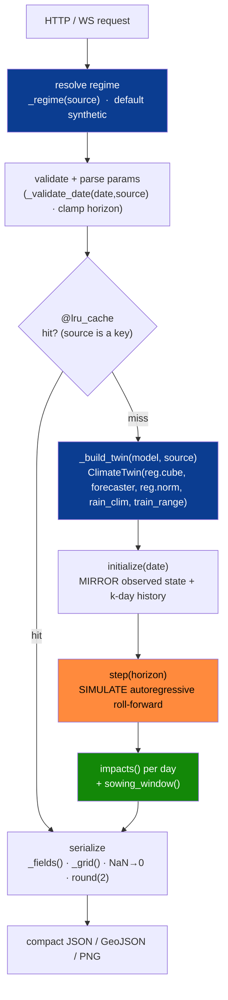
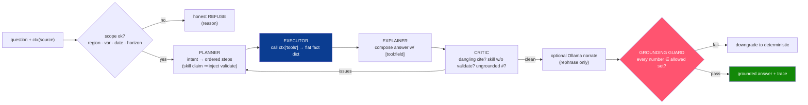
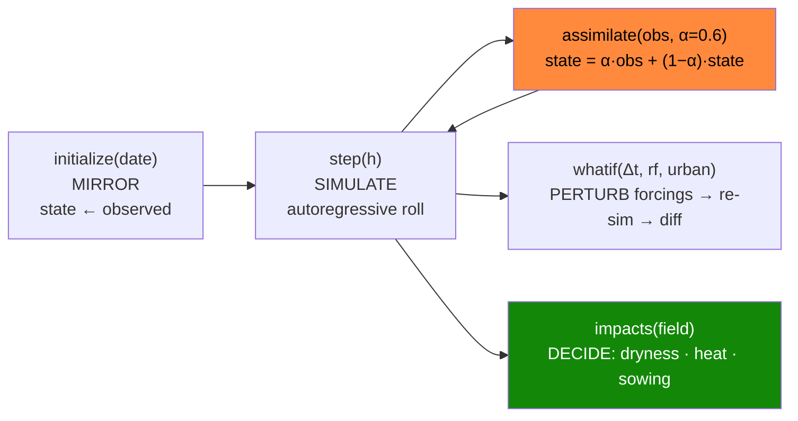
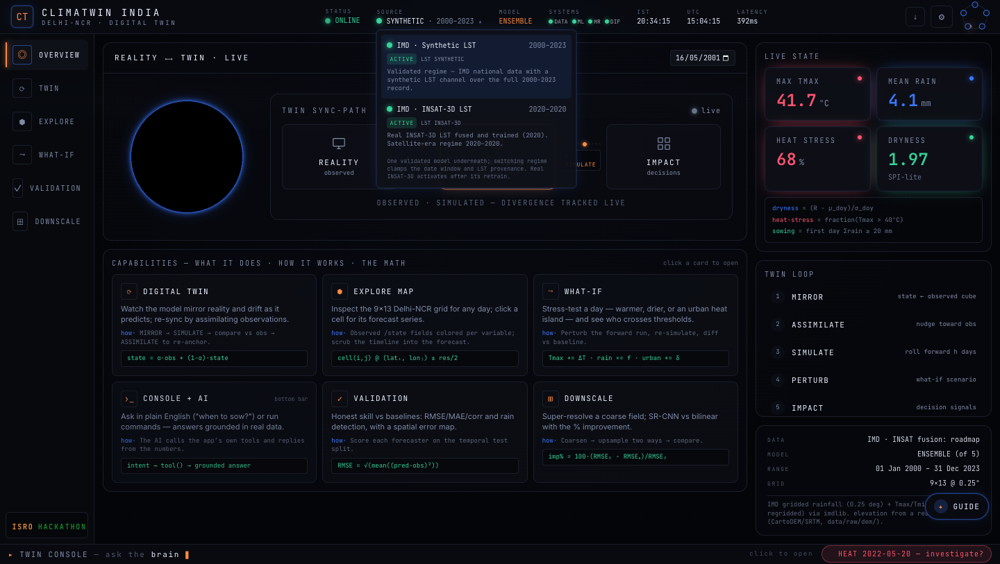
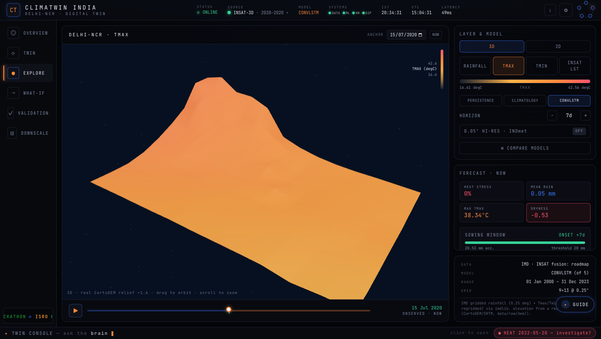
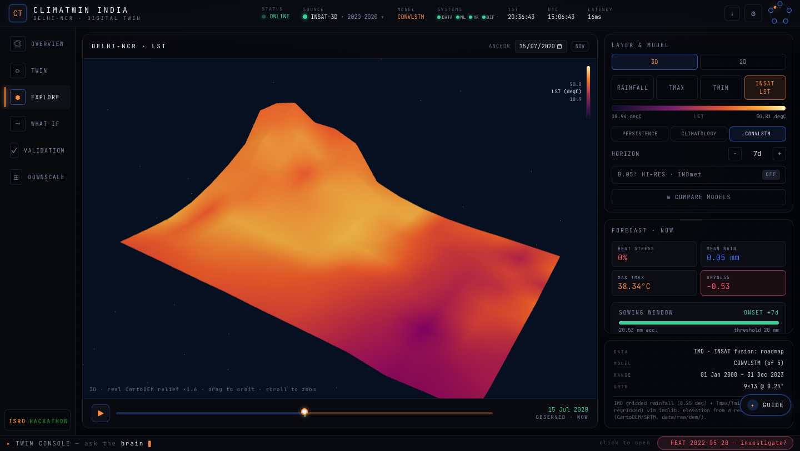
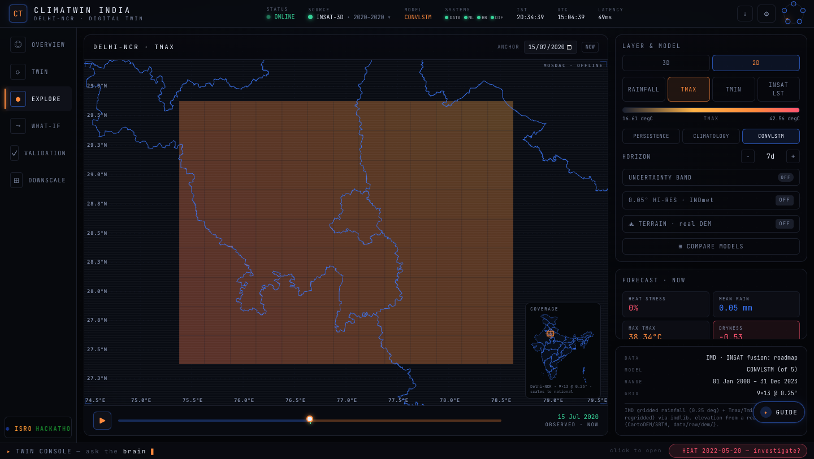
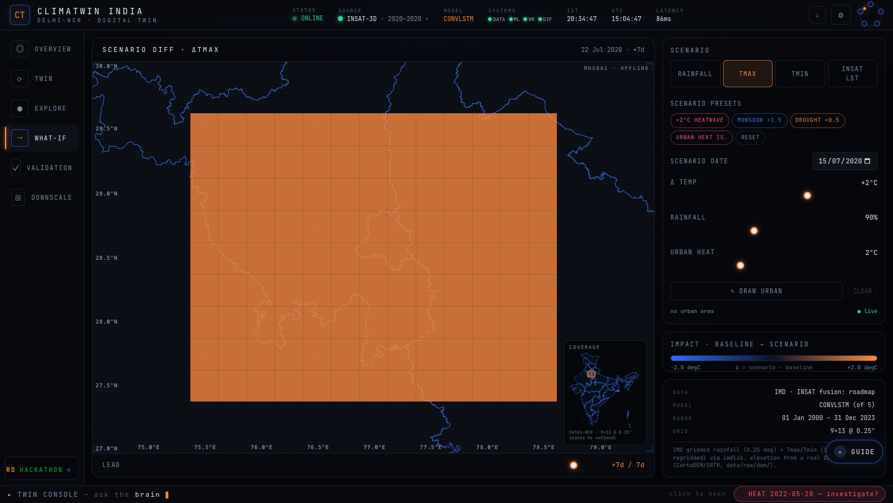

<!-- ░░░ BACKEND BANNER ░░░ -->
<p align="center">
  
</p>

<p align="center">
  
  
  
  
  
  
</p>

> The backend is the **twin engine**: it loads one cached climate cube, wraps it in the five-stage twin
> loop, serves every forecast/what-if/validation through a cached FastAPI surface, streams a live twin
> run over WebSocket, and answers plain-English questions through a **grounded agentic brain that
> cannot fabricate a number**. Everything runs **offline** from `twin_cube.nc` + saved checkpoints.
>
> It is now **dual-source**: one source-aware twin class operates either the validated **`synthetic`**
> regime (full ~2000–2023 record) or a read-only **`insat_real`** 2020 regime carrying **real
> INSAT-3D Land Surface Temperature** — selected per request via a single `source` param.

---

## 📁 Files

| File | Role | LOC |
|---|---|---|
| `app.py` | FastAPI service — 18 endpoints + `WS /ws/twin`, dual-source `REGIMES`, source-routing, caching, warm-start | ~1230 |
| `brain.py` | Agentic brain — planner → executor → critic → explainer → grounding guard (regime-agnostic, source-aware via `ctx`) | ~710 |
| `guide.py` | Always-on plain-language screen explainer (per-view help + glossary), grounded via the same `ctx` | ~195 |
| `ai_engine.py` | Simple intent answerer for `GET /ai` | ~255 |
| `smoke_test.py` | End-to-end import + endpoint smoke test | ~90 |

Imports from the wider repo: `twin/climate_twin.py` (the loop), `models/*` (forecasters), `config.py`.

---

## 🛰️ Dual-source regimes (`REGIMES`)

The backend serves **two data regimes from one source-aware twin**. There is **no separate registry
module** — `REGIMES` is an in-process module-global `dict` in `app.py`. Helper `_regime(source)`
returns `REGIMES.get(source or "synthetic", S)` — an unknown/empty `source` **silently falls back to
synthetic**. `cfg.VARS` stays length-3 (`rainfall, tmax, tmin`) in **both** regimes; **LST is never a
forecast variable** — it is an observation-only layer.

| Aspect | `synthetic` (validated default) | `insat_real` (read-only, 2020) |
|---|---|---|
| Cube | `data/twin_cube.nc`, full ~2000–2023 record | `data/twin_cube_2020.nc` — loaded **only if it exists** |
| Featured day | `cfg.FEATURED_DATE` = `2001-05-16` | `2020-07-15` |
| Forecasters | persistence, climatology, + optional analog / convlstm / ensemble | persistence, climatology, + convlstm **iff** `convlstm_2020.pt` exists. **No analog / no ensemble** (single-year archive) |
| Default model | `ensemble → convlstm → climatology` fallback chain | `convlstm` if present, else `None` |
| Baseline fit | year-based `cfg.SPLIT` (train 2000–2018) | own month-based `norm["_split_dates"]["train"]` (Jan–Sep 2020) |
| LST | not surfaced (`S.extra_vars = []`) | **real INSAT-3D LST** as an extra observation layer (`extra_vars=["lst"]`, °C), read straight from the cube per date |
| Validation file | `cfg.METRICS_PATH` | `data/validation_metrics_2020.json` (pending if absent; `NaN → null`) |
| Conformal block | attached | not attached |
| If model missing | n/a | **read-only / PENDING** — `/forecast`, `/whatif`, `/twin/run`, `/ws/twin` return `{"pending": true, …}` (awaiting `convlstm_2020.pt` from Colab) |

**`insat_real` is genuinely real, but honestly scoped.** Real INSAT-3D LST is fused into the 2020 cube
from **366 real `3DIMG_*_L2B_LST_V01R00.h5` granules** (one per leap-year-2020 day, `lst_coverage = 0.6414`).
It is a **single-year, read-only** regime — **not** real-time INSAT, **not** multi-year real LST. The full
multi-year `twin_cube.nc` still serves a **`synthetic_demo` LST channel** (the committed full-range
ConvLSTM was trained on it); fusing real LST into the multi-year cube is flagged out-of-distribution /
roadmap. The old "synthetic_demo placeholder awaiting MOSDAC approval" framing no longer applies.

**Source-aware twin.** `ClimateTwin.__init__` takes `train_range` (default `None`; `(t0,t1)` ISO dates
for sub-year regimes, else `config.SPLIT`) and a precomputed `rain_clim`, so the API can build a
per-request twin cheaply. `_fit_rain_climatology` uses `self._train_range` if set, else
`cfg.SPLIT["train"]`; `_spi_lite` reads `self._rain_clim` keyed by `dayofyear`. After `insat_real` loads,
its `rain_clim` is **overwritten with the synthetic regime's multi-year IMD climatology** so the 2020
dryness/SPI anomaly is meaningful rather than degenerate (see the 2020 caveat below). One class, two
regimes, no code change.

---

## 🧭 Request → twin → response (lifecycle)



**Boot (`lifespan`):** load `twin_cube.nc` once into the singleton state `S` → register the `synthetic`
regime unconditionally → register `insat_real` **only if** `data/twin_cube_2020.nc` exists (via
`_load_regime_state(...)`, featured `2020-07-15`, optional `convlstm_2020.pt`) → for `synthetic` pick the
`default_model` in priority order `ensemble > convlstm > climatology` → **warm-cache** the featured date's
state + 7-day forecast so the dashboard never lags → optionally load `indmet_cube_005.nc` (0.05° hi-res) →
optionally enable Ollama (`climatwin-ft`) unless `OLLAMA_DISABLE=1`.

**State / regime objects** hold `cube`, `norm`, `rain_clim`, `forecasters`, `dates`, `lats/lons`, per-var
`ranges` (2–98th pct), `data_source`, `default_model`, `extra_vars`, `featured` date, and (synthetic only)
optional `indmet`.

**Serialization helpers:** `_grid()` NaN→0 + round to `ROUND=2`; `_fields()` one grid per `cfg.VARS`
channel (plus regime `extra_vars` such as `lst` for `insat_real`); `_validate_date(date, source)`
bounds-checks `YYYY-MM-DD` against the **regime's** date range.

---

## 🔀 Source-routing across the API

A single query/WS param **`source`** (default `"synthetic"`, values `synthetic | insat_real`) threads the
chosen regime through the whole surface:

- `_validate_date(date, source)` validates against the regime's dates.
- `_regime(source)` resolves the regime object; `_build_twin(model, source)` builds the per-request twin.
- The `@lru_cache`d payload builders (`_state_payload`, `_forecast_payload`, `_twin_run_payload`) take
  **`source` as a cache key**, so regimes never collide in cache.
- `_ai_ctx(source)` and `_ai_tools(source)` bind the brain/guide to the active regime.
- Per-request model resolve in `/forecast`, `/whatif`, `/twin/run`, `/ws/twin` is `model or reg.default_model`.

**Default-model fallback chains:** `synthetic` = `ensemble → convlstm → climatology`; `insat_real` =
`convlstm` if present else `None`; the brain's twin tool picks `convlstm → persistence → reg.default_model`.

**Shared analysis endpoints always use the synthetic regime `S`.** `/downscale`, `/downscale/diffusion`,
`/highres`, and `/terrain` operate on `S.cube` / the shared INDmet 0.05° truth. `/downscale` and
`/downscale/diffusion` **accept `source` only to validate the date range** — their data is always synthetic.
`/highres` and `/terrain` take **no `source` param** at all.

---

## 🔌 Endpoint reference

> Default forecast model = the regime's `default_model` (synthetic: `ensemble → convlstm → climatology`).
> Every read path accepts `source` unless noted. CORS is open (`*`) for the Vite dev server. Interactive
> docs at **`/docs`** when serving.

| Method · Path | Stage | Key params | Returns | Cache |
|---|---|---|---|---|
| `GET /health` | — | — | `{status, data_source, dates, region}` | — |
| `GET /meta` | — | — | `sources[]` (regime list + LST provenance), synthetic grid/bbox/vars/units/colorbar ranges/split/models/default_model/thresholds/availability flags | — |
| `GET /state` | MIRROR | `date? source` | observed `fields` (+ regime `extra_vars` e.g. `lst`) + `impacts` | 512 |
| `GET /forecast` | SIMULATE | `date? horizon(1–14) model? uncertainty? samples(5–60) source` | `days[]` + `sowing_window`; uncertainty bands **only** for `source=synthetic` | 512 |
| `GET /analog` | SIMULATE | `date horizon` *(synthetic-only, no source param)* | analog k-NN forecast + matched past IMD dates | 256 |
| `POST /whatif` | PERTURB | body `WhatIfRequest`; query `source` | per-day `baseline/scenario/diff` + impacts + sowing (read-only regime ⇒ `pending`) | — |
| `GET /highres` | MIRROR | `date? var` *(synthetic-only, no source param)* | real INDmet **0.05°** observed field | 256 |
| `GET /terrain` | MIRROR | — *(no source param)* | real Copernicus GLO-30 / CartoDEM elevation grid | 1 |
| `GET /twin/run` | ASSIMILATE | `date? horizon assimilate model? source` | reality-vs-twin `days[]` + `divergence` + `sync_pct` (read-only regime ⇒ `pending`) | 128 |
| `WS /ws/twin` | live | `date? horizon assimilate model? interval_ms(120–3000) source` | `init` → `tick`×N → `done` frames (read-only regime ⇒ `pending`) | — |
| `GET /validate` | SKILL | `source` (`synthetic`/`insat_real` only; else 400) | `horizons[h][model][var]` RMSE/MAE/corr (+ categorical) + (synthetic) conformal calibration | — |
| `GET /downscale` | SIMULATE | `date? var source`*(date-only)* | coarse · bilinear · SR-CNN + RMSE + DEM ablation | — |
| `GET /downscale/diffusion` | SIMULATE | `date samples(2–24) var source`*(date-only)* | bilinear · ensemble mean/std + samples · truth · CRPS/FSS metrics | 64 |
| `GET /ai` | — | `q source` | simple intent answer | — |
| `GET /brain` | agentic | `q date? source` | full trace: `plan · facts · answer · citations · caveat` | — |
| `GET /brain/anomaly` | agentic | `source` (passes `reg.norm["_split_dates"]` to `anomaly_scan`) | autonomous heat/dryness anomaly vs train thresholds | — |
| `GET /guide` | — | `view variable model? date? q? source` | plain-language screen explainer | — |
| `GET /` | — | — | service info + endpoint index | — |

**Uncertainty variants of `/forecast`** (synthetic regime): MC-dropout (`std` per day,
`uncertainty_method:"MC-dropout"`), analog ensemble spread (`analogs[]`, `k`), and stacked-ensemble
**split-conformal 90% bands** (`uncertainty_method:"split-conformal-90"`).

**`WS /ws/twin` protocol:** `{"type":"init", …grid/dates/model…}` → repeated
`{"type":"tick","lead_day","date","stage":"SIMULATE"|"ASSIMILATE", …entry…}` paced by `interval_ms` →
`{"type":"done","steps":N}`. A read-only `insat_real` regime (no model) emits a `pending` frame instead.
Disconnects handled gracefully; errors sent as `{"type":"error","message"}`.

**Sync metric:** `sync_pct = max(0, 1 − tmax_divergence / 6) × 100` (6 °C drift ⇒ 0 % sync).

---

## 🧠 The agentic brain (`brain.py`)

The brain **operates the twin's own tools** and answers in plain English with **every number cited
`[tool:field]`**. It has **no hard LLM dependency** — an optional Ollama model may only *rephrase*
grounded text, and a final guard rejects any number not traceable to a tool result.



**Source-aware without ever knowing about regimes.** `brain.py` and `guide.py` **never reference `source`
or `REGIMES` directly** — they stay regime-agnostic. Source-awareness is injected entirely through the
`ctx` dict that `app.py` builds per request:

- **`_ai_tools(source)`** binds every tool closure (`t_state`, `t_forecast`, `t_whatif`, `t_validate`,
  `t_twin`) to `_regime(source)` and the source-keyed payload builders. `t_validate` switches the metrics
  file by source; `t_twin` derives its anchor from `reg.dates[-1]`.
- **`_ai_ctx(source)`** advertises regime-specific `latest_date` (`reg.featured`), `dates`, `grid`
  (`len(reg.lats)/reg.lons`), `models` (`list(reg.forecasters)`), and `max_horizon`.
- The brain consumes `ctx["tools" / "latest_date" / "dates" / "grid" / "max_horizon" / "models"]` in
  `plan`, `_scope_violation`, `_allowed_numbers`, and `explain`. Because `_allowed_numbers` derives the
  year bounds from `ctx["dates"]`, the **grounding guard auto-adapts to whichever regime is active** — it
  refuses a 2020-out-of-range date on `insat_real` exactly as it refuses a 2099 date on `synthetic`.

**Grounding contract.** `_collect_numbers()` harvests every numeric leaf from the fact tree;
`_allowed_numbers()` = those numbers ∪ config thresholds ∪ grid dims ∪ regime date bounds; `_numbers_in()`
extracts numbers a reader sees (skipping `[tool:field]` tokens and ISO dates); `_is_grounded()` asserts
**every** visible number is in the allowed set. `_num_forms()` matches a value across renderings
(`str`, `:g`, round-1, round-2, int) so a slight rephrase still validates.

**Scope guards.** Regex refusals for other regions (Mumbai, Chennai…) and other variables (humidity,
wind, AQI, PM2.5…); `_scope_violation()` also enforces date range, year range, and `horizon ≤ max_horizon`.
Out-of-scope ⇒ honest refusal, never a guess.

**Tools the brain calls (flat, citable facts):**

| Tool | Returns |
|---|---|
| `state(date)` | `max_tmax · mean_rain · heat_pct · dryness` |
| `forecast(date,h)` | `total_rain · peak_tmax · sowing_ok · onset_lead_day · accumulated_rain_mm · threshold_mm` |
| `whatif(date,Δt,rf)` | `base_tmax/scen_tmax · base_heat/scen_heat · base_sowing/scen_sowing` |
| `validate()` | `best:{var:model} · pod · csi` (auto-injected before any accuracy claim; file switches by source) |
| `twin(date,h)` | `free_sync_start/end · assim_sync_end · drift_end` |

**Intents:** `help · state · forecast · sowing · whatif · validate · twin` plus brain-only `investigate`
("why / unusual / anomaly") and `compound` (a decision question *and* a scenario perturbation).
`_perturbation()` parses Δtemp + rain-factor from natural language (e.g. "half the rain" → 0.5,
"2 °C warmer" → +2, clamped to ±10).

**Anomaly scan — regime-aware.** `anomaly_scan(cube, split_dates=…)` uses **train-only** thresholds
(98th-pct grid-peak Tmax for heat; 5th-pct 30-day rainfall accumulation for dryness), scanned over the
**unseen test split** — no leakage. `/brain/anomaly` passes the **regime's cube + its `_split_dates`**, so a
single-year `insat_real` cube uses date-based windows while `synthetic` uses year-based ones. Heat takes
priority over dryness; returns a `suggested_question` to investigate.

---

## 💬 `guide.py` & `ai_engine.py`

- **`guide.py`** — per-view templates (`overview/explore/twin/whatif/validation/downscale`) + a jargon
  **glossary** (digital twin, assimilate, ensemble, conformal, downscale, diffusion…). Conceptual
  questions answer from the glossary; data questions delegate to the brain (already grounded). It is
  source-aware **purely through `ctx`** (`_grounded_values → ctx["tools"]["state"]`, and
  `brain.run(question, ctx)` for data Qs). LLM model chain: `OLLAMA_GUIDE_MODEL → OLLAMA_MODEL → deterministic`.
- **`ai_engine.py`** — lightweight `detect_intent → gather (call tools) → draft → optional rephrase`.
  Provider chain `Gemini → Ollama → grounded`; LLM failure always downgrades to grounded, never crashes.

---

## 🔁 Twin core (`twin/climate_twin.py`)

The five non-negotiable methods (plus `run_twin` and `sowing_window`), all **forecaster-agnostic** —
swapping `self.model` changes nothing, which is exactly why one class serves both regimes:



| Method | Formula / behaviour |
|---|---|
| `initialize(date)` | load `(C,H,W)` observed state + last `K_INPUT=7` days as history |
| `assimilate(obs, α=0.6)` | **nudging** `state = α·obs + (1−α)·state` (honest "simplified scheme", not Kalman) |
| `step(horizon=1)` | `model.forecast(history, date, h)`, rainfall clipped to `[0,∞)` |
| `whatif(Δt, rf, urban_mask, urban_lst, h)` | perturb **forcings** (Tmax/Tmin += Δt, rain ×= rf, urban cells += LST) then re-simulate → `{baseline, scenario, diff}` |
| `impacts(field, date)` | `dryness_index` (SPI-lite `(rain−clim_mean)/clim_std` over `self._rain_clim`), `heat_stress_fraction` (Tmax>40 °C), `mean_rainfall_mm`, `max_tmax_c`, `wet_cell_fraction` (≥2.5 mm) |
| `sowing_window(fields)` | first lead day where accumulated grid-mean rain crosses `SOWING_ONSET_MM=20` |
| `run_twin(date, h, assimilate)` | MIRROR then per-day SIMULATE vs reality; free-run drifts, assimilation re-centers — the demo of "why it's a twin" |

Perturbing **forcings** (not the init state) keeps the counterfactual interpretable for *any* forecaster,
including climatology which ignores init state. SPI-lite uses **train-years-only** climatology — no leakage.
In the `insat_real` regime the twin's `rain_clim` is seeded from the synthetic regime's **multi-year**
climatology so every `dayofyear` has support (the month-split single-year regime alone would leave the
day-of-year lookup with no train/test overlap).

---

## 🗺️ Visual gallery — the INSAT-3D & 3D headlines

The dual-source work surfaces in the frontend as a source switcher, a real CartoDEM 3D relief map with a
real INSAT-3D LST drape, and a MOSDAC offline basemap. (Images live in `assets/pictures/`.)


*Data-source switcher: `synthetic` (IMD · Synthetic LST, 2000–2023) vs `INSAT-3D` (IMD · INSAT-3D LST, real fused LST, 2020) — both ACTIVE.*


*Explore 3D: real CartoDEM terrain relief (×1.6) with Tmax draped — INSAT-3D regime, ConvLSTM, orbit/zoom.*


*Explore 3D: REAL INSAT-3D Land Surface Temperature (18.9–50.8 °C, plasma) draped on the CartoDEM terrain — the satellite-data headline.*


*Explore 2D: MOSDAC OFFLINE basemap (ADM1 boundaries, graticule, coverage locator) with the Delhi-NCR grid, INSAT-3D regime.*


*What-If on the INSAT-3D regime: SCENARIO DIFF ΔTmax over the MOSDAC basemap, presets + sliders + impact bar.*

> **Honesty note on the 2020 regime.** `data/validation_metrics_2020.json` is **1-day-lead only** with
> `lst_coverage = 0.6414`. Its **climatology column is a degenerate artifact** — the month-based split
> (train Jan–Sep, test Nov–Dec) shares **no day-of-year** between train and test, so climatology collapses
> toward predicting ~0 (which is accidentally near-right for a dry Delhi winter). The **meaningful**
> comparison for this regime is **ConvLSTM vs persistence**, not anything involving the climatology row.

---

## ⚙️ Config knobs (`config.py`)

```python
PILOT = {"name":"Delhi-NCR", "lat":[27.5,29.5], "lon":[75.5,78.5], "res_deg":0.25, "years":(2000,2023)}
SPLIT = {"train":(2000,2018), "val":(2019,2021), "test":(2022,2023)}   # temporal — never random
VARS  = ["rainfall","tmax","tmin"];  RAIN,TMAX,TMIN = 0,1,2            # (C,H,W) order → 9×13 = 117 cells
K_INPUT=7;  H_HORIZON=7;  MAX_HORIZON=14
FEATURED_DATE="2001-05-16"            # curated *active* day (Tmax≈42°C) so the demo never lands on zeros
RAIN_WET_DAY_MM=2.5;  HEAT_STRESS_TMAX_C=40.0;  SOWING_ONSET_MM=20.0
ASSIMILATION_ALPHA=0.6                # 60% obs, 40% inertia
```

> **Region is config-driven** — change the `PILOT` bbox and rebuild the cube; no code edits. That single
> line *is* the "scalable to national" deliverable.

---

## ⚡ Run it

```bash
make serve                              # uvicorn backend.app:app --reload → http://127.0.0.1:8000
python -m backend.smoke_test            # import + endpoint smoke test
open http://127.0.0.1:8000/docs         # interactive OpenAPI
```

The `insat_real` regime appears automatically when `data/twin_cube_2020.nc` is present, and becomes a
fully runnable forecaster once `models/checkpoints/convlstm_2020.pt` exists (until then it serves
read-only state + LST and returns `pending` on forecast/whatif/twin).

**Environment variables (all optional — backend is offline-first):**

| Var | Effect |
|---|---|
| `OLLAMA_MODEL` | enable LLM *rephrasing* in brain/ai (grounding guard still enforced) |
| `OLLAMA_GUIDE_MODEL` | separate model for the guide (falls back to `OLLAMA_MODEL`) |
| `OLLAMA_HOST` | default `127.0.0.1:11434` |
| `OLLAMA_DISABLE=1` | force fully-deterministic mode |
| `GEMINI_API_KEY` / `GOOGLE_API_KEY` | optional Gemini rephrase in `ai_engine` |

---

## 🚀 Caching & performance

`@lru_cache` on every read path, with **`source` as part of the cache key** so regimes never collide —
`512` (state/forecast/highres), `256` (analog/uncertainty/twin-run), `128`, `64` (diffusion), `1`
(terrain). The **warm-start** pre-renders the featured date on boot. Payloads are NaN-scrubbed, rounded to
2 decimals, and downsampled to what the frontend renders — never raw float64 grids. The whole service runs
from the cached cubes + checkpoints, so the **demo never needs a live download**.

---

<p align="center"><em>National data first · baselines before claims · temporal splits only · honesty over hype.</em></p>
