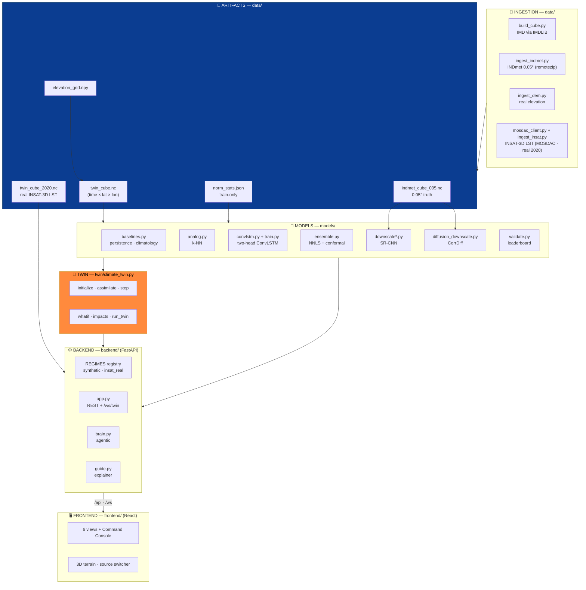
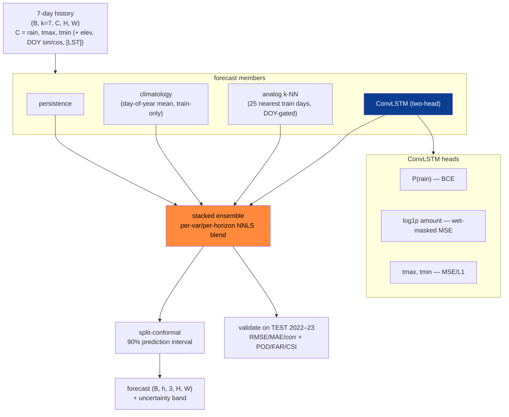
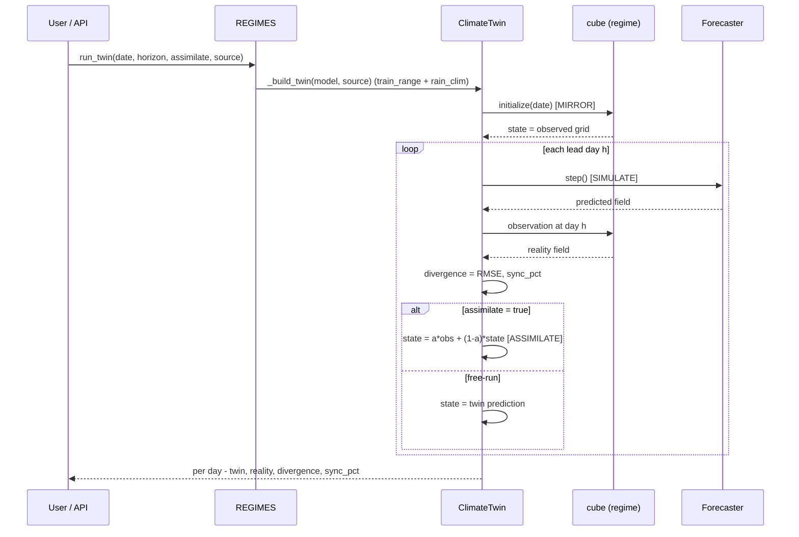
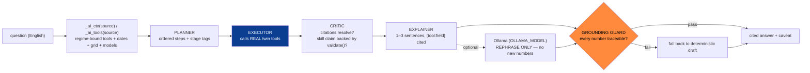
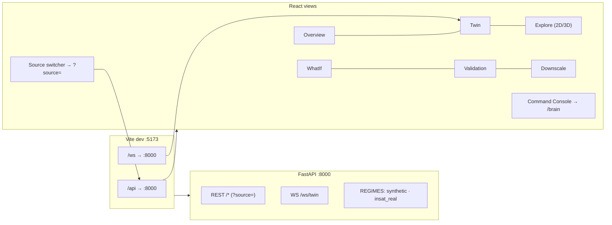
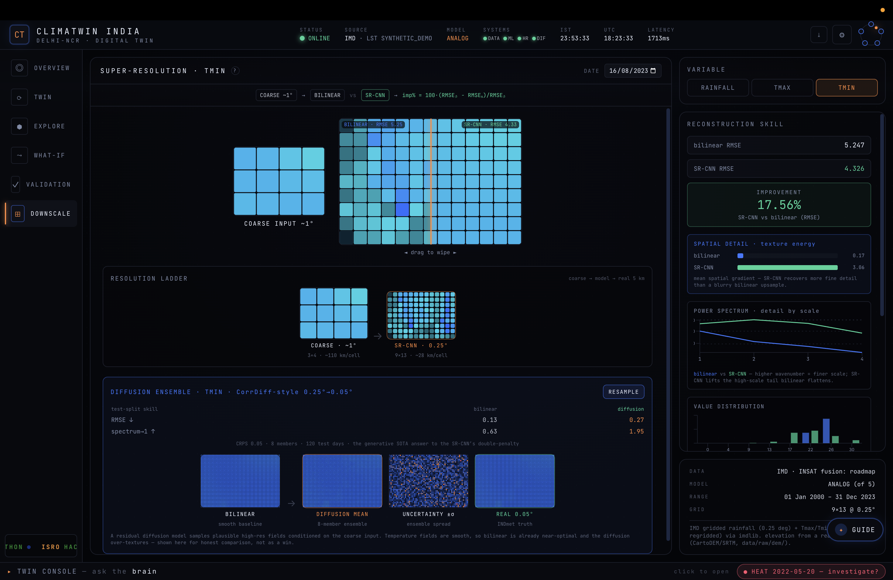
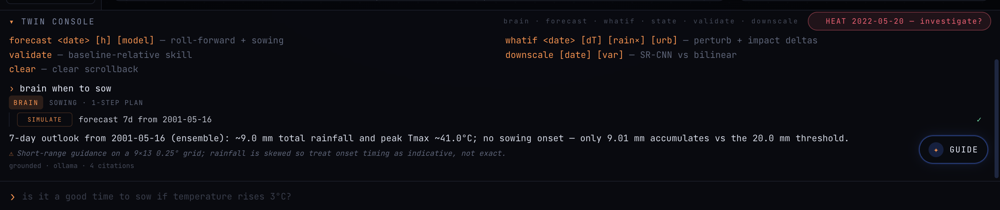

# Architecture — ClimaTwin India

How the system is wired, the twin core, the model/algorithm flow, the AI layer, and the API.
This is the canonical "how it works" reference; the slide-level summary is in
[`pptcontent.md`](pptcontent.md), the data side in [`datasets.md`](datasets.md).

---

## 1 · System architecture (the working)

**Three Earth-2 stages, mapped to code:**

| Stage | Where | What |
|---|---|---|
| **Assimilate** | `twin/climate_twin.py::assimilate` | simplified nudging `state = α·obs + (1−α)·state` (α=0.6) |
| **Forecast** | `models/` (ensemble of 5) | persistence · climatology · analog · ConvLSTM · stacked ensemble |
| **Downscale** | `models/downscale*.py`, `diffusion_downscale.py` | SR-CNN + CorrDiff diffusion, 0.25° → 0.05° |

**Pilot region:** **Delhi-NCR** (`config.py:PILOT`, bbox `lat 27.5–29.5`, `lon 75.5–78.5`,
`res 0.25°`, years 2000–2023). Variables `["rainfall", "tmax", "tmin"]`; LST is an
observation-only extra var, never a forecast variable. Temporal split (year-based, inclusive):
train 2000–2018, val 2019–2021, test 2022–2023.

---

## 1a · Dual-source regime registry

The backend serves **two data regimes** behind one validated model stack. The registry is an
**in-process module-global `dict` named `REGIMES` inside `backend/app.py`** — there is **no separate
registry module**. A helper `_regime(source)` returns `REGIMES.get(source or "synthetic", S)`;
an unknown or empty `source` silently falls back to synthetic.

| Aspect | `synthetic` (default, validated) | `insat_real` (read-only, 2020) |
|---|---|---|
| Cube | `data/twin_cube.nc` (full ~2000–2023) | `data/twin_cube_2020.nc` (2020 only) — loaded **only if the file exists** |
| LST channel | synthetic_demo LST, **not surfaced** (`extra_vars = []`) | **REAL INSAT-3D LST** as an observation layer (`extra_vars = ["lst"]`) |
| Featured day | `cfg.FEATURED_DATE` = `2001-05-16` | `2020-07-15` |
| Forecasters | persistence · climatology · analog · convlstm · ensemble | persistence · climatology · convlstm **iff** `convlstm_2020.pt` exists. **No analog / ensemble** (single-year archive) |
| Baseline fit | year-based `cfg.SPLIT` | own `norm["_split_dates"]["train"]` (month-based: Jan–Sep 2020) |
| `default_model` | fallback chain `ensemble → convlstm → climatology` | `convlstm` if present, else `None` |
| Model missing | n/a | **read-only / PENDING** — `/forecast` `/whatif` `/twin/run` `/ws/twin` return `{"pending": True, …}` ("awaiting `convlstm_2020.pt` from Colab") |
| Validation file | `cfg.METRICS_PATH` | `data/validation_metrics_2020.json` (NaN→null; pending if absent) |
| Conformal block | attached | not attached |

`cfg.VARS` stays length-3 in both regimes — LST is never forecast.

**Source-routing across the API** — every request carries a `source` query/WS param
(default `"synthetic"`). It threads through `_validate_date(date, source)`, `_regime(source)`,
`_build_twin(model, source)`, the `lru_cache`d payload builders `_state_payload` /
`_forecast_payload` / `_twin_run_payload` (source is part of the cache key), and the AI context
builders `_ai_ctx(source)` / `_ai_tools(source)`. Per-request model resolution in `/forecast`,
`/whatif`, `/twin/run`, `/ws/twin` is `model or reg.default_model`.

> **Honesty note.** Real INSAT-3D LST is **genuinely integrated**, but **only** as a read-only,
> single-year (2020) regime: 366 real `3DIMG_*_L2B_LST_V01R00.h5` granules (one per leap-year-2020
> day), `lst_coverage = 0.6414`. The full multi-year `twin_cube.nc` **still serves a
> `synthetic_demo` LST channel** (the committed full-range ConvLSTM was trained on it); fusing real
> LST into the full cube is flagged out-of-distribution / roadmap. There is **no "real-time INSAT"
> and no multi-year real LST**.

**Source-aware twin.** `ClimateTwin.__init__` takes an optional `train_range` (default `None`,
stored as `self._train_range` — `(t0, t1)` ISO dates for sub-year regimes, else `config.SPLIT`) and
precomputes a `rain_clim` (`self._rain_clim`) so the API builds per-request twins cheaply.
`_fit_rain_climatology` uses `self._train_range` if set, else `cfg.SPLIT["train"]`; `_spi_lite`
reads `self._rain_clim` keyed by `dayofyear`. One twin class therefore operates either regime with
no code change.

**Multi-year-climatology fix (dryness / SPI in the 2020 regime).** A month-based split (train
Jan–Sep / test Nov–Dec) leaves the day-of-year climatology with **no overlapping `dayofyear`**
between train and test, so its lookup collapses toward ~0 (`clim_degenerate`, documented in
`models/validate_regime.py`). The fix: the 2020 regime's `rain_clim` is **overwritten with the
synthetic regime's multi-year IMD climatology** (`cfg.SPLIT["train"]`, 2000–2018) via the twin's
`train_range` / `_rain_clim` mechanism, so every `dayofyear` has support and `_spi_lite` returns a
meaningful standardized anomaly. (This fixes the twin's SPI path — the validation-table climatology
column is still degenerate; see §6 caveat.)

**Shared-analysis caveat.** `/downscale`, `/downscale/diffusion`, `/highres`, and `/terrain` always
use the synthetic regime `S`. `/downscale` and `/downscale/diffusion` accept `source` **only to
validate the date range** — their data is always `S.cube` / the shared INDmet 0.05° truth.
`/highres` and `/terrain` have **no** `source` param at all.

---

## 2 · The forecast algorithm

**Leakage-safe by construction:**
- ConvLSTM trained on **train years (≤2018)**; normalization stats train-only.
- Ensemble NNLS weights fit on **val 2019–20**; conformal half-widths calibrated on the **disjoint
  val 2021**; everything scored on **untouched test 2022–23**.
- The ensemble is the **default served model** in the synthetic regime
  (`ensemble > convlstm > climatology` fallback).

**LST conditioning is train-only.** When a ConvLSTM checkpoint carries an LST channel,
`convlstm.py` reads `ckpt["split_dates"]`; if present it uses that regime's `train` window (the 2020
month window), else `cfg.SPLIT["train"]`. It builds a day-of-year climatology table
(`(367, H, W)`, with `table[366] = table[365]`) and `_lst_for` returns real LST inside the
conditioning window and day-of-year climatology for future/unknown dates — no leakage.

**Multi-horizon variant** (`models/train_multihorizon.py`): rolls the ConvLSTM forward H days
*inside the loss* (future LST from the train-year day-of-year climatology, `(367, H, W)` over
`cfg.SPLIT["train"]` — no leakage) so 3–7 day forecasts drift less. Same checkpoint format; the
backend picks it up unchanged.

---

## 3 · The twin loop (sequence)

**Twin core methods** (`twin/climate_twin.py`):

| Method | Stage | Does |
|---|---|---|
| `initialize(date)` | MIRROR | state ← observed cube at date |
| `assimilate(obs, α)` | ASSIMILATE | `state = α·obs + (1−α)·state` |
| `step(horizon)` | SIMULATE | roll forward autoregressively (rainfall floored at 0) |
| `whatif(ΔT, rain×, urban_mask, urban_lst)` | PERTURB | apply scenario before the run → `{baseline, scenario, diff}` |
| `impacts(field, date)` | DECIDE | dryness/SPI-lite · heat-stress fraction · max tmax · wet-cell fraction |
| `sowing_window(forecast)` | DECIDE | first lead day accumulated grid-mean rain ≥ 20 mm |
| `run_twin(date, horizon, assimilate)` | LOOP | mirror → per-day simulate/compare/advance |

The class is **forecaster-agnostic** (swapping `self.model` changes nothing) and
**regime-aware** via `train_range` / `_rain_clim` — see §1a.

---

## 4 · The AI layer (agentic brain)

- **Offline-first:** planner/executor/critic/explainer are plain Python — the demo works with **no
  LLM installed**. An optional Ollama model only *rephrases* grounded text; the guard rejects any
  untraceable number.
- **Tools the brain drives:** `state` (MIRROR) · `forecast` (SIMULATE) · `whatif` (PERTURB) ·
  `twin` (ASSIMILATE) · `validate` (SKILL).
- **Source-aware without ever touching the registry.** `brain.py` and `guide.py` never reference
  `source` or `REGIMES` directly — they stay regime-agnostic. Source-awareness is injected through
  the `ctx` dict:
  - `_ai_tools(source)` binds every tool closure (`t_state`, `t_forecast`, `t_whatif`,
    `t_validate`, `t_twin`) to `_regime(source)` + source-keyed payload builders. `t_validate`
    switches the metrics file by source; `t_twin` derives its anchor from `reg.dates[-1]` and picks
    `convlstm → persistence → reg.default_model`.
  - `_ai_ctx(source)` advertises regime-specific `latest_date` (`reg.featured`), `dates`, `grid`
    (`len(reg.lats)/reg.lons`), and `models` (`list(reg.forecasters)`).
  - The brain consumes `ctx["tools"/"latest_date"/"dates"/"grid"/"max_horizon"/"models"]` in
    `plan`, `_scope_violation`, `_allowed_numbers`, `explain`. `_allowed_numbers` derives year
    bounds from `ctx["dates"]`, so the grounding guard auto-adapts to the active regime.
- **Scope lock:** refuses other regions (Mumbai/Chennai/…), other variables (humidity/wind/AQI),
  horizons > 14 days, and dates outside the **active regime's** range — honestly, instead of
  fabricating.
- **`anomaly_scan`** autonomously flags heat (grid-peak Tmax vs train 98th-pct) or dryness (30-day
  accumulation vs train 5th-pct) using **train-only** thresholds. It is explicitly regime-aware:
  `/brain/anomaly` passes the regime cube + its `_split_dates`, so a single-year cube uses
  date-based windows.
- **`guide.py`** is the non-expert counterpart: per-view plain-language help + a glossary, grounded
  in the same tools (`_grounded_values` → `ctx["tools"]["state"]`), delegating data questions to
  `brain.run`; uses `OLLAMA_GUIDE_MODEL` (falls back to `OLLAMA_MODEL`, then deterministic text).

---

## 5 · API reference

| Method | Path | Params | Purpose |
|---|---|---|---|
| GET | `/health` | none | Liveness |
| GET | `/meta` | none | Returns `sources` array from `_sources_meta()` + synthetic grid/models/default_model |
| GET | `/state` | `date` (opt YYYY-MM-DD), `source` (default synthetic) | Live/observed state grid |
| GET | `/highres` | `date` (opt), `var` (default rainfall) | Synthetic-only INDmet 0.05° field; **no source param** |
| GET | `/forecast` | `date`, `horizon` (default `cfg.H_HORIZON`, 1..`cfg.MAX_HORIZON`), `model` (opt), `uncertainty` (bool), `samples` (5..60, default 30), `source` | Forecast grids; uncertainty paths only for `source=="synthetic"` |
| GET | `/analog` | `date`, `horizon` | Synthetic-only analog k-NN; no source param |
| POST | `/whatif` | body `WhatIfRequest` {date, horizon, delta_temp −5..8, rain_factor 0..3, urban_polygon, urban_lst 0..6, model}; query `source` | Scenario diff + impacts |
| GET | `/twin/run` | `date`, `horizon`, `assimilate` (bool), `model`, `source` | Twin free-run + drift |
| WS | `/ws/twin` | query: `source`, `horizon`, `assimilate`, `model`, `interval_ms` (120..3000), `date` | Streaming twin |
| GET | `/validate` | `source` (synthetic/insat_real only; else 400) | Validation metrics payload |
| GET | `/downscale` | `date`, `var` (default rainfall, in cfg.VARS), `source` (validates date only; data always synthetic) | SR-CNN downscale |
| GET | `/downscale/diffusion` | `date`, `samples` (2..24, default 6), `var` (default rainfall), `source` (date-only) | CorrDiff diffusion ensemble |
| GET | `/terrain` | none | DEM terrain payload |
| GET | `/ai` | `q` (required), `source` | Simple intent answerer |
| GET | `/brain` | `q` (required), `date` (opt), `source` | Agentic brain |
| GET | `/brain/anomaly` | `source` (passes `reg.norm["_split_dates"]` to `anomaly_scan`) | Anomaly scan |
| GET | `/guide` | `view` (default overview), `variable` (default rainfall), `model` (opt), `date` (opt), `q` (opt), `source` | Screen explainer |
| GET | `/` | none | Lists live routes |

**Caching:** payload builders are memoized with `@lru_cache` (with `source` as a cache key); the
latest state and default 7-day forecast are warm-started at boot so the demo never lags.
Forecasters are built once at startup per regime.

---

## 6 · Frontend ↔ backend

Stack: **React 18 · Vite · Tailwind · Leaflet/react-leaflet · react-three-fiber + three.js**
(3D terrain) · **Framer Motion · Recharts · visx · cobe** (globe) · **html-to-image** (PNG export).
The dashboard reads everything through a typed, memoized API client. The twin replay streams over
the WebSocket as offline-safe ticks. State lives in React (no localStorage in artifact components).

**Source switcher (`controls/SourceSelect.tsx`).** A top-bar popover replacing the old read-only
SOURCE text: shows each regime's LST provenance tag, year-range window, and an active/pending dot,
and dispatches `SET_SOURCE`. The source model lives in `lib/sources.ts` (`deriveSources(meta)`,
`useActiveSource()`, `useSnapDateToSource()`): `synthetic` is the validated full record;
`insat_real` is the INSAT-3D era clamped at `INSAT_ERA_START = '2015-01-01'` (the picker floor —
effectively the 2020-only real-LST regime), `active` only when `meta.lst_source === 'insat_real'`,
else `pending`. There is **one underlying validated model** — switching is a data-regime /
provenance choice, not a second model. The reducer (`SET_SOURCE`) adopts the regime's
`default_model` / `featured_date`, clears state/forecast, and falls back `activeVariable` to `tmax`
if the regime lacks the current layer; an effect calls `setApiSource(source)`, clears the cache, and
refetches `/state` + `/forecast`. `api/client.ts` appends `?source=<key>` to every REST call
(omitted for synthetic) and sets `source` on the twin WS.

**3D terrain relief (`map3d/Terrain3D.tsx`).** A react-three-fiber canvas that extrudes real
**CartoDEM / Copernicus GLO-30** elevation as a subdivided `PlaneGeometry` (130×88,
`EXAGGERATION = 1.6`), bilinearly upsamples the 9×13 grid onto the mesh, and drapes the selected
variable as per-vertex colour with baked hillshade (`OrbitControls` + vertical legend + cell
readout). `map3d/SatelliteBackdrop.tsx` adds a deterministic procedural starfield + additive blue
atmospheric glow; a `SelectionMarker` (amber ring + pillar) marks the clicked cell.
`controls/MapModeToggle.tsx` is a segmented 2D/3D button wired in `Explore.tsx`
(`is3D = src?.key === 'insat_real'`) — in 3D the TERRAIN drape + uncertainty toggles hide and hi-res
INDmet 0.05° can drape over the DEM.

**LST layer + MOSDAC basemap.** `lst` is a `LayerVar` carried as the regime's extra var
(observation-only — Explore shows "INSAT-3D LST is an observed satellite layer — no forecast
series"; WhatIf/Compare fall back `lst → tmax`). `map/MosdacBasemap.tsx` renders a satellite-grey
land + blue ADM1-boundary offline basemap (graticule, vignette, scanline sheen, registration ticks,
"MOSDAC · OFFLINE" tag), selected via `basemap='mosdac'` on `DarkIndiaMap.tsx` when
`src.key === 'insat_real'`.

---

## 7 · Visual gallery

Curated dashboard captures (repo path `assets/pictures/<file>`):

*Overview / Mission Control: globe, TWIN SYNC-PATH, live state tiles, 5-stage twin loop, capability cards.*

*Twin free-run drift: sync gauge, drift-over-lead curve, Reality/Twin/Drift heatmaps, assimilate toggle.*

*Explore: 9×13 Delhi-NCR Tmax grid over the dark India map, cell popup, model select, timeline scrubber.*

*What-If scenario diff: diverging Δ map, presets, ΔTemp/rainfall/urban sliders, impact deltas.*

*Validation: Tmax RMSE error map (2022–23 test), baseline-relative leaderboard, calibrated 90% coverage.*

*Downscale rainfall: bilinear vs SR-CNN wipe (17.56%), resolution ladder, CorrDiff ensemble, DEM ablation, spectrum.*

*Downscale Tmin: honest negative result — diffusion over-textures vs near-optimal bilinear.*

*Command Console: grounded agentic brain answering "when to sow" with a 1-step SIMULATE plan + cited numbers.*

*Guide assistant panel open over the Downscale view.*

*Close-up of the Guide assistant panel: jargon-free explainer + ask-me-anything box.*

*Compare Models modal: Model A vs Model B + diff (A−B) map.*

**INSAT-3D regime + 3D terrain (the headline new work):**

*Data-source switcher popover: synthetic (IMD · Synthetic LST, 2000–2023) vs INSAT-3D (IMD · INSAT-3D LST, real fused LST, 2020) — both ACTIVE.*

*Explore 3D: real CartoDEM terrain relief (×1.6) with Tmax draped, INSAT-3D regime, ConvLSTM, orbit/zoom.*

*Explore 3D: REAL INSAT-3D Land Surface Temperature (18.9–50.8 °C, plasma colormap) draped on the CartoDEM terrain — the satellite-data headline.*

*Explore 2D: MOSDAC OFFLINE basemap (ADM1 boundaries, graticule, coverage locator) with the Delhi-NCR grid, INSAT-3D regime.*

*What-If on the INSAT-3D regime: SCENARIO DIFF ΔTmax over the MOSDAC basemap, presets + sliders + impact bar.*

---

## 8 · Configuration is the scale story

Everything regionable lives in `config.py` — `PILOT` bbox, `SPLIT` years, `VARS`, `K_INPUT`,
`H_HORIZON`, thresholds, `ASSIMILATION_ALPHA`, and all artifact paths. Change the bbox and rerun
`make data` → the entire cube → model → dashboard rebuilds for a new region with **no code edits**.
That is the "scalable to national" deliverable in one file. The dual-source regime registry is the
companion story on the *data* axis: the same validated twin and model stack operate either a
synthetic full-record regime or a real-satellite single-year regime, selected by one `source` param.

> **Honesty caveats carried through the docs.** Skill is always **baseline-relative**; splits are
> **temporal**; fitted stats are **train-only**. Real INSAT-3D LST is integrated only as the
> read-only 2020 `insat_real` regime (366 real granules, `lst_coverage 0.6414`), pending
> `convlstm_2020.pt`; the full cube still serves synthetic_demo LST. The 2020 regime's climatology
> RMSE numbers are **degenerate artifacts** (train/test share no day-of-year) — the meaningful
> comparison for that regime is **ConvLSTM vs persistence**, not the climatology column.
