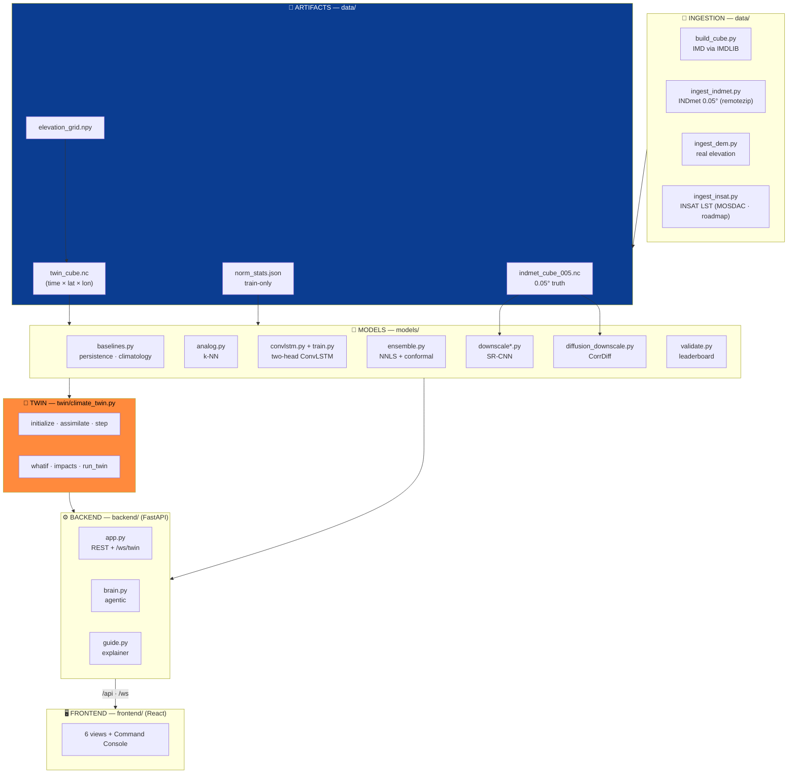
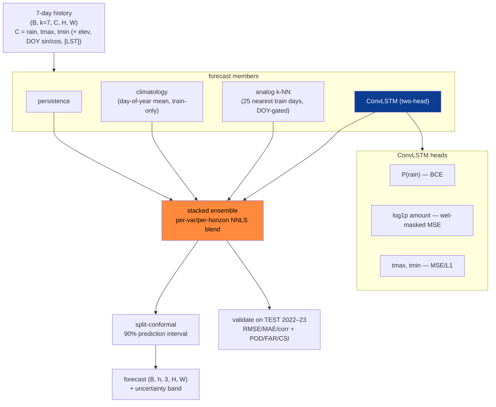
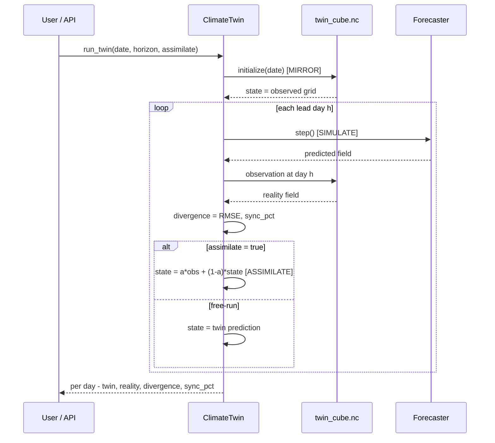
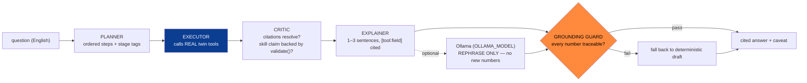
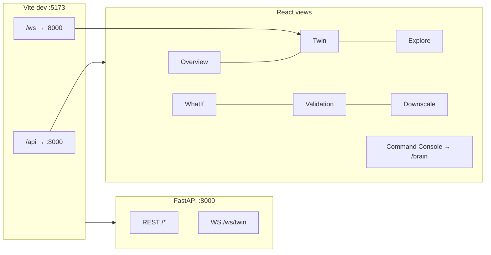

# Architecture — ClimaTwin India

How the system is wired, the twin core, the model/algorithm flow, the AI layer, and the API.
This is the canonical "how it works" reference; the slide-level summary is in
[`pptcontent.md`](pptcontent.md), the data side in [`datasets.md`](datasets.md).

---

## 1 · System architecture (the working)

**Three Earth-2 stages, mapped to code:**

| Stage | Where | What |
|---|---|---|
| **Assimilate** | `twin/climate_twin.py::assimilate` | simplified nudging `state = α·obs + (1−α)·state` (α=0.6) |
| **Forecast** | `models/` (ensemble of 5) | persistence · climatology · analog · ConvLSTM · stacked ensemble |
| **Downscale** | `models/downscale*.py`, `diffusion_downscale.py` | SR-CNN + CorrDiff diffusion, 0.25° → 0.05° |

---

## 2 · The forecast algorithm

**Leakage-safe by construction:**
- ConvLSTM trained on **train years (≤2018)**; normalization stats train-only.
- Ensemble NNLS weights fit on **val 2019–20**; conformal half-widths calibrated on the **disjoint
  val 2021**; everything scored on **untouched test 2022–23**.
- The ensemble is the **default served model** (`ensemble > convlstm > climatology` fallback).

**Multi-horizon variant** (`models/train_multihorizon.py`): rolls the ConvLSTM forward H days
*inside the loss* (future LST from train-year day-of-year climatology — no leakage) so 3–7 day
forecasts drift less. Same checkpoint format; the backend picks it up unchanged.

---

## 3 · The twin loop (sequence)

**Twin core methods** (`twin/climate_twin.py`):

| Method | Stage | Does |
|---|---|---|
| `initialize(date)` | MIRROR | state ← observed cube at date |
| `assimilate(obs, α)` | ASSIMILATE | `state = α·obs + (1−α)·state` |
| `step(horizon)` | SIMULATE | roll forward autoregressively (rainfall floored at 0) |
| `whatif(ΔT, rain×, urban_mask, urban_lst)` | PERTURB | apply scenario before the run → `{baseline, scenario, diff}` |
| `impacts(field, date)` | DECIDE | dryness/SPI-lite · heat-stress fraction · max tmax · wet-cell fraction |
| `sowing_window(forecast)` | DECIDE | first lead day accumulated grid-mean rain ≥ 20 mm |
| `run_twin(date, horizon, assimilate)` | LOOP | mirror → per-day simulate/compare/advance |

---

## 4 · The AI layer (agentic brain)

- **Offline-first:** planner/executor/critic/explainer are plain Python — the demo works with **no
  LLM installed**. An optional Ollama model only *rephrases* grounded text; the guard rejects any
  untraceable number.
- **Tools the brain drives:** `state` (MIRROR) · `forecast` (SIMULATE) · `whatif` (PERTURB) ·
  `twin` (ASSIMILATE) · `validate` (SKILL).
- **Scope lock:** refuses other regions (Mumbai/Chennai/…), other variables (humidity/wind/AQI),
  horizons > 14 days, dates outside 2000–2023 — honestly, instead of fabricating.
- **`anomaly_scan`** autonomously flags heat (grid-peak Tmax vs train 98th-pct) or dryness (30-day
  accumulation vs train 5th-pct) using **train-only** thresholds, and suggests a question to ask.
- **`guide.py`** is the non-expert counterpart: per-view plain-language help + a glossary, grounded
  in the same tools; uses `OLLAMA_GUIDE_MODEL` (falls back to `OLLAMA_MODEL`, then deterministic).

---

## 5 · API reference

| Method | Path | Key params | Returns |
|---|---|---|---|
| GET | `/health` | — | status, data source, dates, region |
| GET | `/meta` | — | grid coords, vars, colorbar ranges, models, default model, thresholds, availability flags |
| GET | `/state` | `date?` | observed state grid + impacts |
| GET | `/highres` | `date?`, `var` | INDmet 0.05° observed field |
| GET | `/forecast` | `date?`, `horizon` 1–14, `model?`, `uncertainty`, `samples` 5–60 | roll-forward fields + impacts (+ uncertainty/conformal bands) |
| GET | `/analog` | `date?`, `horizon` 1–14 | analog forecast + matched past IMD days |
| POST | `/whatif` | `date?`, `horizon`, `delta_temp` −5..8, `rain_factor` 0..3, `urban_polygon?`, `urban_lst` 0..6, `model?` | baseline, scenario, diff + impacts |
| GET | `/twin/run` | `date?`, `horizon`, `assimilate`, `model?` | reality vs twin + divergence + sync % |
| WS | `/ws/twin` | `date`, `horizon`, `assimilate`, `model`, `interval_ms` 120–3000 | live ticks: `init` / `tick` / `done` / `error` |
| GET | `/validate` | — | cached metrics + conformal calibration |
| GET | `/downscale` | `date?`, `var` | coarse vs bilinear vs SR-CNN + improvement % |
| GET | `/downscale/diffusion` | `date?`, `samples` 2–24, `var` | bilinear, mean, std, truth + FSS/CRPS/spectrum |
| GET | `/ai` | `q` | simple intent answer |
| GET | `/brain` | `q`, `date?` | plan + facts + cited answer + caveat |
| GET | `/brain/anomaly` | — | anomaly bool, kind, value, threshold, suggested question |
| GET | `/guide` | `view`, `variable`, `model?`, `date?`, `q?` | headline + plain explanation + tips |

**Caching:** payload builders are memoized with `@lru_cache`; the latest state and default 7-day
forecast are warm-started at boot so the demo never lags. Forecasters are built once at startup.

---

## 6 · Frontend ↔ backend

Stack: **React 18 · Vite · Tailwind · Leaflet/react-leaflet · Framer Motion · Recharts · visx ·
cobe** (globe) · **html-to-image** (PNG export). The dashboard reads everything through a typed,
memoized API client (`frontend/src/api/endpoints.ts`). The twin replay streams over the WebSocket
as offline-safe ticks. State lives in React (no localStorage in artifact components).

---

## 7 · Configuration is the scale story

Everything regionable lives in `config.py` — `PILOT` bbox, `SPLIT` years, `VARS`, `K_INPUT`,
`H_HORIZON`, thresholds, `ASSIMILATION_ALPHA`, and all artifact paths. Change the bbox and rerun
`make data` → the entire cube → model → dashboard rebuilds for a new region with **no code edits**.
That is the "scalable to national" deliverable in one file.
