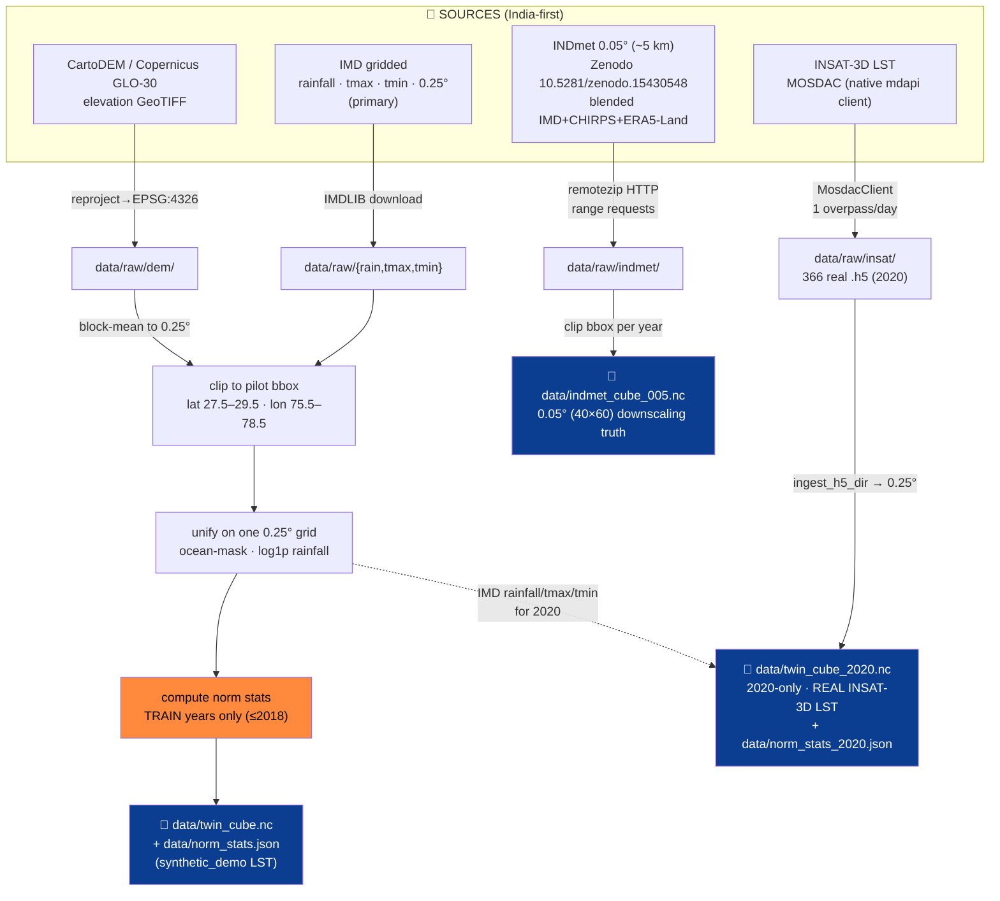

# Datasets & Data Pipeline — ClimaTwin India

How we **find, acquire, clip, regrid, and normalize** India's climate data into the canonical
`twin_cube.nc`, plus the high-resolution `indmet_cube_005.nc` truth used for downscaling and the
focused single-year `twin_cube_2020.nc` that carries **real INSAT-3D land-surface temperature**.
Every choice here is India-first and leakage-safe.

---

## 1 · The data-finding approach (diagram)



The guiding idea: **pull only what the pilot box needs**, clip early so everything stays laptop-
small, and **fit every statistic on train years only**.

---

## 2 · Sources

| Source | What | Resolution | Access | Role |
|---|---|---|---|---|
| **IMD gridded** | rainfall, tmax, tmin | 0.25° | `IMDLIB` (download + cache) | **Primary backbone** |
| **INDmet** | precipitation, tmax, tmin | 0.05° (~5 km) | Zenodo `10.5281/zenodo.15430548`, CC-BY-4.0 (Water & Climate Lab, IIT Gandhinagar); blended IMD + CHIRPS + ERA5-Land | High-res **truth** for downscaling |
| **CartoDEM / Copernicus GLO-30** | terrain elevation | ~30 m → block-mean to 0.25° | GeoTIFF in `data/raw/dem/` (OpenTopography / Bhoonidhi) | static channel + downscaling cue |
| **INSAT-3D LST** | land-surface temperature | half-hourly L2B → 0.25° | MOSDAC native client (`data/mosdac_client.py`) — **REAL, 366 granules for 2020** | observation layer in the 2020 regime |

**Honesty labels.** INDmet is a *blended/derived* product (not pure IMD station gridding) — tagged
`data_source="indmet"`. Elevation is **real**, labeled CartoDEM/Copernicus-GLO-30-class.
INSAT-3D LST is now **genuinely integrated**, but the integration is scoped:

- The **focused 2020 cube** (`twin_cube_2020.nc`) fuses **366 real INSAT-3D L2B LST granules**
  (`lst_source="insat_real"`, `lst_coverage = 0.6414`). This drives the **read-only `insat_real`**
  data regime.
- The **full multi-year `twin_cube.nc` still serves a `synthetic_demo` LST channel** — that is what
  the committed full-range ConvLSTM was trained on. Fusing real LST into the full record is flagged
  out-of-distribution / roadmap (`build_cube` prints a warning).
- There is **no real-time INSAT and no multi-year real LST**. The real path is a single year (2020),
  one overpass per day, read-only.

The pilot region is **Delhi-NCR** (bbox lat 27.5–29.5, lon 75.5–78.5, 0.25° → 9×13 cells).

---

## 3 · Acquisition mechanics

### IMD → cube (`data/build_cube.py`)
```bash
python -m data.build_cube --source auto      # IMD if available, else offline synthetic
```
Downloads via **IMDLIB** (do not hand-roll the `.grd` binary parser), caches to `data/raw/`, clips
to the pilot bbox, unifies onto the common 0.25° grid, masks ocean cells to NaN, applies `log1p` to
rainfall for modeling, and writes `twin_cube.nc` + `norm_stats.json`. IMD rainfall arrives at 0.25°;
Tmax/Tmin arrive at 1° and are bilinearly regridded. No-data flags are masked (rainfall −999; temps
99.9 / −999). If a DEM is present it calls `ingest_dem.grid_elevation(...)`; otherwise it falls back
to a flat ~215 m plane (clearly noted). The default LST channel here is `synthetic_demo`
(`lst_source="demo"`, nearest-date reindex for full coverage).

### INDmet 0.05° (`data/ingest_indmet.py`)
```bash
python -m data.ingest_indmet --vars rainfall tmax tmin --years 2000 2023
```
The INDmet record lives inside one large Zenodo zip, split per-variable × per-year
(`INDmet_Netcdf_Data/Yearly_File_<Var>/INDmet_<var>_05km_<year>.nc`). Zenodo serves **HTTP range
requests**, so `remotezip.RemoteZip` pulls **only the members we need** (clipped to the box) instead
of the full record. Writes `data/indmet_cube_005.nc` (40×60 grid), tagged `data_source="indmet"`,
`resolution_deg=0.05`. This is the **5× finer downscaling target**.

### Real elevation (`data/ingest_dem.py`)
```bash
python -m data.ingest_dem
```
Reads GeoTIFF(s) from `data/raw/dem/` (Bhuvan CartoDEM v3 R1 30 m preferred/indigenous; SRTM /
Copernicus GLO-30 / OpenTopography fallbacks), merges, reprojects to EPSG:4326 with `rasterio`, masks
nodata and `< -1000`, **block-averages onto the 0.25° grid**, and caches `data/elevation_grid.npy`.
For Delhi-NCR this yields a real 9×13 field (Aravalli high in the SW, Yamuna plains low in the E).

---

## 3a · INSAT-3D LST via MOSDAC — the real satellite path

This section replaces the old *"synthetic_demo placeholder awaiting approval"* framing. The MOSDAC
path is now **real and runs end-to-end** for the 2020 pilot year.

```mermaid
flowchart LR
    A["MosdacClient<br/>data/mosdac_client.py"] -->|gettoken (Bearer)<br/>datasets.json| B["mdapi HTTP contract<br/>mosdac.gov.in"]
    B -->|download (stream .h5)| C["download_daily_overpass<br/>1 granule/day @ ~0600 UTC"]
    C --> D["data/raw/insat/<br/>366 × 3DIMG_*_L2B_LST_V01R00.h5"]
    D -->|ingest_h5_dir| E["decode → mask → scale<br/>K→°C → regrid to 0.25°"]
    E -->|build_cube_2020| F["🧊 twin_cube_2020.nc<br/>lst_source=insat_real"]
    style F fill:#0b3d91,color:#fff
```

### Native MOSDAC client (`data/mosdac_client.py`) — REAL
A `requests`-based client that speaks ISRO's `mdapi.py` HTTP contract **without the interactive
prompt**. Endpoints on `https://mosdac.gov.in`:

- `POST /download_api/gettoken` — auth (Bearer token)
- `GET  /apios/datasets.json` — dataset discovery
- `GET  /download_api/download` — streams the `.h5` granule (Bearer)
- `POST /download_api/refresh-token`, `POST /download_api/logout`

`class MosdacClient` reads `data/mosdac_config.json` (credential key literally `"username/email"`;
our config targets datasetId `3DIMG_L2B_LST`, bbox `75.5,27.5,78.5,29.5`, window
2020-06-01…2020-09-30).

**Lockout-safe auth** is the key design point — MOSDAC throttles aggressively:

- never retries `400`/`401` (rejected credentials → `MosdacAuthError`, no hammering)
- distinguishes `429` throttle (`MosdacRateLimit`, ~1 h lockout) from bad creds
- handles `503`, and `NOT_RELEASED` (`404`) for granules not yet published
- typed errors: `MosdacError`, `MosdacConfigError`, `MosdacAuthError`, `MosdacNotReleased`,
  `MosdacRateLimit`
- `download_granule` streams to a `.part` file then renames; 6-attempt retry with token refresh on
  `INVALID_TOKEN` / `NO_ACCESS_TOKEN`; respects `daily_limit` / `minute_limit` (429)

### One-overpass-per-day downloader — REAL
INSAT-3D LST is **half-hourly (~48 granules/day)**. Pulling all of them for a year is wasteful and
trips the rate limit. `download_daily_overpass(start, end, target_hhmm="0600", ...)` picks the **one
granule per calendar day** whose UTC HHMM is closest to the target (default `0600` UTC ≈ local
late-morning skin temperature, a clean daily signal).

```bash
python -m data.mosdac_client --daily --start 2020-01-01 --end 2020-12-31 --target 0600
```

### Real-granule decode (`data/ingest_insat.py:ingest_h5_dir`) — REAL
For each `.h5` granule: `h5py` read → `_FillValue` mask → apply `scale_factor` / `add_offset` →
convert Kelvin→Celsius if median > 150 → broadcast the 1-D L2G geolocation to 2-D → crop to the pilot
bbox (+0.75° margin) → `scipy.interpolate.griddata` linear regrid onto the 0.25° grid → daily-mean
stack. Output is tagged `lst_source="insat_real"`. Two drivers exist: `download_via_native`
(preferred → `MosdacClient.download_all`) and `download_via_mdapi` (fallback: fetch `mdapi.zip`,
unzip to `data/mdapi/`, run the stock `mdapi.py` as a subprocess). `build_lst(source=...)` with
`auto`/`real` tries the real h5 first.

**On disk now:** `data/raw/insat/` holds **366 real `3DIMG_*_L2B_LST_V01R00.h5` granules** (one per
leap-year-2020 day, ~10 MB each, mostly the `_0600_` overpass). `data/mdapi/` keeps the real ISRO
`mdapi.py` (35 KB), `mdapi.zip`, and `config.json` for the fallback path.

### Focused 2020 cube (`data/build_cube_2020.py` → `data/twin_cube_2020.nc`) — REAL LST fused
```bash
python -m data.build_cube_2020
```
Reuses the **real IMD** rainfall/tmax/tmin (+ elevation) for 2020 from the base cube and **swaps in
real INSAT-3D daily LST** via `ingest_h5_dir()`. LST is reindexed to 0.25° on exact dates
(missing → NaN), then gap-filled numpy-only (cloudy cells → that day's spatial mean; fully-missing
days → forward/back-fill). Because it is a **single year, the split is month-based** (not year-based):

- **train** Jan–Sep 2020 · **val** Oct 2020 · **test** Nov–Dec 2020

Norm stats are fit on the **train months only** (rainfall `log1p`), written to
`data/norm_stats_2020.json`. Cube attributes: `data_source="imd"`, `lst_source="insat_real"`,
`regime="insat_real_2020"`, plus `lst_coverage` and `lst_real_days`. The committed
`data/validation_metrics_2020.json` confirms `lst_source: insat_real`, `lst_coverage: 0.6414`.

### LST climatology over the checkpoint split — train-only, no leakage
In `models/convlstm.py.__init__`, when the cube has LST the model reads the checkpoint's
`split_dates`: if present it uses that regime's month-based train window, else `cfg.SPLIT["train"]`.
It computes `clim = tr.groupby("time.dayofyear").mean("time")`, fills a `(367,) + grid` table
(`table[366] = table[365]`), and stores `_lst_clim` + `_lst_index`. `_lst_for(date)` then returns
**real LST inside the conditioning window and day-of-year climatology for future / unknown dates** —
computed on train data only, so there is **no leakage**. (The same train-only multi-year
`groupby("time.dayofyear")` pattern builds the `(367,H,W)` LST table in
`models/train_multihorizon.py._lst_climatology` over `cfg.SPLIT["train"]`.)

### Still synthetic (honestly tagged)
`synthetic_demo_lst()` (`ingest_insat.py`) generates a seeded daily LST = seasonal cosine + a
Gaussian urban hot-spot over Delhi (~28.6 N, 77.2 E) + noise, built **independently of IMD tmax** and
tagged `lst_source="synthetic_demo"`. This is the **default LST for the main multi-year cube** and
what the committed full-range ConvLSTM checkpoint was trained on. Real-LST fusion into
`twin_cube.nc` remains roadmap/out-of-distribution.

### What is REAL vs synthetic_demo — at a glance

| Artifact | LST channel | Status |
|---|---|---|
| `data/twin_cube.nc` (2000–2023) | `synthetic_demo` | Validated default; real-LST fusion is roadmap |
| `data/twin_cube_2020.nc` (2020) | `insat_real` (366 granules, coverage 0.6414) | **REAL**, read-only single-year regime |
| `data/raw/insat/*.h5` | INSAT-3D L2B LST | **REAL** (366 granules) |
| MOSDAC client + daily downloader + decode | — | **REAL** code path |

---

## 4 · The canonical cube

`data/twin_cube.nc`:
- dims `(time, lat, lon)`, daily, 2000–2023
- vars: `rainfall` (mm), `tmax` (°C), `tmin` (°C), static `elevation` (m), optional `lst`
  (`synthetic_demo` in this cube)
- all variables on **one common 0.25° grid** over the pilot bbox (9×13 cells)
- rainfall uses `log1p` for modeling; ocean cells NaN
- `data/norm_stats.json` (train-years-only mean/std per variable) sits beside it

**Model tensor:** input `(B, k=7, C, H, W)` → output `(B, h, 3, H, W)` for `[rainfall, tmax, tmin]`.
Channels `C` = 3 dynamic + elevation + day-of-year (sin/cos) + optional LST. **LST is an
observation-only conditioning channel — it is never a forecast variable** (`cfg.VARS` stays
length-3 in both regimes).

The focused `data/twin_cube_2020.nc` shares the same dims/grid but covers 2020 only and carries the
**real** `lst` channel; it backs the read-only `insat_real` data regime in the API/frontend.

---

## 5 · Splits & leakage discipline


- **Temporal splits only** — never random-split a time series. The synthetic regime uses the
  year-based `cfg.SPLIT` above; the 2020 regime uses the **month-based** split (train Jan–Sep / val
  Oct / test Nov–Dec) because it is a single year.
- Normalization, climatology, the analog archive, ensemble weights, conformal half-widths, and the
  LST day-of-year climatology are each fit on a **disjoint earlier slice**; the test split is touched
  **only** at final scoring.
- This is what makes the leaderboard and the ~90% conformal coverage credible.

> **Caveat — 2020 climatology is degenerate.** With a month-based split, train (Jan–Sep) and test
> (Nov–Dec) share **no day-of-year**, so day-of-year climatology collapses toward ~0. In a dry Delhi
> winter "predict ~0 rainfall" happens to look accurate, so the 2020 climatology RMSE numbers are an
> **artifact, not skill**. The meaningful comparison for that regime is **ConvLSTM vs persistence**.
> The twin's dryness/SPI path avoids this by fitting rain climatology over a **multi-year** window
> (`cfg.SPLIT["train"]`, 2000–2018) through the source-aware `train_range` / `_rain_clim` mechanism,
> so every day-of-year has support.

---

## 6 · Artifacts produced

| File | By | Contents |
|---|---|---|
| `data/twin_cube.nc` | `build_cube.py` | canonical 0.25° cube (synthetic_demo LST) |
| `data/norm_stats.json` | `build_cube.py` | train-only per-var mean/std |
| `data/indmet_cube_005.nc` | `ingest_indmet.py` | 0.05° downscaling truth |
| `data/elevation_grid.npy` | `ingest_dem.py` | cached 0.25° elevation |
| `data/raw/insat/*.h5` | `mosdac_client.py` | 366 real INSAT-3D L2B LST granules (2020) |
| `data/twin_cube_2020.nc` | `build_cube_2020.py` | 2020-only cube with **real** INSAT-3D LST |
| `data/norm_stats_2020.json` | `build_cube_2020.py` | train-month-only stats for the 2020 regime |
| `data/validation_metrics_2020.json` | `validate_regime.py` | 2020-regime metrics (`lst_coverage 0.6414`) |

All are **gitignored and regenerable**; the live demo runs offline from the cached cubes +
checkpoints, never a live IMD/MOSDAC download.

---

## 7 · Why India-first (Atmanirbhar)

The backbone is national (IMD), the high-res truth is IMD-anchored (INDmet blends IMD + CHIRPS +
ERA5-Land), elevation is CartoDEM/Copernicus-class, and the satellite path uses ISRO's **INSAT-3D via
MOSDAC** — now a working download-decode-fuse pipeline (real for 2020). Foreign reanalysis enters
only *inside* INDmet's blend as an auxiliary, never as the backbone — the project stays
national-data-first by construction.

---

## 8 · The real satellite regime, on screen

The 2020 `insat_real` regime is selectable in the dashboard's data-source switcher and renders on a
3D CartoDEM terrain relief with the **real** INSAT-3D LST layer and the MOSDAC offline basemap.


*Data-source switcher popover: `synthetic` (IMD · Synthetic LST, 2000–2023) vs `insat_real`
(IMD · INSAT-3D LST, real fused LST, 2020).*


*Explore 3D: real CartoDEM terrain relief (exaggeration ×1.6) with Tmax draped, INSAT-3D regime,
ConvLSTM forecaster, orbit/zoom.*


*Explore 3D: the **real INSAT-3D** Land Surface Temperature layer (18.9–50.8 °C, plasma colormap)
draped on the CartoDEM terrain — the satellite-data headline.*


*Explore 2D: MOSDAC OFFLINE basemap (ADM1 boundaries, graticule, coverage locator) with the
Delhi-NCR grid, INSAT-3D regime.*


*What-If on the INSAT-3D regime: SCENARIO DIFF ΔTmax over the MOSDAC basemap, with presets, sliders,
and the impact bar.*
