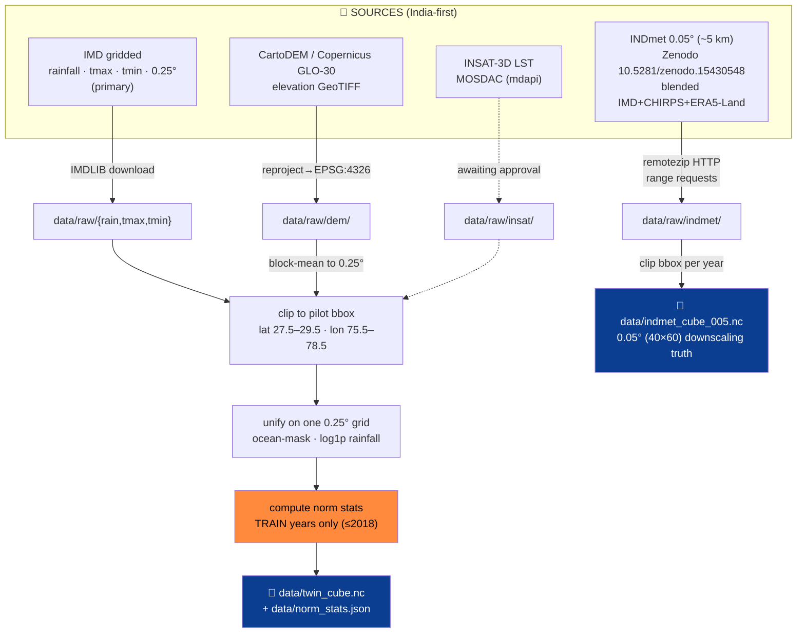

# Datasets & Data Pipeline — ClimaTwin India

How we **find, acquire, clip, regrid, and normalize** India's climate data into the canonical
`twin_cube.nc`, plus the high-resolution `indmet_cube_005.nc` truth used for downscaling. Every
choice here is India-first and leakage-safe.

---

## 1 · The data-finding approach (diagram)



The guiding idea: **pull only what the pilot box needs**, clip early so everything stays laptop-
small, and **fit every statistic on train years only**.

---

## 2 · Sources

| Source | What | Resolution | Access | Role |
|---|---|---|---|---|
| **IMD gridded** | rainfall, tmax, tmin | 0.25° | `IMDLIB` (download + cache) | **Primary backbone** |
| **INDmet** | precipitation, tmax, tmin | 0.05° (~5 km) | Zenodo `10.5281/zenodo.15430548`, CC-BY-4.0 (Water & Climate Lab, IIT Gandhinagar); blended IMD + CHIRPS + ERA5-Land | High-res **truth** for downscaling |
| **CartoDEM / Copernicus GLO-30** | terrain elevation | ~30 m → block-mean to 0.25° | GeoTIFF in `data/raw/dem/` (OpenTopography / Bhoonidhi) | static channel + downscaling cue |
| **INSAT-3D LST** | land-surface temperature | regridded to 0.25° | MOSDAC `mdapi` (real) — **currently a labeled `synthetic_demo` placeholder** | optional fusion channel (**roadmap**) |

**Honesty labels:** INDmet is a *blended/derived* product (not pure IMD station gridding) — tagged
`data_source="indmet"`. INSAT LST is `synthetic_demo` until the real MOSDAC granules clear approval;
the dashboard footer reads *"INSAT fusion: roadmap"*. Elevation is **real** and labeled as
CartoDEM/SRTM-class.

---

## 3 · Acquisition mechanics

### IMD → cube (`data/build_cube.py`)
```bash
python -m data.build_cube --source auto      # IMD if available, else offline synthetic
```
Downloads via **IMDLIB** (do not hand-roll the `.grd` binary parser), caches to `data/raw/`, clips
to the pilot bbox, unifies onto the common 0.25° grid, masks ocean cells to NaN, applies `log1p` to
rainfall for modeling, and writes `twin_cube.nc` + `norm_stats.json`. If a DEM is present it calls
`ingest_dem.grid_elevation(...)`; otherwise it falls back to a flat ~215 m plane (clearly noted).

### INDmet 0.05° (`data/ingest_indmet.py`)
```bash
python -m data.ingest_indmet --vars rainfall tmax tmin --years 2000 2023
```
The INDmet record lives inside one ~16 GB Zenodo zip, split per-variable × per-year. Zenodo serves
**HTTP range requests**, so `remotezip` pulls **only the members we need** (clipped to the box) —
hundreds of MB of cube instead of the full record. Writes `data/indmet_cube_005.nc` (40×60 grid).

### Real elevation (`data/ingest_dem.py`)
```bash
python -m data.ingest_dem
```
Reads GeoTIFF(s) from `data/raw/dem/`, merges, reprojects to EPSG:4326, clips, **block-averages onto
the 0.25° grid**, and caches `data/elevation_grid.npy`. For Delhi-NCR this yields a real 9×13 field
(Aravalli high in the SW, Yamuna plains low in the E).

### INSAT-3D LST (`data/ingest_insat.py`)
```bash
python -m data.ingest_insat --source auto    # real | demo | auto
```
`real` reads `.h5` granules from `data/raw/insat/` (h5py + scipy regrid) or downloads via the MOSDAC
`mdapi` client (needs `data/mosdac_config.json`). `demo` produces an offline, plausible LST field
(urban hot-spot over the Delhi core, independent of IMD tmax). Writes `data/insat_lst.nc`, tagged
`lst_source` = `insat_real` or `synthetic_demo`.

---

## 4 · The canonical cube

`data/twin_cube.nc`:
- dims `(time, lat, lon)`, daily, 2000–2023
- vars: `rainfall` (mm), `tmax` (°C), `tmin` (°C), static `elevation` (m), optional `lst`
- all variables on **one common 0.25° grid** over the pilot bbox (9×13 cells)
- rainfall uses `log1p` for modeling; ocean cells NaN
- `data/norm_stats.json` (train-years-only mean/std per variable) sits beside it

**Model tensor:** input `(B, k=7, C, H, W)` → output `(B, h, 3, H, W)` for `[rainfall, tmax, tmin]`.
Channels `C` = 3 dynamic + elevation + day-of-year (sin/cos) + optional LST.

---

## 5 · Splits & leakage discipline


- **Temporal splits only** — never random-split a time series.
- Normalization, climatology, the analog archive, ensemble weights, and conformal half-widths are
  each fit on a **disjoint earlier slice**; the test split is touched **only** at final scoring.
- This is what makes the leaderboard and the ~90% conformal coverage credible.

---

## 6 · Artifacts produced

| File | By | Contents |
|---|---|---|
| `data/twin_cube.nc` | `build_cube.py` | canonical 0.25° cube |
| `data/norm_stats.json` | `build_cube.py` | train-only per-var mean/std |
| `data/indmet_cube_005.nc` | `ingest_indmet.py` | 0.05° downscaling truth |
| `data/elevation_grid.npy` | `ingest_dem.py` | cached 0.25° elevation |
| `data/insat_lst.nc` | `ingest_insat.py` | LST layer (real or synthetic, tagged) |

All are **gitignored and regenerable**; the live demo runs offline from the cached cube +
checkpoints, never a live IMD/MOSDAC download.

---

## 7 · Why India-first (Atmanirbhar)

The backbone is national (IMD), the high-res truth is IMD-anchored (INDmet blends IMD + CHIRPS +
ERA5-Land), elevation is CartoDEM-class, and the satellite path targets ISRO's INSAT-3D via MOSDAC.
Foreign reanalysis enters only *inside* INDmet's blend as an auxiliary, never as the backbone — the
project stays national-data-first by construction.
