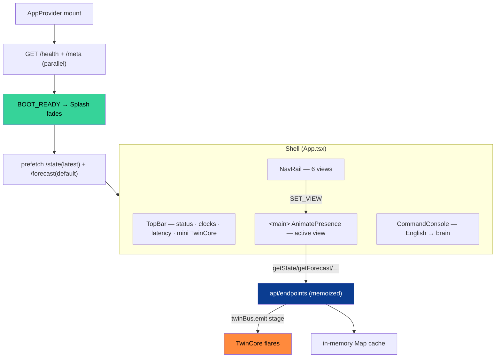
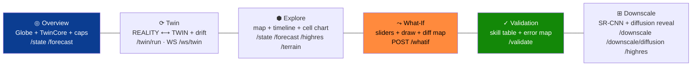

<!-- ░░░ FRONTEND BANNER ░░░ -->
<p align="center">
  
</p>

<p align="center">
  
  
  
  
  
</p>

> A **mission-control** dashboard for the climate twin: six views over one Leaflet map, a scrubbable
> past→now→forecast timeline, a draw-your-own what-if simulator, an honesty scoreboard, a super-resolution
> lab, and a global **Command Console** that turns plain English into grounded twin actions. Animated
> 5-stage **TwinCore** flares in real time as each API call fires. No browser storage — all state in React.

---

## 🧱 Stack

| Layer | Library | Version |
|---|---|---|
| UI | React + React DOM | 18.3.1 |
| Build | Vite | 5.4.10 |
| Language | TypeScript (strict) | 5.6.3 |
| Styling | Tailwind CSS + PostCSS + Autoprefixer | 3.4.14 |
| Maps | Leaflet + react-leaflet | 1.9.4 / 4.2.1 |
| Charts | Recharts | 2.15.4 |
| Heatmaps | Visx (`@visx/heatmap`, `scale`, `group`) | 4.0.0 |
| Motion | Framer Motion | 11.11.0 |
| Globe | Cobe | 0.6.3 |
| PNG export | html-to-image | 1.11.13 |
| Fonts | Inter + JetBrains Mono (`@fontsource`) | 5.1.0 |

**Vite (`vite.config.ts`):** dev `:5173`, preview `:4173`; proxies `/api → 127.0.0.1:8000` (prefix
stripped) and `/ws → 127.0.0.1:8000` (WebSocket). Alias `@/ → src/`. **`.env.development`:**
`VITE_API_BASE=/api`. **TS:** ES2020, `react-jsx`, `bundler` resolution, no unused locals/params.

---

## 🗺️ App shell & data flow



State is **Context + `useReducer`** (`state/AppContext.tsx`) — actions like `SET_VIEW`, `SET_MODEL`,
`SET_HORIZON`, `SET_VARIABLE`, `SELECT_CELL`, `SET_THEME`. No Redux, **no localStorage/sessionStorage**
(per project rule). Boot gates the Splash on `/health`+`/meta`, then non-fatally prefetches the latest
state and default forecast.

---

## 🖥️ The six views



| View | Renders | Endpoints |
|---|---|---|
| **Overview** | spinning Cobe globe + 5-stage TwinCore + 6 capability cards + live `StatCard` telemetry | `/state`, `/forecast` (prefetched) |
| **Twin** | side-by-side REALITY ⟷ TWIN heatmaps + drift line chart + impact badges; TwinCore flares per stage | `GET /twin/run` (or live `WS /ws/twin` via `useTwinStream`) |
| **Explore** | `DarkIndiaMap` + 9×13 `GridLayer` (click-to-select) + rain VFX + `TimeSlider` + per-cell `ForecastChart` | `/state`, `/forecast`, `/highres`, `/terrain` |
| **What-If** | `DiffLayer` (diverging) + `UrbanDrawTool` polygon + slider presets (+2 °C heatwave, monsoon ×1.5, drought ×0.5, UHI) | `POST /whatif` (250 ms debounce) |
| **Validation** | `ErrorLayer` (per-cell RMSE) + `MetricsTable` + `HonestSkillMatrix` (best model highlighted) | `GET /validate` |
| **Downscale** | drag-to-reveal bilinear vs SR-CNN + diffusion ensemble mean/std + spectral stats | `/downscale`, `/downscale/diffusion`, `/highres` |

> Downscale auto-hides if `meta.downscale_available === false`.

---

## 🔗 API layer (`src/api/`)

- **`client.ts`** — `apiFetch<T>(path,{stage,method,body})` wrapper: emits a `twinBus` stage (drives
  TwinCore flares), records `getLastLatency()` (read by TopBar), throws `ApiError` on non-2xx.
  `openTwinStream()` opens the `/ws/twin` socket, parses frames, and emits stages. `twinBus` is a tiny
  pub/sub for stages `MIRROR · ASSIMILATE · SIMULATE · PERTURB · IMPACT`.
- **`endpoints.ts`** — typed functions (`getState`, `getForecast`, `getTwinRun`, `postWhatIf`,
  `getValidate`, `getDownscale`, `getDiffusion`, `getBrain`, `getGuide`, `getAnomaly`…), each memoized in a
  module-level `Map` (survives view switches, cleared on reload).
- **`types.ts`** — TS mirrors of every backend response (`Meta`, `StateResp`, `ForecastResp`,
  `WhatIfResp`, `TwinRunResp`, `ValidateResp`, `HighresResp`, `TerrainResp`…).
- **`cache.ts`** — in-memory `cacheKey/cacheGet/cacheSet` (no web storage).

---

## 🗺️ Map layer (`src/components/map/`)

| Component | What it does |
|---|---|
| `DarkIndiaMap` | tileless Leaflet container; glowing ADM1 state outlines (bundled GeoJSON), non-interactive |
| `GridLayer` | 9×13 grid as Leaflet rectangles, per-variable colormap, click-to-select, hover sparkline, heat-stress **pulse** above threshold |
| `DiffLayer` | diverging scenario − baseline heatmap (blue ↔ saffron, neutral at 0) |
| `ErrorLayer` | per-cell RMSE (sequential dark→red colormap) |
| `RainOverlay` | canvas rain particles; density/velocity scale with intensity, `pointer-events:none` |
| `UrbanDrawTool` | click-to-draw scenario polygon (`useMapEvents`), saffron outline + vertex dots |
| `RegionLocator` | animated ping on the selected cell |

---

## 🎛️ Components

**Shell** — `TopBar` (status, IST/UTC clocks, latency, mini TwinCore), `NavRail`, `CommandPalette`
(⌘K fuzzy jump), `Splash` (typed boot log), `GuideAssistant` (per-screen `/guide` help),
`ProvenanceFooter`, `ScanlineBg`, `SettingsPopover`.
**Controls** — `TimeSlider` (past/now/forecast, play @ 750 ms), `LayerSwitch`, `ColorBar`, `ModelSelect`,
`UncertaintyToggle` (MC-dropout bands), `HiResToggle` (0.05° overlay).
**Panels** — `ForecastChart` (Recharts line + uncertainty band + NOW reference), `MetricsTable`,
`HonestSkillMatrix`, `StatCard` (count-up easing), `ImpactBadges`, `SowingCard`, `AnalogMatches`,
`InfoPopover`.
**Twin** — `TwinCore` (5-stage ring, saffron pulse, flares on `twinBus`), `SyncFlow` legend.
**Console** — `CommandConsole` (REPL: `ai/state/forecast/whatif/validate/downscale/clear`, history nav,
auto anomaly pop on load). **Globe** — `Globe` (Cobe). **UI** — `FieldHeatmap` (Visx), `Skeleton`.

---

## ⏱️ Timeline & live stream (`src/state/`)

- **`useTimeline`** — fetches the past `PAST_DAYS=7` `/state` days concurrently, refetches `/forecast` on
  horizon/model/uncertainty change, builds `Frame[]` (`observed | now | forecast`), and animates the scrub
  at `PLAY_MS=750`. Returns `{frames, index, setIndex, nowIndex, playing, togglePlay, activeData}`.
- **`useTwinStream`** — subscribes to `WS /ws/twin`, accumulates `tick` frames into a `TwinRunResp`,
  exposes `{run, streaming, latestLead, done}`, closes the socket on unmount. Replays the cached cube — no
  live download.

---

## 🎨 Theme & colormaps (`theme.ts`, `lib/colormaps.ts`)

Mission-control palette — ISRO blue `#3a78ff`, saffron `#ff8a3d`, online green `#36d399`, danger
`#ff5470`, near-black base `#030408`. Dark/light toggle via `document.documentElement.dataset.theme` +
CSS variables (instant, no reload). Per-variable colormaps: **rainfall** blue scale · **tmax**
amber→saffron→red · **tmin** cyan→blue · **elevation** hypsometric · **diff** diverging · **error**
sequential. `colorForValue/Scale/Diff`, `gradientCss`, and `applyContrast` (steepen/flatten around 0.5)
drive every legend and cell. `lib/`: `grid` (cell bounds), `geojson` (India outline loader), `fieldstats`
(mean/gradient/histogram/spectrum), `format` (dates/clocks/easing), `exportPng` (2× DPI via html-to-image).

---

## ✨ UX highlights

`⌘K` command palette · real-time **TwinCore** stage flares · canvas **rain particles** · heat-stress
**cell pulses** · scrubbable **timeline** with play/pause · **uncertainty bands** · **draw-your-own**
urban polygon · **compare mode** · **hi-res** 0.05° overlay · instant **dark/light** theme · high-DPI
**PNG export** · count-up **stat animations** · **autonomous anomaly** pop-up on boot · the agentic
**Command Console** (English → grounded brain, each tool call flaring the twin loop).

---

## ⚡ Run it

```bash
cd frontend
npm install
npm run dev        # → http://localhost:5173  (proxies /api + /ws to the backend on :8000)
npm run build      # production bundle
npm run preview    # → http://localhost:4173
```

> Start the backend first (`make serve`). The dev server proxies `/api` and `/ws`, so the dashboard
> talks to `127.0.0.1:8000` with no CORS config on your side.

---

<p align="center"><em>Six views, one twin, zero fabricated numbers — Team CodeCatalysts 🛰️</em></p>
