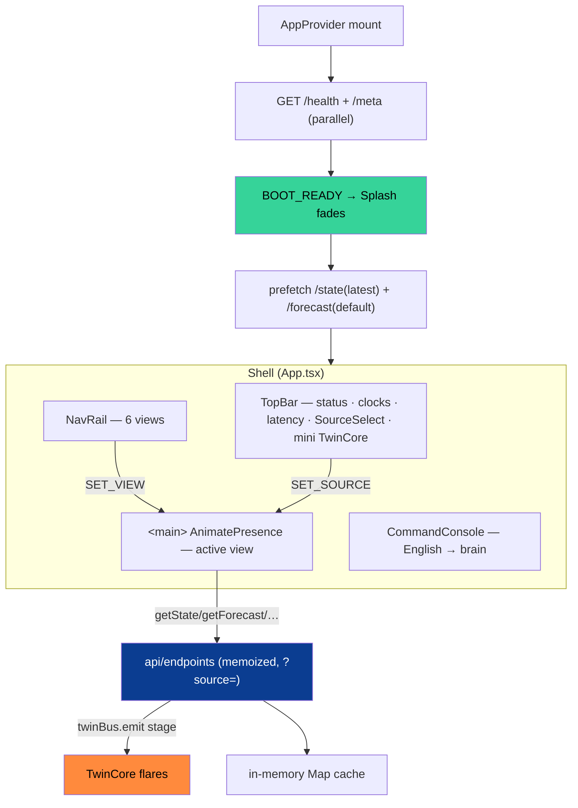
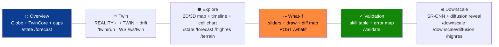

<!-- ░░░ FRONTEND BANNER ░░░ -->
<p align="center">
  
</p>

<p align="center">
  
  
  
  
  
  
</p>

> A **mission-control** dashboard for the climate twin: six views over one map, a scrubbable
> past→now→forecast timeline, a draw-your-own what-if simulator, an honesty scoreboard, a super-resolution
> lab, and a global **Command Console** that turns plain English into grounded twin actions. A top-bar
> **data-source switcher** flips between the validated synthetic IMD regime and a read-only **INSAT-3D
> (2020)** regime that fuses real satellite Land Surface Temperature — the latter unlocking a real
> **3D CartoDEM terrain map** and a **MOSDAC offline basemap**. Animated 5-stage **TwinCore** flares in
> real time as each API call fires. No browser storage — all state in React.

---

## 🧱 Stack

| Layer | Library | Version |
|---|---|---|
| UI | React + React DOM | 18.3.1 |
| Build | Vite | 5.4.10 |
| Language | TypeScript (strict) | 5.6.3 |
| Styling | Tailwind CSS + PostCSS + Autoprefixer | 3.4.14 |
| Maps (2D) | Leaflet + react-leaflet | 1.9.4 / 4.2.1 |
| Maps (3D) | three.js + react-three-fiber + drei | — |
| Charts | Recharts | 2.15.4 |
| Heatmaps | Visx (`@visx/heatmap`, `scale`, `group`) | 4.0.0 |
| Motion | Framer Motion | 11.11.0 |
| Globe | Cobe | 0.6.3 |
| PNG export | html-to-image | 1.11.13 |
| Fonts | Inter + JetBrains Mono (`@fontsource`) | 5.1.0 |

**Vite (`vite.config.ts`):** dev `:5173`, preview `:4173`; proxies `/api → 127.0.0.1:8000` (prefix
stripped) and `/ws → 127.0.0.1:8000` (WebSocket). Alias `@/ → src/`. **`.env.development`:**
`VITE_API_BASE=/api`. **TS:** ES2020, `react-jsx`, `bundler` resolution, no unused locals/params.

---

## 🛰️ Data-source regimes (synthetic vs INSAT-3D 2020)

The dashboard now speaks to **two data regimes**, selected from a top-bar **source switcher**
(`controls/SourceSelect.tsx`, mounted in `TopBar.tsx`). It is **one underlying validated model** —
switching is a *data-regime / provenance* choice, not a second forecaster.

| Regime | Record | LST provenance | Forecasters | Map default |
|---|---|---|---|---|
| **`synthetic`** (default) | full ~2000–2023 IMD record | synthetic LST channel (not surfaced) | ensemble → convlstm → climatology | 2D dark India map |
| **`insat_real`** | **2020 only** | **REAL INSAT-3D LST** (366 granules, coverage **0.6414**) fused as an observation layer | convlstm (if `convlstm_2020.pt` present), else read-only | 3D CartoDEM terrain |

- **`lib/sources.ts`** is the source model/logic: `DataSource`, `deriveSources(meta)`,
  `activeSourceKey`, `useActiveSource()` (active source + date `clamp`), `useSnapDateToSource()`. The
  `insat_real` regime is gated to the INSAT-3D era (`INSAT_ERA_START = '2015-01-01'` picker floor) but is
  **effectively the 2020-only real-LST regime** — that is the only cube/granules that exist. It reports
  `active` only when `meta.lst_source === 'insat_real'`, otherwise `pending`.
- **`SourceSelect.tsx`** is a top-bar popover (replacing the old read-only SOURCE text). Each entry shows
  its **LST provenance tag**, year-range window, and an active/pending dot, then dispatches `SET_SOURCE`.
- **Propagation:** the reducer `SET_SOURCE` adopts the regime's `default_model` / `featured_date`, clears
  the stale state/forecast, and falls back `activeVariable → tmax` if the new regime lacks the current
  layer. A state effect calls `setApiSource(source)`, clears the cache, and refetches `/state` + `/forecast`.
  `api/client.ts` `setApiSource` / `withSource` append `?source=<key>` to every REST call (omitted for the
  default `synthetic`); the twin WebSocket sets `source` too.

> **Honesty.** Skill is always reported **relative to baselines**; splits are **temporal** (train-only
> fitted stats). The real INSAT-3D LST is **genuinely integrated**, but only as a **read-only single-year
> (2020) observation regime** — there is no real-time INSAT and no multi-year real LST. The full
> multi-year cube still serves a `synthetic_demo` LST channel. If the 2020 checkpoint is absent the regime
> stays **read-only / PENDING** and the views surface that state instead of inventing data.

---

## 🗺️ App shell & data flow



State is **Context + `useReducer`** (`state/AppContext.tsx`) — actions like `SET_VIEW`, `SET_MODEL`,
`SET_HORIZON`, `SET_VARIABLE`, `SET_SOURCE`, `SELECT_CELL`, `SET_THEME`. No Redux, **no
localStorage/sessionStorage** (per project rule). Boot gates the Splash on `/health`+`/meta`, then
non-fatally prefetches the latest state and default forecast.

---

## 🖥️ The six views



| View | Renders | Endpoints |
|---|---|---|
| **Overview** | spinning Cobe globe + 5-stage TwinCore + 6 capability cards + live `StatCard` telemetry | `/state`, `/forecast` (prefetched) |
| **Twin** | side-by-side REALITY ⟷ TWIN heatmaps + drift line chart + impact badges; TwinCore flares per stage | `GET /twin/run` (or live `WS /ws/twin` via `useTwinStream`) |
| **Explore** | 2D `DarkIndiaMap` **or** 3D `Terrain3D` + 9×13 grid (click-to-select) + rain VFX + `TimeSlider` + per-cell `ForecastChart` + Compare-Models launcher + INSAT-3D LST layer | `/state`, `/forecast`, `/highres`, `/terrain` |
| **What-If** | `DiffLayer` (diverging) + `UrbanDrawTool` polygon + slider presets (+2 °C heatwave, monsoon ×1.5, drought ×0.5, UHI) | `POST /whatif` (debounced) |
| **Validation** | `ErrorLayer` (per-cell RMSE) + `MetricsTable` + `HonestSkillMatrix` (best model highlighted) | `GET /validate` |
| **Downscale** | drag-to-reveal bilinear vs SR-CNN + CorrDiff diffusion ensemble (mean/±σ + individual realizations) + spectral stats | `/downscale`, `/downscale/diffusion`, `/highres` |

> Downscale auto-hides if `meta.downscale_available === false`.

---

## 🌐 3D terrain map (`src/components/map3d/`, `controls/MapModeToggle.tsx`)

In the **INSAT-3D regime** Explore can switch from the flat map to a real **3D terrain-relief** scene:

| Piece | What it does |
|---|---|
| `Terrain3D.tsx` | react-three-fiber canvas. Extrudes real **CartoDEM / Copernicus GLO-30** elevation (`dem`) as a subdivided `PlaneGeometry` (130×88, `EXAGGERATION = 1.6`), bilinearly upsampling the 9×13 grid onto the mesh. Drapes the selected variable as per-vertex colour with baked hillshade (`meshBasicMaterial`, `DoubleSide`); `OrbitControls` for orbit/zoom + a vertical `Legend` + cell readout. |
| `SatelliteBackdrop.tsx` | deterministic procedural starfield (`THREE.Points`) + an additive blue atmospheric-glow sphere, rendered inside the canvas. |
| `SelectionMarker` (in `Terrain3D.tsx`) | the **3D click marker** — an amber ring + pillar at the clicked cell; `handleClick` inverse-maps the hit point back to `(row, col)`. |
| `MapModeToggle.tsx` | segmented **3D / 2D** button, wired in `Explore.tsx`. `is3D = src?.key === 'insat_real'`; the toggle renders only in that regime, and `show3D` gates `<Terrain3D>` vs `<DarkIndiaMap>`. In 3D, the TERRAIN-drape and uncertainty toggles are hidden; hi-res can drape real INDmet 0.05° over the DEM. |

---

## 🛰️ INSAT-3D LST layer & MOSDAC basemap

- **INSAT-3D LST layer.** In the `insat_real` regime `lst` is carried as a `LayerVar` (from
  `meta.sources` extra vars). It is **observation-only**: Explore shows *"INSAT-3D LST is an observed
  satellite layer — no forecast series"*, and What-If / Compare-Models fall back `lst → tmax` (LST is never
  forecast). Real LST values render with a plasma colormap on either the 3D terrain or the 2D basemap.
- **MOSDAC offline basemap** (`map/MosdacBasemap.tsx`). A bundled, fully-offline satellite-style backdrop:
  satellite-grey land + blue ADM1 boundaries from `india-adm1.geojson`, a live graticule with edge ticks,
  vignette, scanline sheen, corner registration ticks, and a **"MOSDAC · OFFLINE"** tag. Selected via
  `basemap='mosdac'` on `DarkIndiaMap.tsx`, passed from Explore + What-If whenever `src.key === 'insat_real'`.

---

## ⚖️ Compare-Models modal (`views/CompareModal.tsx`)

Launched from Explore's **"⊞ COMPARE MODELS"** button. An overlay modal that fetches **two** forecasts
(model A, model B) for the same date / variable / lead-day and renders three SVG grids
**MODEL A | MODEL B | DIFF (A − B)**, with per-model pickers + a lead-day slider; closes on backdrop click
or Esc. It uses the active regime's model list (`srcMeta?.models ?? meta.models`) and falls back `lst → tmax`.

---

## ⤳ What-If diff (`views/WhatIf.tsx`, `map/DiffLayer.tsx`)

Title **"SCENARIO DIFF · Δ&lt;VAR&gt;"**. A debounced `postWhatIf` sends `delta_temp`, `rain_factor`,
`urban_lst`, and an optional urban polygon, then renders a **diverging diff heatmap** via `DiffLayer.tsx`
over `DarkIndiaMap` (`basemap='mosdac'` in the INSAT-3D regime). Includes a lead-day scrub, a `DiffLegend`
(`COLORMAPS.diff`, Δ = scenario − baseline), and impact deltas via `whatif/ScenarioDeltas.tsx`. Read-only
(`pending`) regimes are handled gracefully, and `lst → tmax`. Supporting pieces: `whatif/WhatIfPanel.tsx`,
`map/UrbanDrawTool.tsx`.

---

## 🔗 API layer (`src/api/`)

- **`client.ts`** — `apiFetch<T>(path,{stage,method,body})` wrapper: emits a `twinBus` stage (drives
  TwinCore flares), records `getLastLatency()` (read by TopBar), throws `ApiError` on non-2xx.
  `setApiSource` / `withSource` append `?source=<key>` to every REST call (omitted for `synthetic`).
  `openTwinStream()` opens the `/ws/twin` socket (with `source`), parses frames, and emits stages.
  `twinBus` is a tiny pub/sub for stages `MIRROR · ASSIMILATE · SIMULATE · PERTURB · IMPACT`.
- **`endpoints.ts`** — typed functions (`getState`, `getForecast`, `getTwinRun`, `postWhatIf`,
  `getValidate`, `getDownscale`, `getDiffusion`, `getBrain`, `getGuide`, `getAnomaly`…), each memoized in a
  module-level `Map` (survives view switches, cleared on reload / source change).
- **`types.ts`** — TS mirrors of every backend response (`Meta`, `StateResp`, `ForecastResp`,
  `WhatIfResp`, `TwinRunResp`, `ValidateResp`, `HighresResp`, `TerrainResp`…).
- **`cache.ts`** — in-memory `cacheKey/cacheGet/cacheSet` (no web storage).

---

## 🗺️ Map layer (`src/components/map/`)

| Component | What it does |
|---|---|
| `DarkIndiaMap` | tileless Leaflet container; glowing ADM1 state outlines (bundled GeoJSON), non-interactive; accepts `basemap='mosdac'` for the MOSDAC offline backdrop |
| `MosdacBasemap` | offline satellite-style basemap (ADM1 boundaries, graticule, vignette, scanline, "MOSDAC · OFFLINE" tag) |
| `GridLayer` | 9×13 grid as Leaflet rectangles, per-variable colormap, click-to-select, hover sparkline, heat-stress **pulse** above threshold |
| `DiffLayer` | diverging scenario − baseline heatmap (blue ↔ saffron, neutral at 0) |
| `ErrorLayer` | per-cell RMSE (sequential dark→red colormap) |
| `SmoothField` | bilinear-smoothed field tiles for downscale thumbnails |
| `RainOverlay` | canvas rain particles; density/velocity scale with intensity, `pointer-events:none` |
| `UrbanDrawTool` | click-to-draw scenario polygon (`useMapEvents`), saffron outline + vertex dots |
| `RegionLocator` | animated ping on the selected cell |

---

## 🎛️ Components

**Shell** — `TopBar` (status, IST/UTC clocks, latency, `SourceSelect`, mini TwinCore), `NavRail`,
`CommandPalette` (⌘K fuzzy jump), `Splash` (typed boot log), `GuideAssistant` (per-screen `/guide` help),
`ProvenanceFooter`, `ScanlineBg`, `SettingsPopover`.
**Controls** — `TimeSlider` (past/now/forecast, play), `LayerSwitch`, `ColorBar`, `ModelSelect`,
`MapModeToggle` (3D/2D), `UncertaintyToggle` (MC-dropout bands), `HiResToggle` (0.05° overlay).
**Map3D** — `Terrain3D`, `SatelliteBackdrop`, `SelectionMarker`.
**Panels** — `ForecastChart` (Recharts line + uncertainty band + NOW reference), `MetricsTable`,
`HonestSkillMatrix`, `StatCard` (count-up easing), `ImpactBadges`, `SowingCard`, `AnalogMatches`,
`ScenarioDeltas`, `InfoPopover`.
**Twin** — `TwinCore` (5-stage ring, saffron pulse, flares on `twinBus`), `SyncFlow` legend.
**Console** — `CommandConsole` (REPL: `ai/state/forecast/whatif/validate/downscale/clear`, history nav,
auto anomaly pop on load). **Globe** — `Globe` (Cobe). **UI** — `FieldHeatmap` (Visx), `Skeleton`.

---

## ⏱️ Timeline & live stream (`src/state/`)

- **`useTimeline`** — fetches the past `PAST_DAYS=7` `/state` days concurrently, refetches `/forecast` on
  horizon/model/uncertainty change, builds `Frame[]` (`observed | now | forecast`), and animates the scrub
  at `PLAY_MS=750`. Returns `{frames, index, setIndex, nowIndex, playing, togglePlay, activeData}`.
- **`useTwinStream`** — subscribes to `WS /ws/twin` (carrying `source`), accumulates `tick` frames into a
  `TwinRunResp`, exposes `{run, streaming, latestLead, done}`, closes the socket on unmount. Replays the
  cached cube — no live download.

---

## 🎨 Theme & colormaps (`theme.ts`, `lib/colormaps.ts`)

Mission-control palette — ISRO blue `#3a78ff`, saffron `#ff8a3d`, online green `#36d399`, danger
`#ff5470`, near-black base `#030408`. Dark/light toggle via `document.documentElement.dataset.theme` +
CSS variables (instant, no reload). Per-variable colormaps: **rainfall** blue scale · **tmax**
amber→saffron→red · **tmin** cyan→blue · **lst** plasma · **elevation** hypsometric · **diff** diverging ·
**error** sequential. `colorForValue/Scale/Diff`, `gradientCss`, and `applyContrast` (steepen/flatten
around 0.5) drive every legend and cell. `lib/`: `sources` (regime model), `grid` (cell bounds), `geojson`
(India outline loader), `fieldstats` (mean/gradient/histogram/spectrum), `format` (dates/clocks/easing),
`exportPng` (2× DPI via html-to-image).

---

## ✨ UX highlights

`⌘K` command palette · **data-source switcher** (synthetic ⟷ INSAT-3D 2020) · real **3D CartoDEM terrain**
with orbit/zoom + 3D click marker · **MOSDAC offline basemap** · **INSAT-3D LST** observation layer ·
real-time **TwinCore** stage flares · canvas **rain particles** · heat-stress **cell pulses** · scrubbable
**timeline** with play/pause · **uncertainty bands** · **draw-your-own** urban polygon · **What-If diff
map** · **Compare-Models** modal · diffusion **ensemble realizations** · **hi-res** 0.05° overlay · instant
**dark/light** theme · high-DPI **PNG export** · count-up **stat animations** · **autonomous anomaly**
pop-up on boot · the agentic **Command Console** (English → grounded brain, each tool call flaring the twin loop).

---

## 🖼️ Gallery

> All screenshots live in [`assets/pictures/`](../assets/pictures).

| | |
|---|---|
| <br/>**Overview / Mission Control** — globe, TWIN SYNC-PATH, live state tiles, 5-stage twin loop, capability cards | <br/>**Twin free-run drift** — sync gauge, drift-over-lead curve, Reality/Twin/Drift heatmaps, assimilate toggle |
| <br/>**Explore** — 9×13 Delhi-NCR Tmax grid over the dark India map, cell popup, model select, timeline scrubber | <br/>**What-If scenario diff** — diverging Δ map, presets, ΔTemp/rainfall/urban sliders, impact deltas |
| <br/>**Validation** — Tmax RMSE error map (2022–23 test), baseline-relative leaderboard, calibrated 90% coverage | <br/>**Downscale rainfall** — bilinear vs SR-CNN wipe (17.56%), resolution ladder, CorrDiff ensemble, DEM ablation, spectrum |
| <br/>**Downscale Tmin** — honest negative result: diffusion over-textures vs near-optimal bilinear | <br/>**Command Console** — grounded agentic brain answering "when to sow" with a 1-step SIMULATE plan + cited numbers |
| <br/>**Guide assistant** open over the Downscale view | <br/>**Guide assistant panel** — jargon-free explainer + ask-me-anything box |
| <br/>**Compare Models** — Model A vs Model B + diff (A − B) map | <br/>**Data-source switcher** — synthetic (IMD · Synthetic LST, 2000–2023) vs INSAT-3D (IMD · INSAT-3D LST, real fused LST, 2020) |

### Headline new work — 3D terrain + real INSAT-3D LST

| | |
|---|---|
| <br/>**Explore 3D** — real CartoDEM terrain relief (×1.6) with Tmax draped, INSAT-3D regime, ConvLSTM, orbit/zoom | <br/>**Explore 3D** — REAL INSAT-3D Land Surface Temperature (18.9–50.8 °C, plasma) draped on the CartoDEM terrain |
| <br/>**Explore 2D** — MOSDAC OFFLINE basemap (ADM1 boundaries, graticule, coverage locator) with the Delhi-NCR grid, INSAT-3D regime | <br/>**What-If (INSAT-3D)** — SCENARIO DIFF ΔTmax over the MOSDAC basemap, presets + sliders + impact bar |

---

## ⚡ Run it

```bash
cd frontend
npm install
npm run dev        # → http://localhost:5173  (proxies /api + /ws to the backend on :8000)
npm run build      # production bundle
npm run preview    # → http://localhost:4173
```

> Start the backend first (`make serve`). The dev server proxies `/api` and `/ws`, so the dashboard
> talks to `127.0.0.1:8000` with no CORS config on your side.

---

<p align="center"><em>Six views, two data regimes, one twin, zero fabricated numbers — Team CodeCatalysts 🛰️</em></p>
