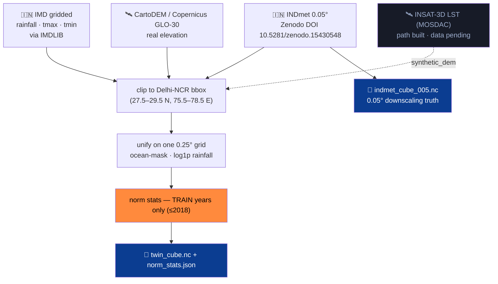

# 2 · Data Sources and Provenance

> *India-first, by principle and by evidence.* This is an **Atmanirbhar**-framed project for an Indian
> space agency, so national datasets are the **backbone**, not an afterthought. Foreign reanalysis is
> auxiliary and never load-bearing; anything synthetic is labeled where it appears.

  

INSAT-3D-class geostationary meteorological satellite — the intended LST source via ISRO's MOSDAC. <em>Image: ISRO, via Wikimedia Commons.</em>

---

## The data pipeline

---

## Primary — IMD gridded (the source of truth)

The **India Meteorological Department's** gridded **rainfall** and **temperature** products are the
canonical observational record for Indian climate. They define the twin's **state** and every **baseline**.

- **Access:** read via **IMDLIB** — we deliberately do *not* hand-parse the binary `.grd` format.
- **Role:** rainfall (0.25°) + Tmax/Tmin (1°, regridded) → the `(rainfall, tmax, tmin)` channels of the cube.
- **Why primary:** it is the national record; using it (not ERA5) as the backbone is the core Atmanirbhar choice.

Rainfall imagery: NASA IMERG over India, via Wikimedia Commons — illustrative of the monsoon signal IMD records.

---

## High-resolution truth — INDmet 0.05° (~5 km)

Downscaling needs a **genuine fine-grid target** to learn against — not an upsampled copy of the coarse
data (which teaches the model nothing real). We use **INDmet**, a 0.05° blended product from the **Water &
Climate Lab, IIT Gandhinagar**, fusing **IMD + CHIRPS + ERA5-Land**.

| | |
|---|---|
| **Resolution** | 0.05° (~5 km) |
| **DOI** | `10.5281/zenodo.15430548` |
| **License** | CC-BY-4.0 |
| **Role** | ground truth the diffusion downscaler is **trained and scored** on |

Using a *real* ~5 km product — rather than a synthetic high-res target — is what makes the downscaling
claim meaningful. → stored as `data/indmet_cube_005.nc`.

---

## Static field — real elevation

  

Terrain is a genuine physical predictor (temperature lapse, orographic rainfall). Elevation comes from
**CartoDEM / Copernicus GLO-30**, reprojected and block-mean-aggregated onto the 0.25° grid — **not** a
placeholder. The DEM-ablation in the Downscale view shows the elevation channel measurably helps.

---

## Satellite — INSAT-3D LST via MOSDAC (honest placeholder)

  
  &nbsp;&nbsp;&nbsp;&nbsp;
  

**INSAT-3D Land Surface Temperature** is the intended satellite input, accessed through ISRO's **MOSDAC**
portal (Meteorological & Oceanographic Satellite Data Archival Centre). The **real ingestion path is
built** (`data/ingest_insat.py`), but data approval is pending — so the LST channel currently carries a
**clearly-labeled `synthetic_demo` placeholder**, and the dashboard footer reads *"INSAT fusion: roadmap."*

> The wiring is real, the data is awaited, and the placeholder is named as such **everywhere it appears**.
> We state this plainly rather than disguise it.

---

## Auxiliary blend components (never the backbone)

| Source | What it is | Role here |
|---|---|---|
| **CHIRPS** | Climate Hazards Group InfraRed Precipitation with Stations | a component *inside* the INDmet blend |
| **ERA5-Land** (ECMWF) | European land reanalysis | a component *inside* the INDmet blend — auxiliary, not backbone |

  

---

## The data contract (and the anti-leakage discipline)

The canonical artifact is **`data/twin_cube.nc`**:

- dims `(time, lat, lon)`, daily, 2000–2023, on **one common 0.25° grid** over the Delhi-NCR bbox;
- vars `rainfall` (mm, `log1p` for modeling), `tmax`/`tmin` (°C), optional `lst`, static `elevation`;
- ocean cells masked to NaN; `norm_stats.json` sits beside it.

**Three rules that protect credibility** (see [[Model Architecture and Approach]] for how they're enforced):

1. **Temporal split only** — train 2000–2018 · val 2019–2021 · test 2022–2023. **Never** random-split a time series.
2. **Train-years-only statistics** — every normalization stat, climatology, and conformal half-width is fit on train, then applied to val/test.
3. **Offline-first** — the demo runs entirely from the cached cube + checkpoints; it never depends on a live IMD/MOSDAC download.

➡️ Continue to **[[Model Architecture and Approach]]**.

---

Imagery & logos (ISRO, Copernicus, ECMWF, INSAT-3DS, PSLV, NASA IMERG monsoon) via Wikimedia Commons,
used for reference/attribution. Dataset DOI and licenses as cited. ClimaTwin is independent and unaffiliated.
