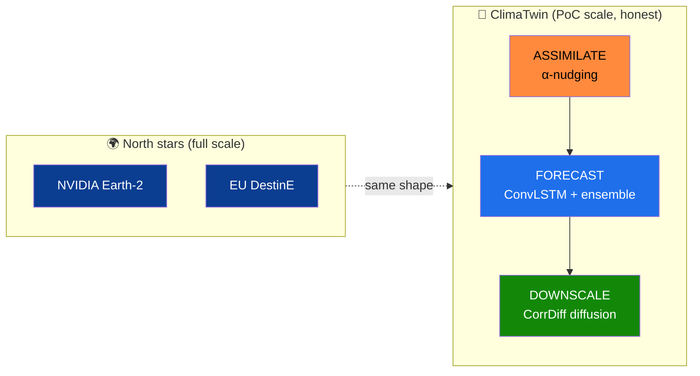

<!-- ░░░ WIKI HOME ░░░ -->

  

  
  &nbsp;&nbsp;&nbsp;&nbsp;
  
  &nbsp;&nbsp;&nbsp;&nbsp;
  
  &nbsp;&nbsp;&nbsp;&nbsp;
  
  &nbsp;&nbsp;&nbsp;&nbsp;
  

  
  
  

---

Welcome to the **ClimaTwin India** engineering & research wiki. ClimaTwin is an **AI-powered digital twin
of India's climate** — it mirrors a live gridded climate state, **assimilates** observations,
**simulates** forward with a trained neural ensemble, **downscales** to ~5 km, runs **what-if** scenarios,
and is operable in plain English by a grounded, offline-first AI agent. Pilot region **Delhi-NCR**;
variables **rainfall + Tmax/Tmin**; horizon **1–14 days**.

It deliberately mirrors the architecture of **NVIDIA Earth-2** and **EU Destination Earth** — the same
`assimilate → forecast → downscale` shape — scaled honestly to hackathon compute.

> *This wiki records **reasoning, not aspiration**. Every numeric claim traces to this repo's own
> validation runs; every borrowed idea is attributed to the paper or system it came from.*

---

## 📖 Read the wiki in order

| # | Page | What you'll learn |
|---|---|---|
| 1 | **[[Research Foundations]]** | Every paper & system we built on, and *exactly what we took* from each (Earth-2, CorrDiff, GraphCast, DGMR, ConvLSTM, DDPM, conformal prediction). |
| 2 | **[[Data Sources and Provenance]]** | India-first data: IMD, INDmet, CHIRPS, ERA5-Land, CartoDEM/Copernicus, INSAT-3D/MOSDAC — how each is sourced, licensed, and preprocessed. |
| 3 | **[[Model Architecture and Approach]]** | Baselines → two-head ConvLSTM → analog k-NN → NNLS stacked ensemble → split-conformal bands → CorrDiff diffusion downscaler. Why each exists. |
| 4 | **[[Low Latency Engineering]]** | How the dashboard answers in **7–34 ms**: warm-start, `lru_cache`, offline-first, compact payloads, in-memory client cache, WebSocket streaming. |
| 5 | **[[Real-time Roadmap and the Best Model]]** | What it takes to make the forecaster *best-in-class for real-time*: streaming assimilation, multi-horizon rollout, INSAT fusion, FNO head, distillation, edge deploy. |
| 6 | **[[Future Scope]]** | Where ClimaTwin goes next: all-India scale-out, soil-moisture/drought (NICES), operational hardening, generative ensembles, policy decision support. |

➡️ Navigation also lives in the **[[_Sidebar|sidebar]]** on every page.

---

## 🛰️ The three-stage twin, at a glance

---

## 📊 Headline verified results (untouched 2022–23 test split)

| Claim | Number | Baseline it beats |
|---|---|---|
| 1-day rainfall RMSE (ensemble) | **7.35 mm** | persistence 9.41 · climatology 8.08 |
| 1-day Tmax / Tmin RMSE (ensemble) | **1.51 / 1.05 °C** | persistence 1.59 / — |
| Rain detection POD / CSI (1-day) | **0.64 / 0.37** | persistence 0.45 / 0.29 |
| Conformal 90% interval coverage | **≈0.90** | — (verified, not assumed) |
| Diffusion downscaler FSS@2.5 mm | **0.82** | bilinear 0.68 |
| Dashboard request latency | **7–34 ms** | (see [[Low Latency Engineering]]) |

---

## 🔗 Project links

- 📦 **Repository:** [`ayushap18/climatwin-india`](https://github.com/ayushap18/climatwin-india)
- 🖼️ **Screenshot gallery:** [`assets/images/`](https://github.com/ayushap18/climatwin-india/tree/main/assets/images)
- 🧠 **Backend README:** [`backend/`](https://github.com/ayushap18/climatwin-india/tree/main/backend)
- 🖥️ **Frontend README:** [`frontend/`](https://github.com/ayushap18/climatwin-india/tree/main/frontend)
- 📚 **In-repo research doc:** [`docs/research.md`](https://github.com/ayushap18/climatwin-india/blob/main/docs/research.md)

---

Logos: ISRO, NVIDIA, Google DeepMind, ECMWF, Copernicus — via Wikimedia Commons, used for
attribution/reference. Satellite imagery credited on each page. ClimaTwin is an independent
hackathon project and is not affiliated with or endorsed by these organisations.
