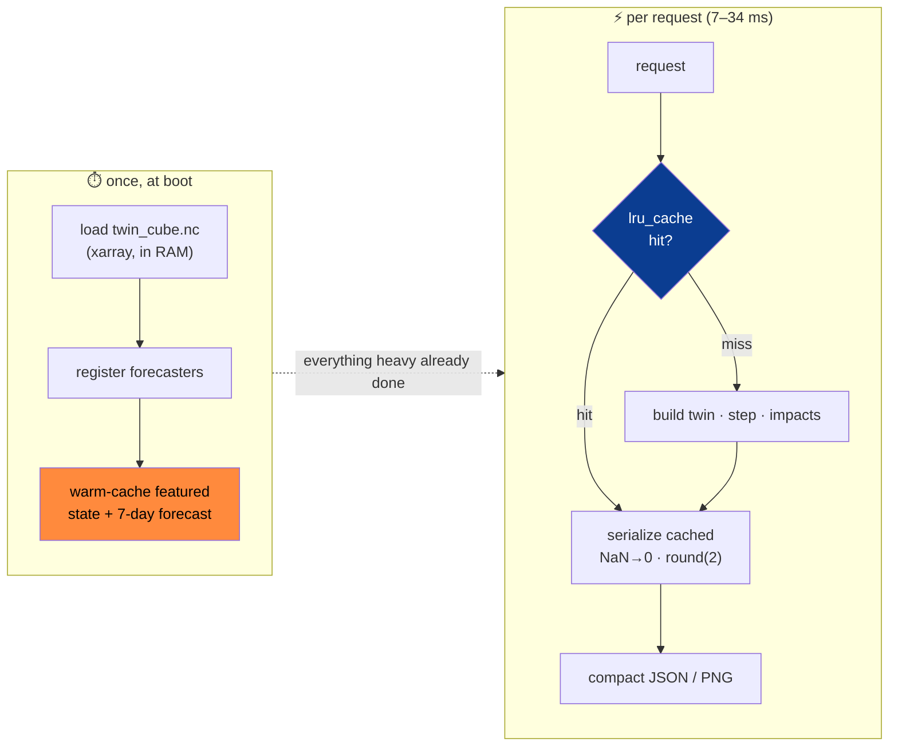
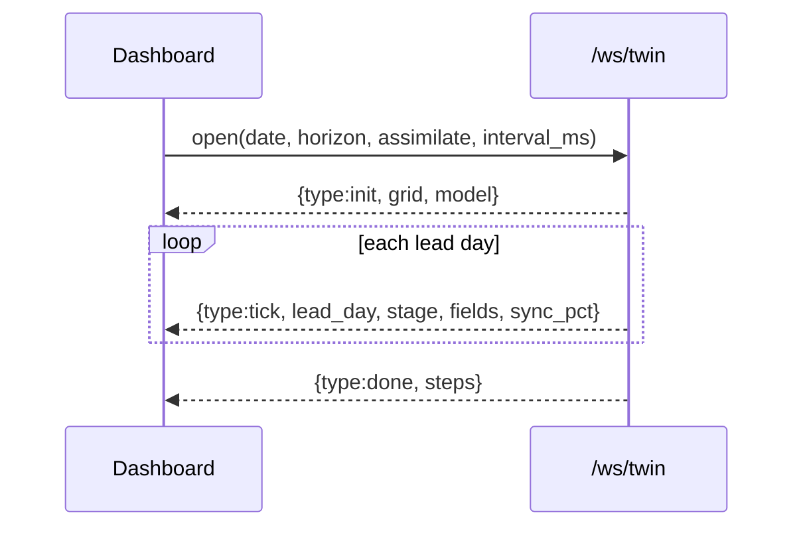

# 4 · Low Latency Engineering

> *How the dashboard answers in **7–34 ms**.* The latency badge in the top bar of every screenshot is
> real, measured client-side per request. This page explains — at multiple levels — exactly how a
> physics-flavoured ML system serves interactively, and why **none of it depends on a live download**.

  

Top-bar telemetry — <b>LATENCY 7ms</b> — is the real per-request round-trip, shown live on every view.

---

## The mental model: do the expensive work once, never on the hot path

The principle: **the cube load, the model registration, and the default views are paid for at startup**, so
a user click only ever pays for serialization or, at worst, one cached twin step.

---

## Level 1 — Server-side: seven techniques

| # | Technique | Where | Effect |
|---|---|---|---|
| 1 | **Cube loaded once into RAM** | `app.py` lifespan | no per-request disk/xarray open |
| 2 | **Warm-start cache** | lifespan pre-renders featured date's state + 7-day forecast | first paint is instant; demo never lags on load |
| 3 | **`@lru_cache` on every read path** | `state` 512 · `forecast` 512 · `highres` 256 · `analog`/`twin-run` 128–256 · `diffusion` 64 · `terrain` 1 | repeat queries are O(1) |
| 4 | **Compact payloads** | `_grid()` NaN→0 + round to 2 decimals; `_fields()` downsampled views | never ship raw float64 grids the UI won't render |
| 5 | **Lazy model imports** | `get_forecaster()` imports torch only when needed | fast cold start, small baseline memory |
| 6 | **Pluggable forecaster fallback** | `ensemble > convlstm > climatology > analog > persistence` | always serves *something* fast, degrades gracefully |
| 7 | **Offline-first** | everything from cached cube + checkpoints | zero network variance in the demo |

> The combined result: the **7 ms** seen on the Overview is a warm-cache hit; heavier first-touch routes
> (analog, validation) land in the **19–34 ms** range seen on the Downscale/Validation screenshots, then
> drop to single digits once cached.

---

## Level 2 — The forecaster is cheap *by design*

Low latency isn't only caching — the **model choices themselves** were made with the interactive budget in
mind (see [[Model Architecture and Approach]]):

- The grid is a deliberate **9×13 (117 cells)** PoC box — small tensors, millisecond inference.
- **Analog k-NN** and the **baselines** need *no GPU and no forward pass* — pure NumPy lookups.
- The served **ensemble** is a precomputed **NNLS blend** with weights baked into `ensemble_weights.json`;
  conformal half-widths are precomputed too. Serving = a weighted sum, not a fit.
- The **diffusion** downscaler (the only genuinely heavy model) is **off the hot path**: it's an explicit,
  cached, opt-in `/downscale/diffusion` call, never part of the default forecast.

---

## Level 3 — Real-time streaming without polling

The live twin run is pushed over a **WebSocket** (`/ws/twin`), not polled:

The client paces frames via `interval_ms`; each tick is a tiny serialized step, so the **TwinCore animation
stays smooth** and the reality-vs-twin drift renders frame-by-frame with no request storm.

---

## Level 4 — Client-side: nothing fetched twice

- **In-memory memoization** — every `api/endpoints.ts` function caches in a module-level `Map`, so switching
  views never re-fetches the same state/forecast.
- **Boot prefetch** — `/health` + `/meta` run in parallel at startup, then the latest state + default
  forecast are prefetched, so the first view is already warm.
- **Compact transport** — the UI requests downsampled grids / PNG tiles sized for rendering.
- **No web storage** — state lives in React (per project rule), avoiding serialization stalls.
- **Latency telemetry** — `getLastLatency()` records every round-trip; the TopBar surfaces it so performance
  regressions are visible *during the demo*, not after.

---

## Why this matters for a *twin*

A digital twin is meant to be **interrogated** — scrub a timeline, drag a what-if slider, draw an urban
polygon, ask the brain a question — and each of those is a request. If any one stalled, the illusion of a
*live* mirror breaks. Sub-35 ms responses are what make ClimaTwin feel like a control room rather than a
batch report.

➡️ Next: **[[Real-time Roadmap and the Best Model]]** — how we take this from "interactive on cached data"
to "best-in-class on live data."

---

Screenshot from this repo's `assets/images/`. Latency figures are real client-side measurements from the live app.
