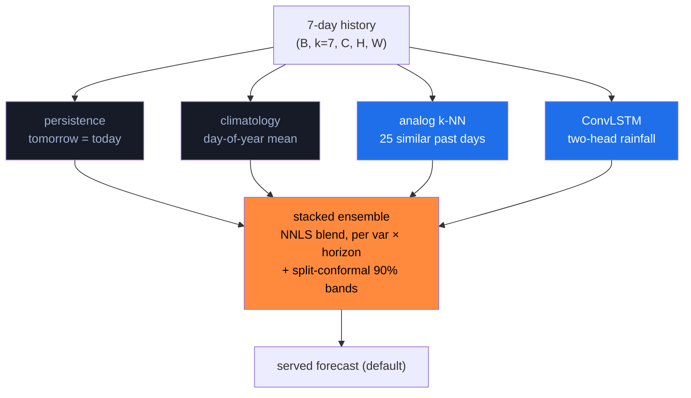

# 3 · Model Architecture and Approach

> *Baselines before claims; the right loss for each variable; an ensemble because no single model wins;
> honest uncertainty; generative downscaling scored the right way.* This page connects each modelling
> choice to the source it came from (see [[Research Foundations]]) and to the number that justifies it.

---

## The forecast stack

---

## Level 1 — Baselines (the floor no claim may skip)

Two baselines are implemented and **must be beaten** before any accuracy statement:

- **Persistence** — tomorrow equals today.
- **Climatology** — the day-of-year average from **train** years.

These are not strawmen. In short-horizon daily rainfall they are genuinely hard to beat — which is exactly
why reporting skill *relative to them* is the only honest framing. (At 7-day lead, skill over climatology
nearly vanishes; we report that rather than hide it.)

---

## Level 2 — The core forecaster: two-head ConvLSTM

Rainfall and temperature are **different statistical objects**, so they are modelled differently — the
single most important loss-design decision in the project:

| Variable | Nature | Loss |
|---|---|---|
| **Tmax / Tmin** | roughly continuous, well-behaved | MSE / L1 |
| **Rainfall** | **zero-inflated + right-skewed** (most days dry; wet days span orders of magnitude) | **two-head**: rain/no-rain **BCE** + wet-masked **MSE on `log1p` amount** |

Plain MSE on raw rainfall is simply wrong — it is dominated by zeros and washes out the rare heavy events
that matter most. The two-head split (derived from standard precipitation practice and the DGMR/CorrDiff
lineage in [[Research Foundations]]) is what makes the **categorical scores (POD/FAR/CSI) meaningful**.

> **Verified payoff:** at 1-day, 2.5 mm threshold, the ensemble reaches **POD 0.64 / CSI 0.37** vs
> persistence's **0.45 / 0.29** — the two-head design materially lifts detection.

---

## Level 3 — Why an ensemble, and why NNLS

No single member wins everywhere — each is best in different cells and horizons:

- **Analog k-NN** retrieves the 25 most-similar past days from *train* years, season-gated (a July day is
  matched to July-like days). No GPU, direct multi-horizon forecasts, and a **free ensemble spread** because
  it returns a *set*. Often holds its own against the neural model on rainfall.
- The members are blended per variable / per horizon with **non-negative least squares (NNLS)**.
  Non-negative weights keep the blend interpretable (a convex-ish combination) and stop a member from
  getting a nonsensical negative contribution. Weights are fit on **validation**, never on test.

> **Verified:** the stacked ensemble wins **7 of 9** variable×horizon cells; 1-day rainfall RMSE
> **7.35 mm** (analog 7.38 · ConvLSTM 7.40 · climatology 8.08 · persistence 9.41). The margin is *honest* —
> the members beat the baselines, they don't crush them.

---

## Level 4 — Honest uncertainty: split-conformal

A twin that says "7.3 mm" without "± how much" is over-claiming. We attach **split-conformal 90% prediction
intervals** — distribution-free, no Gaussian assumption, finite-sample coverage under exchangeability.

The data split is strict and **three-way disjoint**:

> **Verified out-of-sample coverage:** rainfall **0.90**, tmax **0.87–0.93**, tmin **0.89–0.94** — the
> intervals mean what they say.

---

## Level 5 — Generative downscaling (the subtlest choice)

A deterministic SR-CNN trained on pixel RMSE **blurs** (the double-penalty problem — see
[[Research Foundations]]). We built it, confirmed the blur, then went **generative**: a **CorrDiff-style
residual diffusion** model (DDPM, cosine schedule, DDIM sampling) that learns the *residual* detail and
super-resolves **0.25° → 0.05°** against real **INDmet** truth.

| Metric (rainfall) | Diffusion | Bilinear | Why it matters |
|---|---|---|---|
| **FSS @ 2.5 mm** | **0.82** | 0.68 | neighbourhood skill — the headline |
| **High-wavenumber spectral power** | **0.36** | 0.16 | ≈2.3× more recovered fine-scale texture |
| Pixel RMSE | **4.42** | 5.34 | diffusion wins here *too*, but it isn't the point |

**Honest negative result — temperature.** We extended the same model to Tmax/Tmin. On these *smooth*
fields bilinear is already near-optimal (~0.12 °C) and the diffusion **over-textures**, so it does **not**
beat bilinear. We keep it exposed and labeled — rainfall remains the headline diffusion target.

---

## Level 6 — The twin core wraps the forecaster

The forecaster is a *component*; the twin (`twin/climate_twin.py`) is the product:

| Method | Behaviour |
|---|---|
| `initialize` | MIRROR observed state + 7-day history |
| `assimilate` | α-nudge `state = α·obs + (1−α)·state` (α=0.6) — a *simplified* scheme, labeled |
| `step` | SIMULATE the forecaster forward, rainfall clipped ≥ 0 |
| `whatif` | PERTURB forcings (ΔTemp, rain×factor, urban LST) → re-sim → diff |
| `impacts` | DECIDE: SPI-lite dryness, heat-stress flag (Tmax>40 °C), sowing onset (Σrain≥20 mm) |
| `run_twin` | reality-vs-twin drift; free-run drifts, assimilation re-centers |

---

## 🥇 The golden rule (operational discipline)

> **Any time the ConvLSTM is retrained, re-run `python -m models.ensemble --fit` *and* `make validate`.**
> The ensemble weights and the leaderboard *depend on* the model — skipping this silently invalidates
> every number on this page.

➡️ Continue to **[[Low Latency Engineering]]** to see how all this serves in milliseconds.

---

Tensor & file map

- Input `(B, k=7, C, H, W)` → output `(B, h, 3, H, W)` for `[rainfall, tmax, tmin]`, grid 9×13.
- `models/baselines.py` · `analog.py` · `convlstm.py` · `ensemble.py` (+ `ensemble_weights.json`)
- `models/downscale.py` (SR-CNN) · `diffusion_downscale.py` (CorrDiff) · `validate.py`

