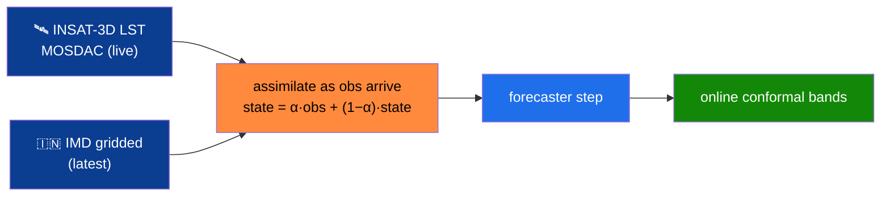

# 5 · Real-time Roadmap and the Best Model

> *What it takes to make the forecaster best-in-class for **real-time**.* Today ClimaTwin is interactive on
> **cached** national data. This page lays out — concretely, in priority order — **what** we change and
> **how**, to move from "fast on a snapshot" to "best-in-class on a live stream," without ever breaking the
> honesty rules in [[Model Architecture and Approach]].

  

The real-time target: extreme-event regimes like landfalling cyclones, where fresh observations matter most. <em>Image: NASA MODIS, via Wikimedia Commons.</em>

---

## The gap between "fast" and "real-time"

| Dimension | Today | Best-in-class real-time |
|---|---|---|
| Data | cached cube (2000–2023) | **live IMD + INSAT-3D feed**, rolling window |
| Assimilation | α-nudging at request time | **streaming** assimilation as obs arrive |
| Horizon skill | strong 1-day, decays by 7-day | **multi-horizon-trained**, drift-corrected |
| Satellite | `synthetic_demo` LST | **real INSAT-3D LST fusion** (MOSDAC) |
| Confidence | conformal on test split | **online conformal** that re-calibrates live |
| Compute | laptop / free Colab | **distilled** model, edge-deployable |

The plan below closes each row, ranked by **return-on-effort**.

---

## Priority 1 — Real observation fusion (the highest-leverage change)

**What:** turn the already-built MOSDAC ingestion path (`data/ingest_insat.py`) from `synthetic_demo` into a
live LST channel, and add IMD's latest gridded fields as a rolling tail on the cube.
**How:** schedule a small ingest job that appends new days, recomputes *only* the affected state, and feeds
it straight into `assimilate`. Skill thresholds stay **train-years-only**, so adding live data never leaks.
**Why first:** an LST channel is the single most physically-informative satellite input for the heat-stress
and urban-bump signals the twin already exposes.

---

## Priority 2 — Streaming assimilation (EnKF-lite)

**What:** upgrade `assimilate` from scalar α-nudging toward a lightweight **Ensemble-Kalman-style** update
that weights observations by their uncertainty and the forecast spread.
**How:** reuse the analog ensemble (and MC-dropout) we already generate as the "ensemble" for a cheap
Kalman gain; keep it labeled as *EnKF-lite*, not full variational DA.
**Why:** this is the honest next rung up the assimilation ladder toward what Earth-2 / DestinE do
(see [[Research Foundations]]) — it makes the twin *re-sync harder* the moment good observations land.

---

## Priority 3 — Multi-horizon rollout training (kill the 3–7 day drift)

**What:** train the ConvLSTM *through* its own autoregressive rollout so it learns to correct compounding
error, instead of optimizing 1-day error and hoping it generalizes.
**How:** `models/train_multihorizon.py` already exists; future LST during rollout comes from **train-year
climatology** (no leakage). Then — per the golden rule — **re-fit the ensemble and re-validate**.
**Why:** today skill over climatology nearly vanishes by 7 days; rollout training is the documented fix for
exactly that drift, and it directly improves the horizons users scrub to most.

---

## Priority 4 — A stronger forecaster head (FNO / transformer)

**What:** add a **Fourier Neural Operator** (or attention) head as an additional ensemble member.
**How:** it plugs into the same `Forecaster` interface and the same NNLS blend — no harness change. It only
ships if it *earns its weight* on validation; NNLS will down-weight it to ~0 if it doesn't help.
**Why:** FNOs capture global spectral structure ConvLSTMs miss; as a *member* (not a replacement) it can
only improve the ensemble, never regress it.

---

## Priority 5 — Distillation + edge deployment (real-time, anywhere)

**What:** distill the served ensemble into a single compact network; quantize for CPU/edge.
**How:** train a student to mimic the ensemble's blended output + conformal bands; target the same 9×13
tensor so the existing [[Low Latency Engineering]] hot path is unchanged.
**Why:** real-time operational use means running on modest hardware near the data — a distilled model keeps
the **7–34 ms** budget while removing the multi-member serving cost.

---

## Priority 6 — Online conformal & live drift monitoring

**What:** let the 90% bands **re-calibrate** as new outcomes arrive, and surface live divergence alerts.
**How:** maintain a rolling conformal calibration window; the existing `anomaly_scan` (train-only
thresholds) becomes a continuous monitor that flags heat/dryness regimes in real time.
**Why:** a real-time twin must keep its uncertainty *honest as the climate shifts* — static bands silently
go stale.

---

## How we'll know it's actually "best"

Same discipline as everywhere else — **no claim without a baseline and a verified number:**

- skill is reported **vs persistence + climatology**, on a **temporal** split, with **train-only** stats;
- downscaling is judged on **FSS / CRPS / spectrum**, not pixel RMSE alone;
- uncertainty is **measured** (coverage ≈ target), not assumed;
- latency stays in the **sub-35 ms** interactive band (see [[Low Latency Engineering]]).

➡️ Continue to **[[Future Scope]]** for what comes after the model is real-time-ready.

---

Imagery: NASA MODIS via Wikimedia Commons, used for reference. Roadmap items map to real files in the
repo (`ingest_insat.py`, `train_multihorizon.py`, `ensemble.py`).
