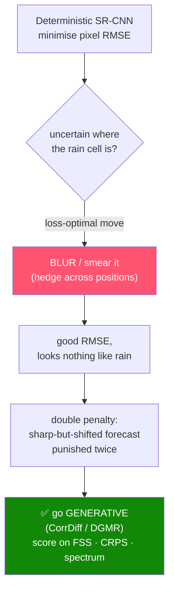

# 1 · Research Foundations

> *How we got the approach from the sources.* This page is the intellectual genealogy of ClimaTwin:
> every system and paper we leaned on, **what specific idea we took from it**, and **how that idea became
> code** in this repo. We name work by name and never fabricate DOIs or arXiv IDs.

---

## Level 0 — The one decision everything follows from

The ISRO problem statement asks for an *AI-powered digital twin of India's climate*. We took the word
**twin** literally. A forecast model answers *"what will the weather be?"*. A **digital twin** answers a
*family* of questions — *what is the state now, how confident am I, what happens if I run it forward, and
what changes if I perturb it?*

That single reading forces the whole architecture: a **state** that is mirrored and assimilated, a
**forecaster** that is just one component inside a loop, and **counterfactuals** as first-class operations.
If the project were "a predictor plus a chart," it would be the wrong artifact. Everything below is
downstream of this choice.

---

## Level 1 — North-star systems (the shape)

<p align="center">
  
  &nbsp;&nbsp;&nbsp;&nbsp;&nbsp;&nbsp;
  
</p>

We anchored on two real, full-scale Earth-system digital twins. Both share **one shape** — and that shape
is the backbone of ClimaTwin:

```
assimilate  →  forecast  →  downscale
(ingest obs)   (step fwd)    (refine to local detail)
```

| North star | What it is | What we *inherited* |
|---|---|---|
| **NVIDIA Earth-2** | A platform for Earth-system digital twins; pairs neural global forecasting with **generative** km-scale downscaling. | The three-stage shape **and** the stance that downscaling should be *generative*, not deterministic. |
| **EU Destination Earth (DestinE)** | European initiative building operational digital twins of the Earth. | The discipline of treating *assimilate / forecast / downscale* as **separately-validated stages**. |

We do **not** claim parity. We inherited their *architecture of honesty*: separate "what is the state",
"how does it evolve", and "how do we add local detail", and validate each on its own terms. Wherever our
PoC simplifies a stage they do for real, we say so (see the simplification table at the bottom).

| Earth-2 / DestinE (full scale) | ClimaTwin (PoC scale) |
|---|---|
| Operational data assimilation (variational / ensemble Kalman) | Simplified **α-nudging** `state = α·obs + (1−α)·state`, honestly labeled |
| Global neural weather models (FourCastNet / GraphCast lineage) | **ConvLSTM + analog k-NN + stacked ensemble** over a 9×13 box |
| **CorrDiff** generative SR at km-scale | **Residual diffusion**, 0.25° → 0.05°, on Indian truth data |

---

## Level 2 — The papers, and exactly what each gave us

### 🌧️ Forecasting

**Shi et al. (2015) — Convolutional LSTM (ConvLSTM).**
*Precipitation nowcasting as a spatiotemporal sequence problem.* This is the architecture of our **core
forecaster**. The insight we used: gridded weather is *both* spatial (neighbouring cells correlate) and
temporal (today conditions tomorrow), so the right primitive replaces the dense connections of an LSTM
with **convolutions**, preserving the grid. → In code: input tensors `(B, k=7, C, H, W)`, seven days of
history over the Delhi-NCR grid, in `models/convlstm.py`.

**DeepMind GraphCast — neural global weather forecasting.**
We did not reimplement GraphCast; we took it as the **proof that a learned forecaster can stand in for a
numerical model** at the *step* stage of a twin. It justifies making the forecaster a *pluggable component*
inside the loop rather than the product itself.

**DeepMind DGMR — Deep Generative Model of Rainfall.**

DGMR is precipitation nowcasting scored on **spatial and probabilistic skill**, not pixel error. Two ideas
crossed over: (1) rainfall must be evaluated with **neighbourhood / probabilistic** metrics (this motivates
our FSS/CRPS scoring), and (2) **generative** models produce the sharp, physically-plausible rain fields
that regression-to-the-mean models cannot.

### 🎲 Generative modelling

**Ho et al. (2020) — Denoising Diffusion Probabilistic Models (DDPM).**
The mathematical formulation behind our downscaler. We use the DDPM forward/reverse process with a
**cosine noise schedule** and **DDIM sampling** for fast inference. → In code: `models/diffusion_downscale.py`.

**NVIDIA CorrDiff — correction/residual diffusion for km-scale downscaling.**
The direct template for our generative downscaler. The borrowed trick that makes it stable at hackathon
scale: **learn the residual** — the fine detail the coarse field is missing — rather than the whole field.
→ Our model super-resolves 0.25° → 0.05° against real Indian truth, scored on FSS/CRPS/spectrum.

### 📏 Uncertainty

**Split-conformal / conformal prediction.**
A twin that says *"7.3 mm"* without *"± how much"* is over-claiming. Conformal prediction gives
**distribution-free** intervals with a finite-sample coverage guarantee under exchangeability — no Gaussian
assumption. → We wrap the ensemble in **90% split-conformal bands**, with a strict three-way-disjoint data
split, and *verify* coverage lands at ≈0.90 on the untouched test years.

---

## Level 3 — How a source became a design rule

The most important transfer wasn't an architecture — it was a **failure mode** the literature documents,
which we reproduced and then designed around: **the double-penalty problem**.



We **built the deterministic SR-CNN first**, watched it blur exactly as the field predicts, and *that
empirical result* — not a citation alone — is why the headline downscaler is generative and why we lead
with FSS and spectral power instead of pixel RMSE.

This is the multi-level pattern across the whole project: **read the source → reproduce the problem it
warns about → adopt the fix → verify the fix on our own data.**

---

## Level 4 — The honesty ledger (where the PoC simplifies a source)

| Stage | What the north stars do | What we do | Labeled honestly? |
|---|---|---|---|
| Assimilate | Variational / Ensemble-Kalman DA | α-nudging | ✅ "simplified nudging scheme" |
| Forecast | Global neural NWP | ConvLSTM + ensemble on one box | ✅ PoC scope stated |
| Downscale | CorrDiff at ~2 km, global | Residual diffusion 0.25°→0.05°, Delhi-NCR | ✅ scored on right metrics |
| Satellite input | Live multi-sensor assimilation | INSAT-3D LST path built, data pending | ✅ tagged `synthetic_demo` |

➡️ Continue to **[[Data Sources and Provenance]]** for where the real numbers come from.

---

### References (named, not fabricated)

- NVIDIA **Earth-2** & **CorrDiff** — generative km-scale downscaling platform/model.
- EU **Destination Earth (DestinE)** — operational Earth digital twins.
- DeepMind **GraphCast** (neural global weather) · **DGMR** (generative rainfall nowcasting).
- Shi et al. (2015) — **ConvLSTM** for precipitation nowcasting.
- Ho et al. (2020) — **DDPM** (diffusion); with cosine schedule + DDIM sampling.
- **Split-conformal prediction** — distribution-free intervals with coverage guarantees.

<sub>Logos via Wikimedia Commons for reference. ClimaTwin is independent and unaffiliated.</sub>
